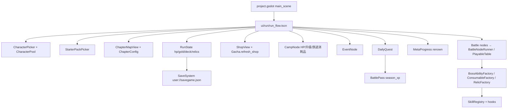

# E0-02 代码 / IP 盘点：肉鸽依赖、12 角色、道具与可复用路径

> Issue：[#222](https://github.com/jingx8885/mahjong-game/issues/222)（Epic [#214](https://github.com/jingx8885/mahjong-game/issues/214)）
> 日期：2026-07-22
> 证据基线：本 worktree 当前代码与 `res://` 资源树（**非**根目录历史 markdown）
> 相关：[`2026-07-22-multiplayer-trash-talk-prd.md`](./2026-07-22-multiplayer-trash-talk-prd.md)、[`2026-07-22-multiplayer-trash-talk-epics.md`](./2026-07-22-multiplayer-trash-talk-epics.md)
> **范围纪律**：无 E6；不涉及举报 / 座位静音 / 语音设置 / 自动禁言。
> **本 Issue 交付物**：仅本文档（代码证据盘点）。**不包含** 业务代码改动、删除实现、资产制作或修改 `project.godot`。
> **Git 交付**：仍按 Issue / `AGENTS.md` 纪律——独立 worktree 与任务分支、中文 PR、维护者人工合并；本文档本身不另立「禁止 commit/push/PR」的永久禁令。

---

## 0. 证据分级

| 标记 | 含义 |
|------|------|
| **[已证实]** | 可直接在源码 / 资源路径 / `project.godot` 中定位到声明或调用 |
| **[推断]** | 由已证实事实合理推出，但无单点声明 |
| **[待确认]** | 行为与文案冲突、工厂未注册、资产无引用，或需产品决策 |

本清单给出每条依赖的 **删除 / 保留 / 原创替换 / 延后** 建议，供 E1-02（#226）与 E1-06（#230）直接消费。

---

## 1. 生产入口与肉鸽依赖总览

### 1.1 生产主场景 [已证实]

| 项 | 证据 | 生产处置建议 |
|----|------|--------------|
| 主场景 | `godot/project.godot`：`run/main_scene="res://ui/lobby/lobby_shell.tscn"` | 大厅壳是唯一生产入口；退役 `ui/run/` 已物理删除 |
| Run 壳 | 原 `godot/ui/run/` 编排角色选择 → 起始包 → 章节地图 → 节点 → 结算 | **已删除**，不再提供 legacy GUT 显式实例化 |
| 4 人桌 | `godot/ui/four_player_table/`（`PlayableTable` 等） | **保留**（E2 统一电脑对战复用） |
| 日麻引擎 | `godot/core/`、`godot/battle/`（`BattleController` / `GameDriver` / `TurnEngine`） | **保留** |

### 1.2 指定 5 个肉鸽 Autoload [已证实]

`godot/project.godot` 注册（E1-02 须从生产配置注销；**脚本保留**）：

| Autoload 名 | 脚本路径 | 持久化路径 | 职责摘要 | 建议 |
|-------------|----------|------------|----------|------|
| `SaveSystem` | `meta/save_system.gd` | `user://savegame.json` | Run 中途档读写 / 清除 | **已删除** |
| `MetaProgress` | `meta/meta_progress.gd` | `user://meta_progress.json` | 跨 Run 声望 `renown` / 通关计数 | **已删除** |
| `BattlePass` | `meta/battle_pass.gd` | `user://battle_pass.json` | 本地赛季 XP / free+premium 奖励表 | **已删除** |
| `DailyQuest` | `meta/daily_quest.gd` | `user://daily_quest.json` | 每日 3 任务 → gold/renown/season_xp | **已删除** |
| `SaveToast` | `meta/save_toast.gd` | （无独立档） | 监听 SaveSystem 弹「已保存」 | **已删除** |

`RunFlow._ready` **[已证实]** 连接 `DailyQuest.quest_claimed` 与 `BattlePass.level_up`，并把 quest gold 写回 `_run_state.gold`。

### 1.3 依赖关系简图 [已证实 + 推断]



---

## 2. Run / 章节 / HP / 经济 / 商店 / 抽卡 / 营地 / 存档 / 战令

### 2.1 Run 入口与生命周期 [已证实]

| 模块 | 路径 | 关键行为 | 生产处置 |
|------|------|----------|----------|
| Run 流 | `ui/run/run_flow.gd` | 新 Run / 读档续跑 / 选角色 / 选包 / 进图 / 节点分发 / 复活 / 结算 | **删除生产可达** |
| Run 状态 | `meta/run_state.gd` | `hp/max_hp/gold/chapter/map/history/player_deck/pity/consumables/relics/selected_character_id/difficulty/speed_streak`；`SAVE_VERSION=2` | **退出生产会话契约**；类型可 **延后** 供测试 |
| 难度 | `meta/difficulty.gd` | 影响起始 HP 修正（`RunFlow` 应用） | **删除生产** |
| HUD / 总结 | `ui/run/run_hud.*`、`run_summary.*` | 显示 HP/金币；失败复活花 gold | **删除生产 UI** |
| 节点种类 | `meta/node_kind.gd` | `NORMAL/ELITE/CAMP/SHOP/EVENT/BOSS` | 肉鸽图 **删除生产**；战斗能力 **保留** 在 E2 |

**成功标准对照（E1）**：生产启动 / 返回大厅 / 再来一局均不可进入 `run_flow.tscn`。

### 2.2 章节 [已证实]

| 项 | 证据 | 说明 |
|----|------|------|
| 章数 | `ChapterConfig.chapter_count() == 3`；`RunState.MAX_CHAPTERS = 3`；`BalanceConstants.chapters = 3` | 固定 3 章 |
| 章配置 | `meta/chapter_config.gd` `chapter_1/2/3()` | floor_count 5/5/6；节点权重 NORMAL/ELITE/SHOP/EVENT；Boss ability id + 变体 |
| 会话种类 | `default_session_kind: "speed"`；Boss：`east_round` / 章 3 `hanchan` | 与 `BalanceConstants.hands_per_node*` 联动 |
| 地图生成 | `meta/chapter_map_generator.gd` | floor0 NORMAL；floor N-2 全 CAMP；floor N-1 BOSS |
| 地图 UI | `ui/run/chapter_map_view.*`、`chapter_intro_overlay.*` | 章节导航 UI |
| Boss 能力 | `boss1_iron_curtain_v1` / `boss2_fortune_runner_v1` / `boss3_kanmon_v1` 及 stealth/dora/yakuman 变体 | 由 `BossAbilityFactory` 注入 AI 座 |

**生产处置**：章节地图 / 配置 / Boss 章末规则 **删除生产主路径**。
**[推断]** Boss ability 机制本身（SkillHook）可作 AI 人设或内容池 **延后复用**，但 id/显示名含 IP 风味文案时需 E5 规则库重写。
**E1 成功标准**：生产路径无「章节」UI 与状态。

### 2.3 HP [已证实]

| 项 | 证据 | 值 / 行为 |
|----|------|-----------|
| 默认起手 / 上限 | `BalanceConstants`：`starting_hp=4`，`max_hp=4` | 与 `Character.starting_hp`（4–6）叠加：`RunFlow._apply_character` 覆盖角色起始 HP |
| 排名扣血 | `node_rank_hp_delta: [0,0,-1,-2]`（半庄同） | `NodeResult` → `RunState.complete_node` |
| 营地回血 | `ui/run/camp_node.gd` `apply_heal()` +1 且 ≤ max_hp | Boss 前强制 CAMP 层 |
| 回复药 | `hp_potion_v1` → `RunState._apply_run_consumable` `hp+1` | RUN 类消耗品 |
| 失败 / 复活 | `hp<=0` → `run_failed`；`RunSummary` 花 gold 复活 `hp=1` | 肉鸽节奏 |

**生产处置**：**删除** 角色字段与生产会话中的 HP；角色生产契约不再含 `starting_hp`（见 E1 Epic 约束）。

### 2.4 经济（金币 / 声望） [已证实]

| 货币 | 持有处 | 来源 | 消耗 | 生产处置 |
|------|--------|------|------|----------|
| Run 内 `gold` | `RunState.gold` | 节点 `gold_reward`；速战连击 bonus（rank1 streak≥2 时 `+2×gold_reward`）；DailyQuest；角色 `starting_gold` | 商店购买；失败复活 | **删除生产** |
| 节点 gold 表 | `BalanceConstants.node_rank_gold_reward` / `_hanchan` | `[30,15,5,0]` / `[60,30,10,0]` | — | **删除生产** |
| 声望 `renown` | `MetaProgress` | 通关 +50 / 失败 +5 | 解锁角色 / 部分遗物阈值 | **删除生产** |
| 点棒 | `starting_points=25000` 等 | 牌局内 | 立直棒 / 本场 | **保留**（日麻规则，非肉鸽） |

**[待确认]** `gold_doubler_v1` 文案为「下场战斗 gold 奖励 ×2」，实现为 `RunState` 立即 `gold += 500`（`run_state.gd`），与描述不一致。

### 2.5 商店 [已证实]

| 项 | 证据 |
|----|------|
| UI | `ui/run/shop_view.gd` / `.tscn` |
| 货源 | `Gacha.refresh_shop(seed)`：默认 5 槽 = 3 tile + 1 ability + 1 consumable（`SHOP_SLOT_COUNT=5`） |
| 扣费 | `ShopView.price_for(GachaResult)` 按稀有度；`RunFlow` 成功购买后写 `player_deck` / consumables |
| 节点 | `NodeKind.SHOP` 由地图权重生成 |

**生产处置**：**删除生产** 商店节点与 UI。抽卡/商店不是 Alpha 产品（PRD 非目标）。

### 2.6 抽卡 / 卡包 / 奖励三选一 [已证实]

| API | 文件 | 行为 | 生产处置 |
|-----|------|------|----------|
| `Gacha.draw_node_single` | `meta/gacha.gd` | 节点单抽；pity；90% 牌 / 10% ability | **删除生产** |
| `Gacha.open_pack` | 同上 | 主题卡包 5 张；末张 UNCOMMON+ | **删除生产** |
| `Gacha.draw_reward_options` | 同上 | 战后 3 选 1（含 consumable/relic/ability/tile） | **删除生产 UI**；机制 **[推断]** 与 E5 发奖窗口不同，勿直接混用 |
| `Gacha.refresh_shop` | 同上 | 商店刷新 | **删除生产** |
| `PityState` | `meta/pity_state.gd` | 跨节点保底 | **删除生产** |
| `CardPool` | `meta/card_pool.gd` | tile **66**（**36** 命名/技能变体 + **30** 循环普通占位）/ ability 37 / relic 12 / consumable 12 **[已证实]** `all_tile_variants()` | **保留池与 hook 路径**；生产发奖子集由 E5 另立规则库 |
| `Deck` / `StarterPacks` | `meta/deck.gd`、`starter_packs.gd` | Run 卡组与起始包 | **删除生产契约** |
| UI | `reward_pick_view.*`、`pack_open_view.*`、`starter_pack_picker.*` | 选奖 / 开包 / 选包 | **删除生产** |

### 2.7 营地 [已证实]

| 项 | 证据 |
|----|------|
| UI | `ui/run/camp_node.gd`：回血 1；展示可升级能力；使用 RUN 类消耗品；离开完成节点 |
| 生成 | `ChapterMapGenerator`：Boss 前一层强制 `CAMP` |
| 与 HP/道具耦合 | 直接改 `RunState.hp` / consumables |

**生产处置**：**删除生产**。

### 2.8 存档 [已证实]

| 层 | 路径 | 内容 | 生产处置 |
|----|------|------|----------|
| Run 档 | `SaveSystem` → `user://savegame.json` | 整份 `RunState.to_dict()`（含 `selected_character_id`、deck、pity…；**不含** 独立 `portrait_path` 字段） | **注销 Autoload**；旧档 **无需迁移** 到新会话（E1 约束） |
| 元进度 | `MetaProgress` → `user://meta_progress.json` | renown / runs_* | **注销** |
| 战令 | `BattlePass` → `user://battle_pass.json` | season_id / xp / claimed / premium | **注销** |
| 每日 | `DailyQuest` → `user://daily_quest.json` | day_key / quests | **注销** |
| 角色立绘与 Run 档 | 见下段 **[已证实]** / **[已证实·Issue 验收输入]** | 当前 Run 读档不依赖 `Character.to_dict`；#230 另要求 Character 字典往返 `portrait_path` | E1-06 / #230 |

**角色序列化 vs Run 读档（勿混淆）**

| 命题 | 等级 | 证据 / 结论 |
|------|------|-------------|
| Run 存档只序列化 `selected_character_id`（及 Run 其它字段） | **[已证实]** | `RunState.to_dict()` / `from_dict()` |
| 续跑后立绘/文案通过 `CharacterPool.find(selected_character_id)` 取回（含 `portrait_path`） | **[已证实]** | `RunFlow` 选角与恢复路径；`portrait_path` 定义在 `CharacterPool` 内存对象上 |
| `Character.to_dict()` / `from_dict()` **未** 往返 `portrait_path` | **[已证实]** | `meta/character.gd` 字段列表 |
| 上述 `Character` 序列化遗漏 **不是** 当前 Run 读档 bug | **[已证实]** | 当前生产读档从未把 `Character.to_dict()` 当作存档载荷 |
| #230 新原创角色生产验收：`Character.to_dict`/`from_dict` **必须** 往返 `portrait_path`；12 条最终路径经 `ResourceLoader.exists` 验证 | **[已证实·Issue 验收输入]** | GitHub #230 明确要求；**禁止**以「稳定 id 查表」等替代 Character 字典往返；与「当前 Run 读档不是 bug」事实并列、不互相否定 |

### 2.9 战令 [已证实]

| 项 | 证据 |
|----|------|
| 实现 | `meta/battle_pass.gd` Autoload |
| 规则 | `XP_PER_LEVEL=100`，`MAX_LEVEL=30`；每月 `season_id=YYYYMM` 重置 xp/claimed/premium |
| 奖励 | 30 级 free/premium 表：gold / renown / 占位 skin id / `season_char_v1` / title |
| 输入 | `DailyQuest.quest_claimed` → `add_xp` |
| 商业位 | `purchased_premium` 本地 bool；注释写明未接真 IAP |

**生产处置**：**删除生产**（PRD 非目标含战令）。脚本可留作 legacy。

### 2.10 事件节点 [已证实]

- `ui/run/event_node.gd`：硬编码选项与 `RunState` 副作用。
- **生产处置**：**删除生产**。

### 2.11 依赖处置汇总表

| 依赖 | 证据位置 | 删除生产 | 保留机制/代码 | 备注 |
|------|----------|----------|---------------|------|
| Run 入口 `run_flow` | `project.godot` + `ui/run/` | ✅ | 测试可实例化 | E1-01/02 |
| 章节 / 地图 | `chapter_*` | ✅ | — | |
| HP / gold / renown | `RunState` / `MetaProgress` / `BalanceConstants` | ✅ | 点棒规则保留 | |
| 商店 / 抽卡 / 卡包 / pity | `Gacha*` / `ShopView` / `CardPack` | ✅ | `CardPool`+hooks 可复用战斗效果 | |
| 营地 / 事件 | `camp_node` / `event_node` | ✅ | — | |
| 存档 5 Autoload | `project.godot` | 注销 | 脚本保留 | E1-02 |
| 战令 / 每日 | `BattlePass` / `DailyQuest` | ✅ | — | |
| 4 人桌 + 引擎 + Skill 框架 | `ui/four_player_table` / `core` / `battle` / `skills` | ❌ | **保留** | E2/E5 |
| 角色能力语义 | hooks + 部分 factory | ❌ 删 IP 身份 | **保留语义、原创替换身份** | E1-06 |
| 战斗消耗品/遗物 hook | factories + hooks | 部分 | **可复用路径见 §4** | E5 子集另选 |

---

## 3. 十二角色真实盘点

### 3.1 数据源与字段 [已证实]

- 唯一权威池：`godot/meta/character_pool.gd` → `CharacterPool.all()` **恰好 12 人**（GUT：`test_saki_characters.gd` `assert_eq(..., 12)`）。
- 结构：`godot/meta/character.gd`
  `id` / `display_name` / `description` / `ability_id` / `starting_hp` / `starting_gold` / `recommended_pack` / `unlock_renown` / `portrait_path`
  - **[已证实]** 现状：`Character.to_dict()` / `from_dict()` **不往返** `portrait_path`（序列化契约本身不完整）。
  - **[已证实]** **不是** 当前 Run 读档 bug：Run 只存 `selected_character_id`，加载后由 `CharacterPool.find` 取回含 `portrait_path` 的池对象（见 §2.8）。
  - **[已证实·Issue 验收输入 · #230]** 新原创角色生产验收**必须**严格为：`Character.to_dict` / `from_dict` **往返** `portrait_path`；并对 12 名角色最终 `portrait_path` 调用 `ResourceLoader.exists` 全部为真。**不允许**用「稳定 id 查表」等替代方案绕过 Character 字典往返。这是补齐生产契约，不是宣称旧 Run 档因漏字段而坏立绘。
  - 生产新契约（E1）只应保留：**原创身份、能力映射、立绘、Momentum affinity**；HP/金币/卡包/声望解锁 **退出生产**。
- 注入链：`RunFlow._player_ability_ids()` 把 `Character.ability_id` 并入玩家 ability 列表 → `BattleNodeRunner` → `BossAbilityFactory.inject_player_abilities`。
- 工厂表：`godot/battle/boss_ability_factory.gd` 的 `_ABILITY_TRIGGERS`。
  **后 6 名角色的 `char_*_passive_v1` 未登记**（master plan 已点名的工厂缺口）。

### 3.2 解锁门槛 [已证实]

| renown | 累计解锁人数 | 角色 id |
|--------|--------------|---------|
| 0 | 3 | `akagi` `kaiji` `washizu` |
| 50 | 4 | +`saki` |
| 100 | 5 | +`teru` |
| 200 | 6 | +`awai` |
| 300 | 8 | +`koromo` `nodoka` |
| 400 | 10 | +`toki` `kuro` |
| 500 | 12 | +`momoko` `tetsuya` |

### 3.3 角色一览表

说明列中的「工厂」指 `BossAbilityFactory.build/inject` 能否用 **该 `ability_id`** 成功构建。

| # | 稳定 id | 显示名 | ability_id | 起始 HP/Gold | 推荐包 | 解锁 | 立绘 path | 磁盘 PNG | 工厂 | 机制摘要（代码） | IP 风险 | 建议 |
|---|---------|--------|------------|--------------|--------|------|-----------|----------|------|------------------|---------|------|
| 1 | `akagi` | 赤木 | `char_akagi_passive_v1` | 4 / 50 | `starter_aggro` | 0 | `res://assets/roguelike/characters/char_akagi.png` | **有** | **有** `TILE_DRAWN` | 己方摸牌后 `reveal_random_from_seat` 下家 1 张 | **高**（姓名/hook「赤木しげる」等 **[已证实]** 仓库指向；作品权利链 **[待确认 法务/产品]**；**勿** 归入「赌博默示录」） | **原创替换** id/名/文案/立绘；**保留** 透视下家机制 |
| 2 | `kaiji` | 开司 | `char_kaiji_passive_v1` | 5 / 0 | `starter_control` | 0 | `.../char_kaiji.png` | **有** | **有** `WIN_DECLARED_PRE` | 分数 `<15000` 时胡牌 `+2` 番 | **高**（显示名「开司」+ hook「伊藤开司」**[已证实]**；外部常指向《赌博默示录》系，**权利链待法务/产品核验**） | **原创替换**；**保留** 逆境加番 |
| 3 | `washizu` | 鹲巣 | `char_washizu_passive_v1` | 6 / 0 | `starter_fast` | 0 | `.../char_washizu.png` | **有** | **有** `GAME_BEGIN` | 开局对 3 对手各 reveal 2 张 | **高**（文案/hook「鷲巣麻雀」**[已证实]**；与 akagi 同属福本伸行《アカギ》向指向 **[推断·外部]**，**非**「赌博默示录」角色；权利链 **[待确认]**） | **原创替换**；**保留** 开局多路透视 |
| 4 | `saki` | 宫永咲 | `char_saki_passive_v1` | 5 / 0 | `starter_aggro` | 50 | **空** | 无角色专属图 | **有** `WIN_DECLARED_PRE` | 胡牌 `mark_extra_dora +2` | **高**：咲-Saki- 宫永咲；嶺上人设 | **原创替换**；**保留** 胡牌 +Dora |
| 5 | `teru` | 宫永照 | `char_teru_passive_v1` | 4 / 30 | `starter_aggro` | 100 | **空** | 无 | **有** `WIN_DECLARED_PRE` | 同局连胡：第 n 次 `+n` 番（`params.streak`） | **高**：咲·宫永照 | **原创替换**；**保留** 连胡递增 |
| 6 | `awai` | 大星淡 | `char_awai_passive_v1` | 5 / 20 | `starter_fast` | 200 | **空** | 无 | **有** `GAME_BEGIN` | `clear_furiten` + reveal 下次摸牌 | **高**：咲·大星淡「絶対安全圏」 | **原创替换**；**保留** 清振听+预知摸牌 |
| 7 | `koromo` | 天江衣 | `char_koromo_passive_v1` | 4 / 30 | `starter_control` | 300 | **空** | 无 | **无** | HAITEI/HOUTEI 自胡 `+3`；摸牌时 reveal 墙顶 3 | **高**：咲·天江衣 | **原创替换**；**保留** 机制；E1-06 **必须补工厂登记** |
| 8 | `nodoka` | 原村和 | `char_nodoka_passive_v1` | 5 / 10 | `starter_control` | 300 | **空** | 无 | **无** | 自胡 `+1`；对手 `HAND_FORMED` 时 reveal 1 张 | **高**：咲·原村和「デジタル」 | 同上 |
| 9 | `toki` | 園城寺怜 | `char_toki_passive_v1` | 4 / 20 | `starter_fast` | 400 | **空** | 无 | **无** | `GAME_BEGIN` 对 4 席 `reveal_next_draw` | **高**：咲·園城寺怜 | 同上 |
| 10 | `kuro` | 松実玄 | `char_kuro_passive_v1` | 5 / 0 | `starter_aggro` | 400 | **空** | 无 | **无** | 自胡 `+2` extra Dora | **高**：咲·松実玄 | 同上 |
| 11 | `momoko` | 東横桃子 | `char_momoko_passive_v1` | 5 / 10 | `starter_fast` | 500 | **空** | 无 | **无** | 立直后 primed；下次自胡 `+1` | **高**：咲·東横桃子 | 同上 |
| 12 | `tetsuya` | 哲也 | `char_tetsuya_passive_v1` | 4 / 40 | `starter_aggro` | 500 | **空** | 无 | **无** | 自胡 `+(1+wins)` 累加 | **高**（显示名「哲也」+ hook「麻雀放浪記」**[已证实]** 仓库指向；具体作品/权利链 **[待确认 法务/产品]**，与福本伸行作品簇分开） | 同上 |

### 3.4 代码引用矩阵 [已证实]

| 区域 | 引用方式 | 覆盖 |
|------|----------|------|
| `meta/character_pool.gd` | 定义 12 人 | 全部 |
| `meta/card_pool.gd` `all_abilities()` | 12 个 `char_*_passive_v1` AbilityCard + 日文/中文 IP 显示名 | 全部有卡；显示名含原作役名 |
| `skills/hooks/char_*_passive_hook.gd` | 12 个 hook 文件均存在 | 全部有实现 |
| `battle/boss_ability_factory.gd` | 仅前 6 个 `char_*` 在 `_ABILITY_TRIGGERS` | **后 6 缺口** |
| `ui/run/character_picker.gd` | `CharacterPool.unlocked(renown)` + `portrait_path` | 全池 |
| `ui/run/run_flow.gd` | 选角、apply HP/gold、注入 ability | 全池 |
| `meta/run_state.gd` | `selected_character_id` 序列化 | 全池 id 字符串 |
| `tests/battle/test_character_system.gd` | akagi/kaiji/washizu + 注入 | 前 3 |
| `tests/battle/test_saki_characters.gd` | 解锁阶梯 + saki/teru/awai 注入与战斗 | 中段 3 |
| `tests/skills/test_new_characters.gd` | 直接 preload 后 6 hook（**绕过工厂**） | 后 6 |
| `tests/ui/.../test_playable_table_render_mode.gd` | `selected_character_id = &"akagi"` | 1 |
| `ui/four_player_table/four_player_table.gd` | AI 人设 **不是** CharacterPool：凌夜/阿烈/金老 + `char_lingye/alie/jinlao.png` | 旁路 AI 立绘；**无** 随库 license/provenance 清单 |

### 3.5 立绘与孤儿资产

| 文件 | 被谁引用 | 证据等级 | 说明 |
|------|----------|----------|------|
| `char_akagi.png` / `char_kaiji.png` / `char_washizu.png` | CharacterPool `portrait_path`；部分 UI 测试 | 路径绑定 **[已证实]**；资产授权 **[待确认]** | 与高风险姓名 id 绑定 → **E1-06 不得作为生产原创身份沿用**（PRD：全新 12 人美术） |
| `char_lingye.png` / `char_alie.png` / `char_jinlao.png` | `four_player_table.gd` AI persona | 引用 **[已证实]**；来源/授权 **[待确认]** | 显示名为仓库自拟中文名 **[已证实]**；**不可**据此标「已证实低–中风险原创」；E1-06 仍要求 12 玩家角色全新方向 |
| `char_qingluan.png` | **无 gd 引用** | **[待确认]** | 孤儿资产；不纳入生产角色身份 |

### 3.6 工厂缺口明细（E1-06 硬输入）[已证实]

下列 `CharacterPool.ability_id` 在 `CardPool` 与 hook 文件中存在，但 **`BossAbilityFactory._ABILITY_TRIGGERS` 无键** → 生产注入静默失败（`build` 返 null）：

1. `char_koromo_passive_v1`
2. `char_nodoka_passive_v1`
3. `char_toki_passive_v1`
4. `char_kuro_passive_v1`
5. `char_momoko_passive_v1`
6. `char_tetsuya_passive_v1`

**注意**：工厂中有语义相近的 **可抽卡 ability**（非角色稳定 id）：

| 角色被动（缺口） | 池内近似 ability（已在工厂） | 关系 |
|------------------|------------------------------|------|
| `char_koromo_passive_v1` | `koromo_haitei_ability_v1` | **[推断]** 内容分叉/历史副本；不可当作角色工厂已接通 |
| `char_toki_passive_v1` | `toki_foresight_v1` | 同上 |
| `char_kuro_passive_v1` | `kuro_dora_love_v1` | 同上 |
| `char_momoko_passive_v1` | `momoko_stealth_ability_v1` | 同上 |

E1-06 验收必须以 **12 个 `CharacterPool.ability_id` 均可 `BossAbilityFactory.build/inject`** 为准，**不接受** 测试绕过工厂直接 `preload` hook。

### 3.7 IP 与文案风险总判

> **分级纪律**：仓库代码/资源能证明的只有 **姓名、description、hook 头注释、立绘路径绑定**。
> 将注释中的人名映射到外部漫画/动画作品、作者作品簇拆分、以及 **权利链/许可**，均属 **外部知识**，一律标 **[推断·外部]** 或 **[待确认 法务/产品]**，**不得** 标成「权利归属已证实」。

| 来源簇（外部作品指向，待核验） | 角色 | 仓库内可核验证据 **[已证实]** | 风险 | 处置 |
|--------------------------------|------|-------------------------------|------|------|
| 福本伸行《アカギ》向（**不是**「赌博默示录」） | `akagi`, `washizu` | 显示名「赤木」「鹲巣」；hook「赤木しげる」「鷲巣麻雀」；能力文案；`char_akagi/washizu.png` 绑定 | **高**（第三方角色指向强烈）；作品簇映射 **[推断·外部]**；权利链 **[待确认]** | 全面原创替换 |
| 福本伸行《赌博默示录／カイジ》向 | `kaiji` | 显示名「开司」；hook「伊藤开司」；`char_kaiji.png` | **高**；权利链 **[待确认]** | 全面原创替换 |
| 《咲-Saki-》及衍生向 | saki, teru, awai, koromo, nodoka, toki, kuro, momoko | 完整姓名 + 役名文案 + 多处 hook「原著」句 | **高**；权利链 **[待确认]** | 全面原创替换 |
| 「哲也／麻雀放浪記」向（**与上列福本作品分开**） | `tetsuya` | 显示名「哲也」；hook「麻雀放浪記の凄腕玄人」 | **高**；具体作品与权利链 **[待确认]** | 全面原创替换 |
| CardPool 角色 ability 显示名 | 12 个 `char_*` 等 | 如「赤木·鬼読み」「宫永咲·嶺上の華」字符串 **[已证实]** | **高** | 随能力映射一并改名 |
| AI 人设 凌夜/阿烈/金老及 PNG | 非 CharacterPool | `four_player_table.gd` 引用路径 **[已证实]**；**无** 随库 license/provenance | 风险等级 **[待确认]**（勿标已证实低/中） | 可暂作非生产/临时；最终以 E1 规范 + 来源留档为准 |
| 牌面 `mahjong_tiles_riichi` | 全桌 | 文件名/尺寸契约在 CLAUDE 与 import 管线有 **仓库声明**；`import_fluffystuff.py`/文档写 FluffyStuff **CC0** | **[待确认]**：须核验来源凭据、上游版本与许可证留档后再定风险，**不得** 直接判「已证实低风险」 | **保留** 文件名与 272×389 工程契约；来源审计另做 |

**保留建议（统一）**：

- **保留**：12 套已实现的对局语义（加番 / 透视 / 清振听 / Dora / 立直联动等）与 SkillHook 模式。
- **原创替换**：稳定角色 id（是否改 id 由 E1-06 产品闸门定；**[待确认]** 可新 id 映射旧 ability 或同步改名）、`display_name`、`description`、立绘、CardPool 显示名、hook 文件头「原著」注释、测试夹具中的旧名。
- **删除生产**：`starting_hp/gold`、`recommended_pack`、`unlock_renown` 作为生产契约字段。
- **不得**：把现有 3 张高风险姓名绑定立绘或旁路 AI PNG 直接宣布为「12 名生产原创角色」；旁路资产无 provenance 时不得宣称版权清晰。

---

## 4. 道具 / 技能可复用路径

### 4.1 技能框架（生产应保留）[已证实]

| 组件 | 路径 | 作用 |
|------|------|------|
| `SkillHook` / `SkillResource` / `SkillRegistry` | `godot/skills/` | 事件驱动技能总线 |
| `BossAbilityFactory` | `battle/boss_ability_factory.gd` | ability 构建与座位注入（**宜逐步改名**，历史 Boss 前缀） |
| `TileSkillFactory` | `battle/tile_skill_factory.gd` | 牌面变体技能 |
| `ConsumableFactory` | `battle/consumable_factory.gd` | 战斗消耗品 → registry |
| `RelicFactory` | `battle/relic_factory.gd` | 遗物 → registry |
| `SkillCtx` API | battle 侧 ctx | reveal / add_han / mark_extra_dora 等 |

### 4.2 消耗品池（`CardPool.all_consumables` = 12）[已证实]

| id | 显示名 | kind | 稀有度 | hook | 工厂登记 | 图标默认路径模式 | 建议 |
|----|--------|------|--------|------|----------|------------------|------|
| `iron_shield_v1` | 铁盾 | BATTLE | UNCOMMON | `consumable_iron_shield_hook.gd` | **有** | `assets/roguelike/consumables/consumable_*.png` | **可复用** 战斗效果；发奖进 E5 规则库时重审文案 |
| `wall_peek_v1` | 千里眼 | BATTLE | COMMON | `consumable_wall_peek_hook.gd` | **有** | 同上 | **可复用** |
| `double_payout_v1` | 倍率券 | BATTLE | EPIC | `consumable_double_payout_hook.gd` | **有** | 同上 | **可复用** |
| `dora_charm_v1` | 宝牌护符 | BATTLE | EPIC | `consumable_dora_charm_hook.gd` | **有** | 同上 | **可复用** |
| `hp_potion_v1` | 回复药 | RUN | COMMON | （无 hook，RunState） | 不适用 | 有 PNG | **删除生产**（纯肉鸽 HP） |
| `gold_doubler_v1` | 聚宝盆 | RUN | UNCOMMON | （无 hook，RunState `+500`） | 不适用 | 有 PNG | **删除生产**；文案/实现 **[待确认]** 不一致 |
| `wall_collapse_v1` | 牌墙崩塌 | BATTLE | UNCOMMON | hook 文件存在 | **无** | 有 PNG | **机制可复用**；E5 前须补工厂 triggers |
| `dora_flip_v1` | 翻宝牌 | BATTLE | UNCOMMON | 有 | **无** | 有 | 同上 |
| `seat_swap_v1` | 换座 | BATTLE | COMMON | 有 | **无** | 有 | 同上；多人权威下需 **[待确认]** 合法性 |
| `furiten_bomb_v1` | 振听炸弹 | BATTLE | EPIC | 有 | **无** | 有 | 同上 |
| `point_shield_v1` | 点棒护盾 | BATTLE | EPIC | 有 | **无** | 有 | 同上 |
| `tsubame_v1` | 燕返 | BATTLE | COMMON | 有 | **无** | 有 | 同上；名称「燕返」偏作品黑话 → 文案宜原创替换 |

**工厂已接通（生产可立刻复用链路）**：仅 4 个 BATTLE 消耗品。
**RUN 类 2 个**：跟 HP/金币绑定 → 去肉鸽时 **删除生产**。
**M12 增补 6 个**：hook+图标在，工厂未登记 → **保留代码，延后接通**。

### 4.3 遗物池（12）[已证实]

| id | 显示名 | 工厂 | 建议 |
|----|--------|------|------|
| `relic_lucky_cat_v1` 招财猫 | 有 | **可复用** 被动 |
| `relic_iron_will_v1` 铁壁意志 | 有 | **可复用** |
| `relic_soul_mirror_v1` 魂镜 | 有 | **可复用** |
| `relic_wall_eye_v1` 墙眼 | 有 | **可复用** |
| `relic_red_string_v1` 等 M12×8 | **无** | hook+PNG 在；**延后** 补 `RelicFactory._RELIC_TRIGGERS` |
| `relic_pity_breaker_v1` 天命打破 | **无** | 描述绑定 gacha 保底 → **删除生产语义**（无抽卡）或改写为对局效果 **[待确认]** |

遗物在 Run 中最多 5 件（`RunState.MAX_RELICS`）；生产欢乐场库存模型改由 E5 多实例道具承担，**遗物体系默认不进 Alpha 生产**，但 hook 仍是效果实现参考。

### 4.4 可抽 ability / 牌变体 / Boss [已证实]

| 类别 | 数量 | 路径 | 生产建议 |
|------|------|------|----------|
| AbilityCard | 37 | `CardPool.all_abilities` + 多数已进 `BossAbilityFactory` | 角色 12 被动：原创替换；其余作内容池 / AI；含 IP 役名的显示名重写 |
| TileVariant | **66** = **36** 命名/技能 + **30** 普通占位 | `CardPool.all_tile_variants()` + `TileSkillFactory` | **机制可复用**（技能变体侧）；占位无 hook。若进欢乐场需产品点名；Alpha 默认发奖是「道具」不是牌变体 **[推断]** |
| Boss ability | 6 | ChapterConfig + factory | 去章节后 **删除生产 Boss 节点**；hook 可改 AI 人格 **延后** |

### 4.5 资产目录契约 [已证实]

```
godot/assets/roguelike/characters/   # 角色/AI 立绘
godot/assets/roguelike/consumables/  # consumable_*.png
godot/assets/roguelike/relics/       # relic_*.png
godot/skills/hooks/                  # 全部 hook 脚本
godot/meta/card_pool.gd              # 池权威
godot/battle/*_factory.gd            # 注入权威
```

默认图标解析：`ConsumableItem.default_icon_path` / `RelicItem.default_icon_path`（去 `_v1` 后缀后拼路径）。

### 4.6 第三方 IP / 文案风险（道具技能侧）

| 项 | 风险 / 等级 | 说明 |
|----|-------------|------|
| 角色 ability 显示名 / hook 头注释 | **高**；字符串 **[已证实]** | 直接写第三方指向人名与能力名；权利链 **[待确认]** |
| `tsubame` / `tsubame_gaeshi` / 部分日文 ability 名 | **中** **[推断]** | 作品黑话或通用麻将语混杂；E5 多语言规则库需原创包装 |
| 遗物/消耗品中文名（铁盾、招财猫等） | **[待确认 法务/产品]** | 多为通用词表象，不能在无检索记录前标「已证实低风险」 |
| 牌面 PNG（`mahjong_tiles_riichi`） | **[待确认]** | 仓库 `import_fluffystuff.py` / `CLAUDE.md` **声明** FluffyStuff **CC0** 与工程契约；资产目录 **无** 随库 license/provenance 清单 → 须核验来源凭据、版本、许可证留档；**不要** 直接判已证实低风险 |
| 旁路 AI 立绘 PNG | **[待确认]** | 见 §3.5；无来源清单 |

---

## 5. 给 E1-02 / E1-06 的直接输入

### 5.1 E1-02（#226）— 肉鸽依赖退出生产

**必须从生产 `project.godot` 注销的 Autoload（脚本保留）**

1. `SaveSystem`
2. `MetaProgress`
3. `BattlePass`
4. `DailyQuest`
5. `SaveToast`

**必须切断的生产可达依赖（按模块）**

| 优先级 | 模块 | 动作要点 |
|--------|------|----------|
| P0 | `main_scene` / 导航 | 不再进入 `ui/run/run_flow.tscn`（与 E1-01 协同） |
| P0 | Run 状态读写 | 新会话不调用 `SaveSystem.save_run/load_run`；不要求迁移 `user://savegame.json` |
| P0 | 经济 UI | 无 HP/金币 HUD、商店、抽卡、卡包、营地、战令页 |
| P1 | RunFlow 对 DailyQuest/BattlePass 的信号连接 | 生产壳不得再 `get_node("/root/BattlePass")` 等 |
| P1 | 测试 | legacy GUT 改为显式加载脚本/场景，不依赖生产 Autoload 注册 |

**可保留在仓库但不进生产主路径**

- `meta/run_state.gd`、`gacha*.gd`、`chapter_*.gd`、`ui/run/**` 整树
- 全部 skill hooks 与 factories
- `four_player_table`、core 引擎

**明确非本 Issue / 非 E1-02**：删除磁盘文件、重做美术、实现大厅。

### 5.2 E1-06（#230）— 12 原创角色

**迁移映射模板（实现时填「新」列；本盘点只钉「旧」列）**

| 旧稳定 id | 旧显示名 | 旧 ability_id | 建议保留的能力语义（勿改数值 unless 产品重平衡） | 旧立绘 | 新 id | 新名 | 新立绘 | 新 affinity |
|-----------|----------|---------------|--------------------------------------------------|--------|-------|------|--------|-------------|
| `akagi` | 赤木 | `char_akagi_passive_v1` | 摸牌后透视下家 1 张 | char_akagi.png | （闸门 1） | | | |
| `kaiji` | 开司 | `char_kaiji_passive_v1` | 低分（&lt;15000）胡牌 +2 番 | char_kaiji.png | | | | |
| `washizu` | 鹲巣 | `char_washizu_passive_v1` | 开局三家各透视 2 张 | char_washizu.png | | | | |
| `saki` | 宫永咲 | `char_saki_passive_v1` | 胡牌 +2 Dora | （无） | | | | |
| `teru` | 宫永照 | `char_teru_passive_v1` | 连胡 +streak 番 | （无） | | | | |
| `awai` | 大星淡 | `char_awai_passive_v1` | 清振听 + 预知下次摸牌 | （无） | | | | |
| `koromo` | 天江衣 | `char_koromo_passive_v1` | 海底/河底 +3；墙顶 3 透视 | （无） | | | | |
| `nodoka` | 原村和 | `char_nodoka_passive_v1` | 胡牌 +1；对手听牌透视 1 | （无） | | | | |
| `toki` | 園城寺怜 | `char_toki_passive_v1` | 开局四席下一摸透视 | （无） | | | | |
| `kuro` | 松実玄 | `char_kuro_passive_v1` | 胡牌 +2 Dora | （无） | | | | |
| `momoko` | 東横桃子 | `char_momoko_passive_v1` | 立直后下一次胡 +1 | （无） | | | | |
| `tetsuya` | 哲也 | `char_tetsuya_passive_v1` | 胡牌累加 +(1+wins) | （无） | | | | |

**工程强制项**

1. 两道用户确认闸门：① 身份/能力/美术 brief；② 小批量样张 → 再批量入库。
2. `BossAbilityFactory`（或后继工厂）登记 **全部 12** 个角色 `ability_id` 的 triggers；补齐后 6。
3. **立绘生产契约（#230，严格）**：
   - 事实保留：当前 Run 档只序列化 `selected_character_id`，续跑经 `CharacterPool.find` 取立绘——**不是**「旧 Run 因 `Character.to_dict` 漏 `portrait_path` 而读档坏立绘」。
   - 生产验收**必须**：12 名新原创角色的 `Character.to_dict()` / `from_dict()` **往返** `portrait_path`（字段写入 dict 再读回一致）；**不允许**「序列化 path **或** 稳定 id 查表」二选一。
   - 并对 `from_dict` 后的 12 条最终 `portrait_path` 用 `ResourceLoader.exists` 验证均为真（GUT/回归钉死）。
4. 生产资源树 `rg` 审计：无旧 IP 名、旧 id、旧立绘路径残留于生产 UI。
5. PNG / 新 `class_name` 后必须 `godot --headless --path godot --import`。
6. 不把 `char_lingye/alie/jinlao/qingluan`（无 provenance）或旧三张高风险姓名绑定立绘冒充 12 原创角色交付。

**字段退出生产契约**：`starting_hp`、`starting_gold`、`recommended_pack`、`unlock_renown`。

### 5.3 与 E5 的边界（避免偷跑）[推断]

- 本盘点的消耗品/遗物 **可复用 hook 路径** ≠ Alpha 已批准发奖表。
- E5 发奖是 RewardWindow 四道具一对一；与 Run 三选一 / 商店 / 遗物栏不同模。
- `Momentum` 旧倍率不进生产结算（PRD）；角色只带 affinity 标签（E5-01 规则库）。

---

## 6. 明确不在范围

| 项 | 状态 |
|----|------|
| E6 及任何同义模块 | **不存在**；不规划 |
| 语音举报 / 证据缓冲 / 音频上传 / 人工审核 / 对象存储 | 非目标 |
| 按座位静音 / 语音音量 / 全局关语音 / 自动临时禁言 | 非目标 |
| 业务代码改动 / 删除实现 / 资产生成 / 修改 `project.godot` | **非本 Issue 交付物**（交付仅本文档） |
| Git 分支、中文 PR、维护者人工合并 | **按 Issue 交付纪律执行**；本文档不另设「禁止 commit/push/PR」条款 |

---

## 7. 验证记录（本交付）

纯文档交付，不跑 GUT。建议维护者本地抽查：

```bash
# 唯一新增文件
git status --short
test -f docs/superpowers/specs/2026-07-22-e0-02-code-ip-inventory.md

# 关键证据锚点
rg -n "class_name CharacterPool|char_akagi_passive|char_tetsuya_passive" godot/meta/character_pool.gd godot/battle/boss_ability_factory.gd
rg -n 'SaveSystem=|MetaProgress=|BattlePass=|DailyQuest=|SaveToast=|main_scene' godot/project.godot
rg -n "_mk_consumable|_mk_relic" godot/meta/card_pool.gd | wc -l
ls godot/assets/roguelike/characters/*.png
git diff --check
```

**验收对照 Issue #222**

- [x] Run 入口、章节、HP、经济、商店、抽卡、营地、存档、战令依赖已列表并标注处置
- [x] 12 角色机制、名称、文案、立绘、引用、IP、保留建议已列表
- [x] 道具/技能可复用路径与第三方 IP 风险已列表
- [x] 已证实 / 推断 / 待确认已区分
- [x] E1-02 / E1-06 输入已给出
- [x] 无 E6 / 举报静音语音设置自动禁言内容

---

## 8. 变更日志

| 日期 | 说明 |
|------|------|
| 2026-07-22 | 初版：基于 worktree 代码证据完成 E0-02 盘点文档（仅本文件）。 |
| 2026-07-22 | P2 修订：拆分福本作品簇（akagi/washizu ≠ 赌博默示录）；纠正 portrait_path/Run 读档叙述；牌面与 AI 立绘改为仓库声明+待核验 provenance。 |
| 2026-07-22 | P2：TileVariant 总量 36+30=66；文首/§6 去掉「禁止 commit/push/PR」永久表述，改为交付物边界 + Issue Git 纪律。 |
| 2026-07-22 | P2：#230 立绘契约改为强制 `Character.to_dict/from_dict` 往返 `portrait_path` + 12 路 `ResourceLoader.exists`；全文去除行尾空白。 |
