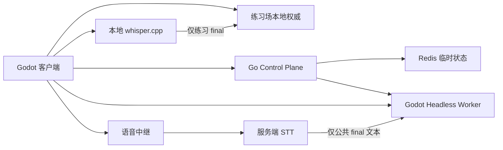

# E0-03 架构与协议 ADR

> **Issue**：[#223](https://github.com/jingx8885/mahjong-game/issues/223)（父 Epic [#214](https://github.com/jingx8885/mahjong-game/issues/214)）
> **状态**：Accepted（E0 基线冻结）
> **日期**：2026-07-22
> **产品契约**：[`2026-07-22-multiplayer-trash-talk-prd.md`](./2026-07-22-multiplayer-trash-talk-prd.md)
> **Epic PRD**：[`2026-07-22-multiplayer-trash-talk-epics.md`](./2026-07-22-multiplayer-trash-talk-epics.md)
> **Master Plan**：[`../plans/2026-07-22-multiplayer-trash-talk-master-plan.md`](../plans/2026-07-22-multiplayer-trash-talk-master-plan.md)

本文是桌面 Alpha 的**架构职责与协议契约唯一权威 ADR**。后续 E1–E5、E7 实现必须以本文与总 PRD 为准；冲突时先改本文/PRD，再改代码。

**网络端到端未验证。** 本文仅冻结契约与边界，不实现服务、不引入社区插件、不声明任何公网四客户端链路已通过。

---

## 1. 决策摘要

| 决策 | 冻结结论 |
|---|---|
| 根目录 `main.go` | **仅** Railway `/` 与 `/api/health` 健康检查桩；**不扩张**为 Control Plane 或游戏服 |
| 公共权威 | Godot Headless Worker 独占牌墙、随机数、合法性、AI、技能、道具、RewardWindow、发奖与事件序列 |
| 练习权威 | 同一套纯逻辑本地权威（Godot 进程内）；不经 Control Plane / 服务端 STT |
| 匹配与路由 | 独立 Go Control Plane + Redis 临时状态；不跑日麻规则 |
| 语音 | 独立 WebSocket 中继；有界内存；不落盘 |
| STT | 双层：本地 whisper.cpp（字幕/练习评分输入）+ 服务端 faster-whisper（公共权威 final）+ new-api 回退 |
| 协议 | 版本化命令 / 事件 / 快照；`NetworkedEvent` 六键 envelope + 必填 `view_hash`；`command_id` 同指纹幂等、异指纹 `COMMAND_ID_CONFLICT`；`server_seq` 单调；可解析 JSON |
| RewardWindow | 开窗 4 个互不重复 `item_id` 奖池；24 弃 + CLOSING + 双边界 + 1500ms + CLAIM 屏障；三出口优先级固定 |
| Momentum | 仅五类 affinity/标签枚举；旧技能倍率不进生产协议或结算 |
| 非目标 | **无 E6**；无举报、静音、语音设置、自动禁言契约 |

---

## 2. 范围、非目标与并行边界

### 2.1 范围内

- Control Plane / Redis / Headless Worker / 练习本地权威 / 语音中继 / 双层 STT 的职责、信任与部署边界
- 最小 HTTP、牌局 WebSocket、语音 WebSocket 包络与稳定错误码形态
- RewardWindow 三出口、条件式 `ITEM_GRANTED`、多实例库存、武装与 `ITEM_USE` 命令语义
- 故障、超时、重连、AI 接管、STT 回退与确定性回放数据流
- #241 / #247 / #252 / #253 的单一所有权边界（实现归后续 Issue，契约在本文写死）

### 2.2 非目标

- 不实现任何服务代码、Worker 进程或客户端接线
- 不引入未评估的社区插件
- **不存在 E6**：语音举报、证据缓冲、音频上传、人工审核、对象存储、按座位静音、语音音量/总开关、自动临时禁言及任何同义占位 API/UI
- 不在本 ADR 定义 E0-04 测试矩阵细节（归 [#224](https://github.com/jingx8885/mahjong-game/issues/224)）
- 不在本 ADR 做代码/IP 盘点（归 [#222](https://github.com/jingx8885/mahjong-game/issues/222)）

### 2.3 E0 并行边界（#222 / #223 / #224）

| Issue | 唯一产物 | 不得抢写 |
|---|---|---|
| #222 E0-02 | 代码/IP/角色/道具盘点文档 | 架构职责、协议 schema、验收矩阵 |
| **#223 E0-03（本文）** | **本 ADR 唯一文件** | 盘点表、测试矩阵、业务代码 |
| #224 E0-04 | 验收矩阵与 Alpha DoD | 架构决策、协议字段、业务代码 |

三者依赖关系为：#221 完成后，**#222 / #223 / #224 可独立并行**；#224 验收引用本文协议与 #222 盘点，但三者写文件不重叠。本 Issue **只新增**
`docs/superpowers/specs/2026-07-22-e0-03-architecture-protocol-adr.md`。

---

## 3. 代码事实前提

| 事实 | 约束 |
|---|---|
| 根 `main.go` | 仅健康检查桩；Railway 探针依赖它；**Alpha 与后续服务不得把游戏逻辑塞进该文件** |
| 新增后端 | 必须使用**独立目录 + 独立 Go module**（例如未来 `controlplane/`），不复用根 module 扩张职责 |
| 根 `Dockerfile` / `start.sh` | 继续服务健康检查桩部署；Control Plane / Worker / STT 使用独立拓扑（E7） |
| Godot 主路径 | 生产将切向大厅；既有日麻引擎在 `core/` / `battle/`；联机骨架 `NetworkedBattleController` / `LocalLoopbackServer` 仅作参考，**不是**生产权威 |
| 网络 | 本仓无对战服；凡涉及公共 WebSocket / 公网路径的后续 PR，在真实四客户端验证前必须声明 **「网络端到端未验证」** |

---

## 4. 组件职责、信任与部署



### 4.1 职责矩阵

| 组件 | 唯一职责 | 信任边界 | 不得承担 |
|---|---|---|---|
| **Godot 客户端** | UI、输入、音频播放、练习场本地权威、公共场权威事件投影 | 不信任自身对公共牌局/发奖的计算结果 | 公共场牌墙、合法性、AI、评分、发奖 |
| **练习场本地权威** | 与 Worker **同一套**纯逻辑：TurnEngine、AI、RewardWindow、库存、武装 | 单机可信；不连接公共队列/房间/服务端 STT | 向公共场注入事件或伪造公共 `ITEM_GRANTED` |
| **Go Control Plane** | 游客会话、队列、房间/Worker 分配、令牌签发、STT 路由元数据 | 信任 Redis 租约与 Worker 注册；不信任客户端自报 seat/隐藏牌 | 日麻规则、牌墙、RewardWindow、发奖 |
| **Redis** | 临时队列、ticket、房间租约、Worker 注册/心跳 | 可丢可重建的临时状态 | 永久账号资料、权威牌局状态、事件日志永久存储 |
| **Godot Headless Worker** | 公共场**全部**权威：牌墙、RNG、合法行动、AI、技能、道具、窗口、矩阵/取消、分配、库存、武装、`server_seq` 事件流 | 唯一可信状态源；客户端命令仅输入 | 跨房匹配、账号、原始音频持久化 |
| **语音中继** | 同房 PCM 广播 + 送入 STT；有界背压 | 鉴权到 `room_id + seat + session` | 改牌局状态、选道具、评分 |
| **服务端 STT** | VAD、转写、主备去重；输出文字 | 只产出文本；响应 Worker 的 deadline/cancel | 第二个窗口计时器、发奖、改库存 |
| **本地 whisper.cpp** | 即时字幕；练习场 final 作为本地权威评分输入 | 公共场本地结果**不可信**为评分源 | 公共场发奖、伪造服务端 final |

### 4.2 信任原则

1. **公共场**：客户端只提交**命令**与语音帧；所有状态变更以 Worker 事件为准。
2. **练习场**：本地权威复用同一规则与事件 schema；本地字幕 final **可以**进入本地评分；**不得**假装为公共 Worker 事件。
3. **字幕不发奖**：任何 UI 字幕、partial、本地转写均无发奖权；公共到账反馈**只认**权威 `ITEM_GRANTED`。
4. **STT/LLM 无发奖权**：转写与任何 LLM 不得选择道具、写库存或发射 `ITEM_*` / `REWARD_WINDOW_*`。
5. **伪造拒绝**：客户端提交的计算结果、隐藏牌、伪造 `ITEM_GRANTED` / `REWARD_WINDOW_*` 或擅自携带权威字段，必须被拒绝并返回稳定 `ERROR` **控制响应**（非业务事件）。

### 4.3 部署约束

| 部署项 | Alpha 约束 |
|---|---|
| 根 `main.go` | 保持健康检查桩；**不**承载 Control Plane |
| Control Plane | 独立 Go module；`/healthz`、`/readyz`；优雅关闭 |
| Redis | 开发/测试用真实 Redis；不以内存 map 冒充队列核心语义 |
| Worker | Godot headless；向 CP 注册容量与租约 |
| STT | 可独立进程；由 CP 路由；遵从 Worker 边界 |
| 凭证 | 仅环境变量/本地私密配置；**不入库** |
| 可复现拓扑 | E7 一条命令拉起 CP + Redis + STT + ≥1 Worker |
| 热迁移 | Alpha **不承诺**跨 Worker 热迁移；Worker 失联 → 房间失败，CP 停新分配 |

---

## 5. 模式与权威选择

公开枚举（稳定协议值，E2-01 序列化）：

| 枚举 | 合法值 |
|---|---|
| `GameMode` | `STANDARD` \| `TRASH_TALK` |
| `RoomKind` | `PRACTICE` \| `PUBLIC_CASUAL` |
| `RoundKind` | `EAST` \| `HANCHAN` |
| `ParticipantKind` | `HUMAN` \| `AI` |

| 场景 | 权威进程 | 语音/STT | 发奖权 |
|---|---|---|---|
| 练习 × 标准 | 本地 | 不创建 | 无 |
| 练习 × 欢乐 | 本地 | PTT + 本地 whisper final | **本地**确定性规则（同 Worker 逻辑） |
| 公共 × 标准 | Worker | 不创建 | 无 |
| 公共 × 欢乐 | Worker | PTT + 中继 + 服务端 final；本地仅字幕 | **Worker** 确定性规则 |

`STANDARD` 为**构造期硬隔离**：不实例化角色能力、道具库存、RewardWindow、Momentum、语音采集/传输；不能仅隐藏 UI。相关命令一律拒绝。

---

## 6. 协议总则

### 6.1 版本

- Alpha **仅支持** `protocol_version: 1`。
- 握手或首包携带不兼容版本 → **拒绝**，不做静默降级。
- 规则/分配版本独立字段：`rule_version`、`assignment_version`；与协议主版本正交。
- 快照模块扩展使用稳定 `module_key` + `schema_version` + `payload`（见 §9 / #241）；协议字段不得使用 `module_version` 或模块级 `data`。

### 6.2 幂等与序号

| 机制 | 规则 |
|---|---|
| `command_id` | 客户端生成 UUID；**首次处理时**绑定业务指纹（见下）；同 ID 同指纹才幂等重放 |
| `client_seq` | 每座位单调，用于调试/缺口检测；**不参与**业务指纹，也**不能**代替 `command_id` 幂等 |
| `server_seq` | Worker（或练习本地权威）全局单调递增；事件与快照边界的唯一续传锚点；幂等命中与 `COMMAND_ID_CONFLICT` **均不**分配新业务 `server_seq` |
| `view_hash` | 业务事件 envelope **必填**；该 recipient 的 public view 经 canonical JSON 后的 SHA-256（64 小写 hex）；分叉 → 停止预测并 `RESYNC_REQUEST`（语义见 §8.2） |

**业务指纹（首次处理绑定，全文唯一解释）**：

- 首次处理某 `command_id` 时，权威绑定指纹：
  `session_id + room_id + seat + hand_seq + decision_id + kind + 规范化 payload 指纹`
- `hand_seq` 与 `decision_id` 参与业务指纹；同一 `command_id` 不得跨局或跨决策窗回放旧结果。
- **`client_seq` 不参与**业务指纹。
- 规范化 payload 指纹：对 `payload` 做稳定字段序 / 类型规范化后的摘要（实现钉死算法即可；本 ADR 只要求可复现与可比较）。

**同 `command_id` 二次到达**：

| 情况 | 行为 |
|---|---|
| 同 ID **且**指纹与缓存完全一致 | **正常幂等命中**（成功路径）：返回/重放**原命令结果**或明确的原结果引用；**不**重发业务事件、**不**分配新 `server_seq`、**不**再次改变状态 |
| 同 ID **但**指纹与缓存不同 | **不是**正常重复：稳定拒绝 `COMMAND_ID_CONFLICT`；**不**改状态、**不**分配 `server_seq`、**不**覆盖已缓存的原结果/原指纹 |

幂等命中细则：

1. **不重新发射**任何业务事件（含 `ACTION_APPLIED`、`ITEM_*`、`REWARD_WINDOW_*`、`CHARACTER_ABILITY_*` 等）。
2. **不分配**新的 `server_seq`；权威状态与事件日志保持首次处理结果。
3. **不再次改变**牌局/库存/窗口/武装等权威状态。
4. 对调用方 **返回或重放原命令结果**，或返回明确的**原结果引用**（例如首次处理产生的 `server_seq` 区间 / 结果摘要句柄）；客户端必须视为**成功路径上的幂等命中**，不得当失败重试升级。
5. 可选诊断字段（如 `idempotent_replay: true`）仅可为**非错误元数据**，不得改写原结果语义，**不得**映射为 `ERROR` 控制响应或稳定错误码。

正常网络重试、重复投递与客户端重发：只要指纹一致，适用幂等命中。**首次处理**本身若已是拒绝（稳定 `ERROR` 控制响应，含首次拒绝缓存语义）且指纹一致，重复提交仍返回**同一拒绝结果**，同样不二次改状态、不新分配业务 `server_seq`、不覆盖缓存。正常幂等命中**不是** `ERROR`。

### 6.3 传输形态

- 牌局控制面：WebSocket **文本 JSON**（客户端命令、权威业务 `NetworkedEvent`、服务端控制响应）。
- 语音：独立 WebSocket；控制帧文本 JSON + 二进制 PCM 帧。
- 所有示例 JSON **必须**可被标准 JSON 解析器解析（本 ADR 内示例已自检）。

### 6.4 服务端控制响应 `ERROR`（非业务事件）

**冻结（解决 ERROR / `server_seq` 冲突，全文唯一解释）**：

| 类别 | 规则 |
|---|---|
| 权威业务 `NetworkedEvent`（`ServerEvent`） | 业务事件流与回放日志中的每一条**全部**使用 §8.2 六键 envelope（含 `server_seq` 与必填 `view_hash`）；属于 `EventKind` |
| `ERROR` | **服务端控制响应**（WebSocket response / control frame；HTTP 使用**同逻辑**错误体），`ServerControlKind = ERROR` |
| 非 `EventKind` | `ERROR` **不属于**权威业务 `EventKind`，**不进入**回放日志，**不带** `server_seq` / `view_hash`，**不改**权威状态 |
| `COMMAND_ID_CONFLICT` | 经该控制响应返回，因此**不分配** `server_seq` |
| 正常幂等命中 | **不是** `ERROR`，走成功路径的原结果/引用 |

WebSocket `ERROR` 控制响应示例（可解析；**无** `server_seq` / `view_hash`）：

```json
{
  "protocol_version": 1,
  "room_id": "room_x",
  "kind": "ERROR",
  "command_id": "550e8400-e29b-41d4-a716-446655440000",
  "request_id": "req_optional",
  "code": "COMMAND_ID_CONFLICT",
  "message": "command_id fingerprint mismatch"
}
```

- `command_id` / `request_id` 均可空（无对应命令时省略或为 `null`）。
- 客户端**只按 `code` 分支**。HTTP 错误体使用相同 `code` / `message` / 可选 `request_id` 逻辑字段，不伪装为带 `server_seq` 的业务事件。

典型稳定码（实现可扩充，不得静默改义）：

| code | 含义 |
|---|---|
| `PROTOCOL_VERSION_UNSUPPORTED` | 版本不兼容 |
| `UNAUTHORIZED` | 令牌无效/过期/跨房跨座 |
| `COMMAND_REJECTED` | 非法座位/错回合/非法牌/模式拒绝（**首次处理**判定的业务拒绝） |
| `COMMAND_ID_CONFLICT` | 同 `command_id` 但业务指纹与已缓存不同；控制响应拒绝；不改状态、不分配 `server_seq`、不覆盖原结果 |
| `FORGERY_REJECTED` | 伪造服务端专属字段/事件/计算结果（含客户端 `PTT_END` 擅自携带权威字段） |
| `RESYNC_REQUIRED` | 要求快照续传 |
| `ROOM_FAILED` | Worker 失联等房间级失败 |

**明确禁止**：不得将**正常幂等命中**（同 ID 同指纹）定义为 `COMMAND_DUPLICATE` 或任何 `ERROR` `code`。幂等命中不属于错误表。指纹冲突只用 `COMMAND_ID_CONFLICT`，**不要**恢复或使用 `COMMAND_DUPLICATE`。禁止把 `ERROR` 写进权威业务事件流或回放日志。

---

## 7. HTTP（Control Plane）

| 方法与路径 | 用途 | 关键结果 |
|---|---|---|
| `POST /v1/guest-sessions` | 游客会话 | `guest_id`、`display_name`、`session_token`、`expires_at` |
| `POST /v1/queues/casual` | 加入公共队列 | `ticket_id`、规则组合、`queued_at`、`deadline_at` |
| `GET /v1/queues/casual/{ticket_id}` | 查询分配 | `waiting` 或 Worker/room/seat/token |
| `DELETE /v1/queues/casual/{ticket_id}` | 取消排队 | 幂等取消 |
| `GET /healthz`、`GET /readyz` | 探针 | 进程与依赖状态 |

约束：

- 匹配池按 `round_kind + game_mode` 隔离；重复加入同池返回既有 ticket。
- 四真人到齐**立即**开房；最早 ticket 自 `queued_at` 起 **30 秒**后补 1–3 AI，且**只创建一个**房间。
- 游客 `session_token` **不可**直接当房间令牌；房间令牌绑定 `room_id + seat + session_id + expires_at`。
- **根 `main.go` 的 `/api/health` 与上述 CP 探针是不同进程职责，禁止合并进根桩。**

---

## 8. 牌局 WebSocket 协议

### 8.1 客户端命令包络

对局业务命令使用 `Action v1`；与 `godot/protocol/action.gd` 的唯一 DTO 契约对齐，顶层键必须恰好为以下九个键：

| 字段 | 类型 / 约束 |
|---|---|
| `protocol_version` | `int`，固定 `1` |
| `command_id` | UUID 字符串（`8-4-4-4-12` hex） |
| `room_id` | 非空 `String` |
| `seat` | `int`，仅 `0..3`；越界在 DTO 边界拒绝（`from_dict`/`helper` 返回 null） |
| `hand_seq` | `int`，必须落在可安全生成本局牌实体 ID 的范围 |
| `decision_id` | 当前权威 `DecisionWindow` 的 UUID；旧窗或错窗命令拒绝 |
| `kind` | 稳定字符串对局 ActionKind（拒绝 int enum / 旧 `PASS_CLAIM` / `DRAW`） |
| `payload` | 按 kind **精确 schema**（多字段 / 缺字段 / 错类型一律拒绝） |
| `client_seq` | 非负 `int` |

```json
{
  "protocol_version": 1,
  "command_id": "550e8400-e29b-41d4-a716-446655440000",
  "room_id": "room_x",
  "seat": 0,
  "hand_seq": 0,
  "decision_id": "550e8400-e29b-41d4-a716-446655440010",
  "kind": "DISCARD",
  "payload": {
    "tile_instance_id": 4
  },
  "client_seq": 12
}
```

**对局 `Action v1` 集合（kind）**：

`DISCARD`、`CHI`、`PON`、`KAN`、`RIICHI`、`RON`、`TSUMO`、`PASS`、`ITEM_USE`、`DECLARE_ABORTIVE_DRAW`。

`JOIN`、`READY`、`RESYNC_REQUEST` 属于会话 / 传输控制命令，由 E3 的控制协议定义；它们**不是** `Action v1`，不得伪造 `decision_id` 后进入牌局行动入口。

#### 按 kind 的精确 payload schema（Action v1 冻结）

| kind | payload 精确键 | 说明 |
|---|---|---|
| `DISCARD` / `RIICHI` | `{ "tile_instance_id": int }` | 实体必须属于 envelope 的 `hand_seq` |
| `CHI` / `PON` | `{ "companion_tile_instance_ids": [int, int] }` | 两个实体互异且属于本局；被鸣牌与弃牌座来自权威窗口，不由客户端重复声明 |
| `KAN` | MINKAN：`{ "kan_kind": "MINKAN", "companion_tile_instance_ids": [int, int, int] }`；ANKAN：`{ "kan_kind": "ANKAN", "tile_instance_ids": [int, int, int, int] }`；ADDED_KAN：`{ "kan_kind": "ADDED_KAN", "meld_id": int, "added_tile_instance_id": int }` | 所有牌实体必须属于本局；`kan_kind ∈ {MINKAN, ANKAN, ADDED_KAN}` |
| `RON` | `{}` | 和牌张与放铳 / 加杠座来自权威窗口 |
| `TSUMO` / `PASS` | `{}` | 空对象；非空拒绝。`PASS` 替代已删除的 `PASS_CLAIM` |
| `ITEM_USE` | `{ "item_instance_id": string }` | 非空字符串；**仅命令** |
| `DECLARE_ABORTIVE_DRAW` | `{ "reason": "KYUUSYU_KYUUHAI" }` | Alpha **冻结**九种九牌唯一 reason；其它 reason 拒绝 |

#### `ITEM_USE`（仅命令）

```json
{
  "protocol_version": 1,
  "command_id": "550e8400-e29b-41d4-a716-446655440001",
  "room_id": "room_x",
  "seat": 0,
  "hand_seq": 0,
  "decision_id": "550e8400-e29b-41d4-a716-446655440011",
  "kind": "ITEM_USE",
  "payload": {
    "item_instance_id": "inst_abc"
  },
  "client_seq": 13
}
```

- `ITEM_USE` **不是**服务端业务 `EventKind`。
- 权威**首次处理**并采纳命令后，**只**通过 `ITEM_CONSUMED`（实例移除时）和/或 `ITEM_APPLIED`（效果已应用）表达结果。
- Alpha **不定义**「使用已接受」回声业务事件；拒绝则返回 `ERROR` **控制响应**（§6.4），不进入回放日志。

#### `DECLARE_ABORTIVE_DRAW`（九种九牌）

```json
{
  "protocol_version": 1,
  "command_id": "550e8400-e29b-41d4-a716-446655440002",
  "room_id": "room_x",
  "seat": 0,
  "hand_seq": 0,
  "decision_id": "550e8400-e29b-41d4-a716-446655440012",
  "kind": "DECLARE_ABORTIVE_DRAW",
  "payload": {
    "reason": "KYUUSYU_KYUUHAI"
  },
  "client_seq": 14
}
```

- Alpha 仅承认 `reason = "KYUUSYU_KYUUHAI"`；扩展其它中途流局 reason 须另开协议修订。

### 8.2 权威业务事件包络（`NetworkedEvent` / `ServerEvent`）

线上业务事件 DTO 为 **`NetworkedEvent`**（文档亦称 `ServerEvent`）。权威业务事件流与回放日志中的每一条 envelope **顶层键必须恰好**为以下六个键（多键/缺键/错名一律拒绝）：

`protocol_version` · `server_seq` · `room_id` · `kind` · `payload` · `view_hash`

| 字段 | 约束 |
|---|---|
| `protocol_version` | `int`，固定 `1` |
| `server_seq` | 正整数；与房间内业务序号空间单调 |
| `room_id` | 非空字符串 |
| `kind` | 稳定 `EventKind` 字符串 |
| `payload` | 按 kind 的精确 schema（Dictionary） |
| `view_hash` | **必填**；64 位小写 hex（SHA-256） |

**`view_hash` 语义（全文唯一解释）**：

1. **`ROOM_SNAPSHOT`**：`view_hash` = **该 recipient 的 public projection**（本快照 payload 所承载的座位可见投影）经 **canonical JSON** 后的 SHA-256。
2. **其它业务事件**：`view_hash` = **该事件应用后**，**同一 recipient** 的 public view 经 **canonical JSON** 后的 SHA-256（**不是**对本事件 `payload` 本身取哈希）。
3. **不同 recipient** 的 `view_hash` **可以不同**；客户端用它做分叉检测：不匹配 → 停止预测并 `RESYNC_REQUEST` / `RESYNC_REQUIRED`。

**DTO 字段纪律**：

- 协议 DTO（含 envelope、`payload`、`modules` 及任意嵌套对象）**递归禁止**历史私有/全量状态摘要字段名；线上分叉检测**仅**允许 envelope 顶层 `view_hash`。
- **`AuthorityReplaySnapshot`** 是服务端内部恢复与确定性回放结构，**不进入**线上协议 envelope、`payload` 或 `modules`；不得与 recipient public projection / `view_hash` 混用或混发。

`ERROR` **不是**本集合成员（见 §6.4）。

```json
{
  "protocol_version": 1,
  "server_seq": 42,
  "room_id": "room_x",
  "kind": "ACTION_APPLIED",
  "payload": {},
  "view_hash": "e3b0c44298fc1c149afbf4c8996fb92427ae41e4649b934ca495991b7852b855"
}
```

**最小业务事件集合（`EventKind`）**：

`ROOM_SNAPSHOT`、`PLAYER_JOINED`、`TURN_PROMPT`、`ACTION_APPLIED`、`CLAIM_WINDOW`、`REWARD_WINDOW_OPENED`、`REWARD_WINDOW_CLOSING`、`REWARD_WINDOW_SETTLED`、`REWARD_WINDOW_CANCELLED`、`ITEM_GRANTED`、`ITEM_CONSUMED`、`ITEM_APPLIED`、`CHARACTER_ABILITY_ARMED`、`CHARACTER_ABILITY_DISARMED`、`HAND_SETTLED`、`MATCH_SETTLED`

**服务端控制 kind（`ServerControlKind`，非业务事件）**：`ERROR`（见 §6.4）。

### 8.3 发射所有权（单一权威）

| 事件/状态 | 唯一业务发射/写入方 | 说明 |
|---|---|---|
| 全部 `REWARD_WINDOW_*`、phase、`window_exit`、双边界、`grace_deadline_at`、结算屏障 | **#252 / Worker（或练习本地权威同逻辑）** | 绝不发 `ITEM_GRANTED` |
| 条件式 `ITEM_GRANTED`、库存、`active_window_id`/`pending_window_id`、`ITEM_CONSUMED`/`ITEM_APPLIED`、`CHARACTER_ABILITY_*` | **#253（同一权威事务内消费 settle）** | 仅 `FULL_GRANT` 后 seat 0–3 各一次 `ITEM_GRANTED` |
| 基础快照包络、`server_seq` 续传、module provider 组合接口 | **#241** | E3 用测试 provider；不提前实现 E5 字段 |
| STT final / cancel 响应 | **#247** | 只遵从 Worker 边界/deadline；**不**创建第二个权威计时器 |
| schema/偏序 fixture（不发射业务） | **#232** | 生产适配层不得发射任何 `REWARD_WINDOW_*` / `ITEM_GRANTED` / `CHARACTER_ABILITY_*` |

不存在第二种 GRANT 业务事件。UI 动画不得推断库存。

---

## 9. 快照、重连与 AI 接管

### 9.1 `ROOM_SNAPSHOT`

`protocol_version: 1` 的 `ROOM_SNAPSHOT` **冻结不变量**（实现与测试必须断言；禁止模糊近似表述）：

1. `envelope.server_seq == payload.snapshot_server_seq`
2. `payload.next_server_seq == payload.snapshot_server_seq + 1`

违反任一条即为非法快照，客户端不得局部应用；应稳定 `RESYNC_REQUIRED` 或断开后重拉（由 #241 实现细节收口）。

```json
{
  "protocol_version": 1,
  "server_seq": 100,
  "room_id": "room_x",
  "kind": "ROOM_SNAPSHOT",
  "payload": {
    "snapshot_server_seq": 100,
    "next_server_seq": 101,
    "seat_view": 0,
    "modules": [
      {
        "module_key": "core_table",
        "schema_version": 1,
        "payload": {}
      }
    ]
  },
  "view_hash": "e3b0c44298fc1c149afbf4c8996fb92427ae41e4649b934ca495991b7852b855"
}
```

| 规则 | 说明 |
|---|---|
| v1 序号不变量 | `server_seq == snapshot_server_seq` 且 `next_server_seq == snapshot_server_seq + 1`（强制） |
| `view_hash` | 该 recipient 的 public projection 经 canonical JSON 后的 SHA-256（§8.2）；生产实现须与校验器对完整 payload 的 canonical 哈希一致 |
| 续传边界 | 以 `snapshot_server_seq` 为已应用上限；客户端从 `next_server_seq`（恒为 +1）起消费后续增量事件 |
| modules 字段 | 每个 module 冻结为 `module_key` + `schema_version` + 按座位裁剪的 `payload`；**禁止**协议字段名 `module_version` 或模块级 `data`；modules 内亦适用 §8.2 递归字段纪律 |
| #241 | 只冻结基础包络 + 稳定 module provider 注册/组合/恢复（每 `module_key` 恰好一个 provider）；测试 provider round-trip；不读取/改写模块业务字段 |
| #252 | 后续提供 RewardWindow DTO/provider（phase、`window_exit`、奖池、双边界、`grace_deadline_at` 等） |
| #253 | 后续提供该席 `ItemInstance[]`、`active_window_id`/`pending_window_id` DTO/provider |
| STANDARD | 不注册欢乐场 module key；快照不得出现窗口/库存/武装模块 |

### 9.2 掉线 / 重连 / AI

| 场景 | 行为 |
|---|---|
| 掉线 | 保留座位 **30 秒** |
| 超时 | Worker AI **接管**该席；房间继续 |
| 本局内重连 | 下发 `ROOM_SNAPSHOT` + 增量；在**安全行动边界**归还控制 |
| 跨局 | Alpha 仅承诺本局内恢复；不承诺跨 match 占座 |
| `view_hash` 分叉 | `RESYNC_REQUIRED` → 快照覆盖本地预测（不同 recipient 的 `view_hash` 可不同） |

---

## 10. 语音 WebSocket

### 10.1 控制帧 kind

`PTT_START`、`PTT_END`、`TRANSCRIPT_PARTIAL`、`TRANSCRIPT_FINAL`

**`PTT_END` 方向与权威归一化（全文唯一解释）**：

1. **客户端请求** `PTT_END`：只标识本席结束说话，**只带** `utterance_id`（及 room/seat/protocol 等鉴权上下文）。**不得发送、选择或伪造 `server_seq` / `server_seq_ref` 或其他仅权威可写字段**。
2. 若客户端请求**携带** `server_seq`、`server_seq_ref` 或其他权威字段：必须稳定返回 `FORGERY_REJECTED` **控制响应**（§6.4）；**整条**该 `PTT_END` **不得**进入权威归一化、**不得**获得 `server_seq`、**不得**参与语音边界。**禁止静默忽略**。
3. Worker / 练习本地权威对**合法**客户端请求**首次处理**并采纳后，形成**同 kind** 的**权威归一化** `PTT_END`，**才**写入 `server_seq`（与牌局业务事件同一单调序号空间），并回送客户端 / 转交 STT。
4. 全文语音边界**只认**该权威版本：`PTT_END.server_seq <= closing_boundary_server_seq`。
5. `TRANSCRIPT_FINAL.ptt_end_server_seq` **复制**权威 `PTT_END.server_seq`，供 STT 结果绑定 utterance。
6. 不引入第二个时钟；窗口宽限仍只认 Worker 唯一 `grace_deadline_at`（§11.2 / #252）；#247 不创建第二个 deadline。

客户端请求示例（**无** `server_seq`）：

```json
{
  "protocol_version": 1,
  "room_id": "room_x",
  "seat": 0,
  "kind": "PTT_END",
  "utterance_id": "utt_1"
}
```

权威归一化 `PTT_END` 示例（**有** `server_seq`；仅此版本参与边界）：

```json
{
  "protocol_version": 1,
  "room_id": "room_x",
  "seat": 0,
  "kind": "PTT_END",
  "utterance_id": "utt_1",
  "server_seq": 88
}
```

`TRANSCRIPT_FINAL` 继续复制权威序号：

```json
{
  "protocol_version": 1,
  "room_id": "room_x",
  "seat": 0,
  "kind": "TRANSCRIPT_FINAL",
  "utterance_id": "utt_1",
  "text": "example",
  "lang": "zh",
  "ptt_end_server_seq": 88,
  "source": "faster_whisper"
}
```

### 10.2 二进制音频帧

- PCM16 little-endian、16 kHz、单声道、20 ms 帧。
- 固定头包含：协议版本、座位、`utterance_id`、帧序号、采样格式。
- 允许跳帧；**禁止**为慢客户端无限缓存或阻塞牌局命令通道。
- 背压：丢弃过旧语音帧。
- 原始音频仅房间生命周期内有界内存；断开/完成后释放，**不写磁盘**。

### 10.3 双层 STT 与评分输入

| 层 | 组件 | 用途 | 可否进入公共评分 |
|---|---|---|---|
| 本地 | whisper.cpp multilingual small | 中英日 partial/final 字幕；练习场 final | **否**（公共）；练习 **是**（本地权威） |
| 服务端主 | faster-whisper small + VAD | 公共权威 final | **是**（唯一文本源侧） |
| 回退 | new-api `/v1/audio/transcriptions` | 主失败/超时后仅最终片段 | 与主结果**同 utterance 至多采用一次** |

- 公共本地字幕**不得**进入评分或发奖。
- 主备均失败：该 utterance 无权威文本、不累计窗口文本；**牌局继续**。
- #247 **不得**维护第二个 `grace_deadline`；只按 Worker 给出的 `closing_boundary_server_seq` / `grace_deadline_at` 返回或取消 final。

---

## 11. RewardWindow 冻结契约

### 11.1 生命周期与合法转换

```text
OPEN → CLOSING → SETTLED | CANCELLED
OPEN → CANCELLED
```

- **开窗奖池**：每个 RewardWindow 在 `REWARD_WINDOW_OPENED` 时由权威确定性选出并公开 **恰好 4 个互不重复的 `item_id`**；客户端不得选择、替换或伪造奖池。三出口（`FULL_GRANT` / `DISPLAY_ONLY` / `CANCELLED_BY_WIN`）不改变该“四件互不重复”开窗契约。
- 流局 / 终场非和牌展示即使未满 24，也必须先 `CLOSING` 再 settle。
- Alpha **只有权威和牌**可 cancel；流局**不得**复用 cancel。
- 禁止：`SETTLED → CANCELLED`、`CANCELLED → SETTLED`、`DISPLAY_ONLY → ITEM_GRANTED`。
- 重复 close/settle/cancel/grant/consume 必须**幂等**（同 §6.2：不二次改状态、不新分配业务 `server_seq`、不重发已落定业务事件）。

### 11.2 24 弃、CLOSING、双边界、1500ms、CLAIM 屏障

| 概念 | 定义 |
|---|---|
| 弃牌计数 | 每应用一次权威弃牌事件 +1；满 **24** 进入关闭路径 |
| `REWARD_WINDOW_CLOSING` | 第 24 弃后**立即**发出；同时写 `closing_boundary_server_seq`，关闭新语音输入，设唯一权威 `grace_deadline_at`（最多 **1500ms**） |
| 语音边界 | `closing_boundary_server_seq`：仅**权威** `PTT_END.server_seq <= closing_boundary_server_seq` 的 utterance 可在宽限内提交 final（客户端请求无 `server_seq`；误带权威字段 → `FORGERY_REJECTED` 且整条不归一化；`TRANSCRIPT_FINAL.ptt_end_server_seq` 复制权威序号；无第二时钟） |
| 上下文边界 | `context_boundary_server_seq`：无和牌时，CLAIM 完成或无 CLAIM 的结果判定序号；**不得与语音边界混用** |
| 并行 | 第 24 弃后 **CLAIM 与剩余 1500ms STT 宽限并行** |
| 荣和抢占 | 权威和牌一成立：中止宽限 → `REWARD_WINDOW_CANCELLED`；迟到 final **不跨窗** |
| `claim_is_terminal` | (1) 全部 CLAIM 资格动作终态且非和牌鸣牌已应用；或 (2) 无开放 CLAIM 且权威结果已在同一事务判定为流局/终场非和牌（立即 true） |
| 结算屏障 | `claim_is_terminal AND (all_eligible_utterances_are_terminal OR now >= grace_deadline_at)`；和牌 cancel **立即**中止屏障 |
| 屏障后 | 在下一次摸打/岭上/出牌提示/道具技能等状态推进前发出 `SETTLED` 或走 cancel 路径；纯 UI 动画**不**属屏障 |

### 11.3 `window_exit` 三值与出口优先级

权威状态字段 `window_exit`（OPEN/CLOSING 时为 `null`）：

| 值 | 何时 | 评分/分配 | `ITEM_GRANTED` |
|---|---|---|---|
| `FULL_GRANT` | 比赛仍继续：满 24 无和牌，或非终场流局 | 4×4 矩阵 + 稳定双射分配 | 恰好 **4**（seat 0–3 各 1） |
| `DISPLAY_ONLY` | 整场结束且未走和牌取消 | 矩阵 + 展示分配 | **0** |
| `CANCELLED_BY_WIN` | 任意自摸/荣和 | 不评分、不分配 | **0**；事件为 `REWARD_WINDOW_CANCELLED` |

**出口优先级（固定）**：

```text
CANCELLED_BY_WIN > DISPLAY_ONLY > FULL_GRANT
```

- 取消后**不可**再 settle。
- 展示后**不可** grant。
- 终场和牌只走取消，不叠加展示出口。

### 11.4 `SETTLED` 与 `CANCELLED` 载荷约束

#### `REWARD_WINDOW_SETTLED.outcome` **仅两值**

`FULL_GRANT` | `DISPLAY_ONLY`

不得携带 `CANCELLED_BY_WIN`。

```json
{
  "protocol_version": 1,
  "server_seq": 120,
  "room_id": "room_x",
  "kind": "REWARD_WINDOW_SETTLED",
  "payload": {
    "window_id": "hand_3_window_1",
    "outcome": "FULL_GRANT",
    "settle_reason": "FULL_24_NO_WIN",
    "rule_version": "reward_v2",
    "assignment_version": "assign_v1",
    "prize_pool": ["item_a", "item_b", "item_c", "item_d"],
    "matrix_summary": {
      "scores": [
        [1000, 0, 0, 0],
        [0, 1000, 0, 0],
        [0, 0, 1000, 0],
        [0, 0, 0, 1000]
      ]
    },
    "assignment": {
      "0": "item_a",
      "1": "item_b",
      "2": "item_c",
      "3": "item_d"
    },
    "closing_boundary_server_seq": 110,
    "context_boundary_server_seq": 118,
    "grace_deadline_at": "2026-07-22T12:00:01.500Z",
    "grant_count": 4,
    "hand_seq": 3,
    "transcript_summary": {}
  },
  "view_hash": "e3b0c44298fc1c149afbf4c8996fb92427ae41e4649b934ca495991b7852b855"
}
```

`DISPLAY_ONLY` 时 `grant_count` 必须为 `0`。

#### `REWARD_WINDOW_CANCELLED` **仅** `cancel_reason`

- `cancel_reason` **固定** `CANCELLED_BY_WIN`
- **不含** `outcome`、**不含**矩阵
- 可含：可空 `closing_boundary_server_seq`、`grace_aborted`、`scored=false`、`grant_count=0`

```json
{
  "protocol_version": 1,
  "server_seq": 121,
  "room_id": "room_x",
  "kind": "REWARD_WINDOW_CANCELLED",
  "payload": {
    "window_id": "hand_3_window_1",
    "cancel_reason": "CANCELLED_BY_WIN",
    "closing_boundary_server_seq": 110,
    "grace_aborted": true,
    "scored": false,
    "grant_count": 0,
    "hand_seq": 3
  },
  "view_hash": "e3b0c44298fc1c149afbf4c8996fb92427ae41e4649b934ca495991b7852b855"
}
```

### 11.5 固定事件顺序（不得变体）

1. **满 24 无和牌**
   `ACTION_APPLIED(discard) → REWARD_WINDOW_CLOSING` →（CLAIM ∥ 宽限）→ 屏障 →
   `REWARD_WINDOW_SETTLED(FULL_GRANT) → ITEM_GRANTED(seat 0..3) → CHARACTER_ABILITY_DISARMED? → REWARD_WINDOW_OPENED(next) → CHARACTER_ABILITY_ARMED?` → 下一普通行动
   **不发** `HAND_SETTLED`。CLAIM 期间当前窗被动仍有效。

2. **任意和牌**
   `REWARD_WINDOW_CANCELLED → CHARACTER_ABILITY_DISARMED? → HAND_SETTLED`
   若已 CLOSING 则中止 STT 宽限。不得插入 `SETTLED`/矩阵/`ITEM_GRANTED`。整场结束则继续 `MATCH_SETTLED` 并清空库存/active/pending。

3. **非终场流局**
   写双边界/deadline → `CLOSING` → 屏障 →
   `SETTLED(FULL_GRANT) → 4×ITEM_GRANTED → DISARM? → HAND_SETTLED → 下一局 OPEN/ARM`
   奖励与 pending 可带入下一局。

4. **终场非和牌**
   `CLOSING` → 屏障 →
   `SETTLED(DISPLAY_ONLY) → DISARM? → HAND_SETTLED → MATCH_SETTLED`
   **0** `ITEM_GRANTED`；整场库存清空。

---

## 12. 道具、库存与角色武装

### 12.1 `ITEM_GRANTED` 必填字段

仅 `FULL_GRANT` 路径、由 #253 在 settle 同一权威事务内按 seat 0–3 发射：

```json
{
  "protocol_version": 1,
  "server_seq": 122,
  "room_id": "room_x",
  "kind": "ITEM_GRANTED",
  "payload": {
    "window_id": "hand_3_window_1",
    "rule_version": "reward_v2",
    "assignment_version": "assign_v1",
    "matched_rule_ids": ["stable_rule_id"],
    "item_id": "stable_item_id",
    "item_instance_id": "stable_instance_id",
    "seat": 0,
    "hand_seq": 3,
    "score": 2700,
    "affinity_match": true,
    "armed_for_window_id": "hand_3_window_2"
  },
  "view_hash": "e3b0c44298fc1c149afbf4c8996fb92427ae41e4649b934ca495991b7852b855"
}
```

| 字段 | 约束 |
|---|---|
| `window_id` | 来源窗口 |
| `rule_version` / `assignment_version` | 可回放版本钉 |
| `item_id` | 道具稳定 ID |
| `item_instance_id` | **全局唯一实例**；同 `item_id` 可多实例并存 |
| `seat` / `hand_seq` / `score` | 分配席、局序号、该席该件得分 |
| `matched_rule_ids` | 命中规则稳定 ID 列表 |
| `affinity_match` | 是否命中角色 affinity |
| `armed_for_window_id` | 可空；命中时登记下一窗 pending 的目标 `window_id` |

### 12.2 多实例与被动叠加

- 同一玩家可重复持有同 `item_id` 的不同 `item_instance_id`。
- 相同 `item_id` 的持续被动：**逐实例**注册、触发，按既有 hook 顺序叠加；**禁止**按 `item_id` 去重为一次效果。
- 使用/消耗只作用于命令指定的 `item_instance_id`。
- Alpha 不设人为库存容量上限；UI 滚动/分页，**不得**反向限制权威集合。
- 套装效果不在 Alpha。

### 12.3 库存事件驱动

| 动作 | 唯一认的事件 |
|---|---|
| 新增库存 | 仅 `ITEM_GRANTED` |
| 移除实例 | 仅指定实例 `ITEM_CONSUMED`，或 `MATCH_SETTLED` 清场 |
| 效果反馈 | 仅 `ITEM_APPLIED` |
| 禁止 | 从 `SETTLED` 或动画推断库存 |

### 12.4 武装与 DISARM 不回滚

| 字段 | 语义 |
|---|---|
| `active_window_id` | 当前窗已武装 |
| `pending_window_id` | 仅下一窗目标；OPEN/CLOSING 时 pending 必须已被消费或为空 |

- 目标 `REWARD_WINDOW_OPENED` **原子**消费匹配 pending → active。
- `ITEM_GRANTED` 可在同事务登记 next pending；若 pending 已非空 → **不变量错误**，禁止静默覆盖。
- `CHARACTER_ABILITY_DISARMED` **只清 active**，不得清刚登记的 next pending。
- `DISPLAY_ONLY` / `CANCELLED_BY_WIN` **不**登记 pending。
- DISARM **只停止后续 hook 派发**；ARM 时已发生的揭示/清振听等权威副作用**不回滚**，遵循牌局状态自然生命周期。
- Match 级首窗无条件 unarmed；后续窗仅 pending 匹配时 arm。
- `GAME_BEGIN`-only 能力 ID（`char_washizu_passive_v1`、`char_awai_passive_v1`、`char_toki_passive_v1`）在目标窗 `CHARACTER_ABILITY_ARMED` 时执行既有 hook 等价激活。

`ITEM_CONSUMED` / `ITEM_APPLIED` 最小形态：

```json
{
  "protocol_version": 1,
  "server_seq": 130,
  "room_id": "room_x",
  "kind": "ITEM_CONSUMED",
  "payload": {
    "seat": 0,
    "item_id": "stable_item_id",
    "item_instance_id": "inst_abc",
    "command_id": "550e8400-e29b-41d4-a716-446655440001"
  },
  "view_hash": "e3b0c44298fc1c149afbf4c8996fb92427ae41e4649b934ca495991b7852b855"
}
```

```json
{
  "protocol_version": 1,
  "server_seq": 131,
  "room_id": "room_x",
  "kind": "ITEM_APPLIED",
  "payload": {
    "seat": 0,
    "item_id": "stable_item_id",
    "item_instance_id": "inst_abc",
    "effect_id": "stable_effect_id",
    "command_id": "550e8400-e29b-41d4-a716-446655440001"
  },
  "view_hash": "e3b0c44298fc1c149afbf4c8996fb92427ae41e4649b934ca495991b7852b855"
}
```

---

## 13. Momentum（五类 affinity）

生产协议与结算**只保留**五类 affinity/标签枚举（历史名可映射）：

| 稳定标签 | 历史属性名 |
|---|---|
| `DOMINATION` | 霸气 |
| `CALM` | 冷静 |
| `CUNNING` | 狡猾 |
| `PASSION` | 热血 |
| `MYSTIC` | 神秘 |

- 旧 `skill_effect_multiplier()` / 浮点气势累计**不进入**生产协议、评分或发奖。
- affinity 只在实际 `ITEM_GRANTED` 时判定是否登记 next arm。
- 评分矩阵只使用版本化标准化文本特征、关键词/模板、角色 affinity、道具标签与**权威公开**牌局上下文；无在线 LLM、无向量相似度、无隐藏牌。

---

## 14. 故障、回退、重连与回放数据流

| 场景 | 规定行为 |
|---|---|
| 重复队列加入 | 同池返回既有 ticket（成功幂等，非错误） |
| 30s 内四真人 | 立即开房 |
| deadline 不足四人 | 原子创建房间并补 AI |
| 同 `command_id` 同指纹 | 见 §6.2：返回/重放原结果或原结果引用；不重发业务事件、不分配新 `server_seq`、不二次改状态；**不是** `ERROR` 控制响应；禁止 `COMMAND_DUPLICATE` |
| 同 `command_id` 不同指纹 | `COMMAND_ID_CONFLICT` **控制响应**；不改状态、不分配 `server_seq`、不覆盖缓存原结果、不进回放日志 |
| `view_hash` 分叉 | 停预测 → 快照 / `RESYNC_REQUEST` |
| 非法 `ROOM_SNAPSHOT` 序号 | 违反 `server_seq == snapshot_server_seq` 或 `next == snapshot + 1` → 不部分应用；`RESYNC_REQUIRED` 控制响应 / 重拉 |
| 客户端 `PTT_END` 携带 `server_seq` / 权威字段 | `FORGERY_REJECTED` 控制响应；整条不进入权威归一化与边界；**禁止静默忽略** |
| 掉线 30s / AI 接管 / 重连 | 见 §9.2 |
| 本地 whisper 不可用 | 练习欢乐提示下载/重试；**禁止**伪造文字发奖 |
| faster-whisper 超时 | 最终片段 → new-api 回退 |
| 主备 STT 均失败 | 无权威字幕累计；牌局继续 |
| 满 24 | 双边界 + 并行 CLAIM/宽限；见 §11 |
| 24 弃后荣和 | cancel 抢占；不评分不发奖 |
| 其他自摸/荣和 | cancel + disarm；库存不变、不新武装 |
| 非终场流局未满 24 | `FULL_GRANT` 提前结算并发四件 |
| 终场非和牌 | `DISPLAY_ONLY`，0 grant，随后清空库存 |
| 语音背压 | 丢旧帧；牌局通道不受影响 |
| Worker 失联 | CP 停新分配；房间失败；无跨 Worker 热迁移 |

### 14.1 确定性回放输入（三出口可稳定重放）

同一 fixture 必须包含并可重放：

1. `protocol_version`、`rule_version`、`assignment_version`
2. `GameSessionConfig` 等价字段：seed、局制、模式、角色映射
3. 有序权威命令流（含 `command_id`）与 AI 确定性决策输入
4. 窗口内权威 final / AI 模板文本序列（按 `window_id + seat + utterance_id` 幂等）
5. 权威牌局事件至双边界与屏障释放点

在相同输入下，下列输出必须 byte-stable（JSON 字段序以实现序列化为准，逻辑值全等）：

- 开窗 4 个互不重复 `item_id` 奖池、`window_exit` / settle 或 cancel 路径
- 4×4 矩阵、24 双射分配、`grant_count`
- `ITEM_GRANTED` 的 `item_instance_id` 生成规则（由后续 #253 钉死生成器；ADR 要求可重放）
- active/pending 武装轨迹

公共场回放以 Worker 事件日志为准；练习场以本地权威同 schema 事件日志为准。

---

## 15. 与后续 Issue 的依赖图（无环）

```text
#221 模式矩阵
  ├── #222 盘点（并行）
  ├── #223 本文 ADR（并行）
  └── #224 验收矩阵（并行，引用 222/223）
        │
        ▼
      E1 … E2（#232 冻结 schema fixture，不发业务事件）
        │
        ▼
      E3 #236–#240 → #241 快照包络 → #242 幂等/对抗
        │
        ▼
      E4 #243–#246 → #247 STT（遵从 Worker deadline）→ #248 回退
        │
        ▼
      E5 #249–#251 → #252 窗口/三出口 → #253 库存/武装 → #254 UI 投影
        │
        ▼
      E7 部署与公网 E2E（此前一律声明网络端到端未验证）
```

无环约束：#247 不拥有窗口相位；#252 不发 `ITEM_GRANTED`；#253 不推进 `window_exit`；#241 不实现 E5 module 数据。

---

## 16. 验收对照（Issue #223）

| 验收项 | 本文位置 |
|---|---|
| 根 `main.go` 仅健康桩 | §1、§3、§4.3、§7 |
| 命令/事件/语音/RewardWindow 最小契约 | §8–§12 |
| `REWARD_WINDOW_*`、条件式 `ITEM_GRANTED`、`CHARACTER_ABILITY_*` | §8.2、§11、§12 |
| `window_exit` 三值；`SETTLED.outcome` 两值；`CANCELLED` 仅 reason | §11.3–§11.4 |
| `ITEM_GRANTED` 字段清单 | §12.1 |
| 快照 modules：`module_key` + `schema_version` + `payload` | §6.1、§9.1 |
| `ROOM_SNAPSHOT` v1：`server_seq == snapshot` 且 `next == snapshot + 1` | §9.1 |
| `NetworkedEvent` 六键 envelope；必填 `view_hash`；DTO 递归禁止历史状态摘要字段名；`AuthorityReplaySnapshot` 不进线上协议 | §6.2、§8.2、§9.1 |
| 客户端 `PTT_END` 无权威字段；误带 → `FORGERY_REJECTED`；权威归一化后才写 `server_seq` | §10.1、§11.2 |
| 开窗 4 个互不重复 `item_id` 奖池 | §11.1 |
| 24 弃、1500ms、CLAIM 并行、双边界 | §11.2 |
| 出口优先级；取消后不 settle；展示后不 grant | §11.3 |
| 多实例与逐实例被动 | §12.2 |
| `ITEM_USE` 仅命令；`CONSUMED`/`APPLIED` | §8.1、§12.3–§12.4 |
| 公共 Worker / 练习同逻辑本地权威 | §4、§5 |
| 故障/超时/重连/STT 回退/三出口回放 | §9、§10、§14 |
| 同 ID 同指纹幂等；同 ID 异指纹 `COMMAND_ID_CONFLICT` 控制响应 | §6.2、§6.4、§14 |
| `ERROR` 为 `ServerControlKind`，非 `EventKind`，无 `server_seq` / `view_hash` | §6.4、§8.2、§17 |
| Momentum 仅五 affinity | §13 |
| #252/#253/#241/#247 单一所有权 | §8.3、§15 |
| 无 E6/举报/静音/语音控制/自动禁言 | §2.2 |
| 网络端到端未验证 | 文首、§3 |
| #222/#223/#224 独立并行 | §2.3 |

### 16.1 本 Issue 验证方式

- 人工评审本 ADR 与 PRD/Epic 无矛盾。
- 文中全部 JSON 示例可被标准解析器解析。
- 依赖图无环；关键枚举集合闭合。
- 本文档是**唯一交付文件**；Git 交付由主 agent 按独立 worktree / 中文 PR / 人工合并执行。
- 公共网络链路在真实四客户端验证前须标注：**网络端到端未验证**。

---

## 17. 关键枚举速查（闭合集）

```text
GameMode:           STANDARD | TRASH_TALK
RoomKind:           PRACTICE | PUBLIC_CASUAL
RoundKind:          EAST | HANCHAN
ParticipantKind:    HUMAN | AI

ActionKind:         DISCARD | CHI | PON | KAN | RIICHI | RON | TSUMO | PASS
                    | ITEM_USE | DECLARE_ABORTIVE_DRAW
                    （PASS 替代旧 PASS_CLAIM；DECLARE_ABORTIVE_DRAW.payload.reason 冻结 KYUUSYU_KYUUHAI）
ControlCommandKind: JOIN | READY | RESYNC_REQUEST（E3 会话 / 传输控制；不进入 Action v1）

EventKind:          ROOM_SNAPSHOT | PLAYER_JOINED | TURN_PROMPT | ACTION_APPLIED | CLAIM_WINDOW
                    | REWARD_WINDOW_OPENED | REWARD_WINDOW_CLOSING | REWARD_WINDOW_SETTLED | REWARD_WINDOW_CANCELLED
                    | ITEM_GRANTED | ITEM_CONSUMED | ITEM_APPLIED
                    | CHARACTER_ABILITY_ARMED | CHARACTER_ABILITY_DISARMED
                    | HAND_SETTLED | MATCH_SETTLED
                    （NetworkedEvent 六键 envelope：protocol_version/server_seq/room_id/kind/payload/view_hash；
                      进入回放日志；不含 ERROR；DTO 递归禁止历史状态摘要字段名）

ServerControlKind:  ERROR
                    （控制响应；不进回放；不带 server_seq/view_hash；不改状态）

VoiceControlKind:   PTT_START | PTT_END | TRANSCRIPT_PARTIAL | TRANSCRIPT_FINAL

window_exit:        FULL_GRANT | DISPLAY_ONLY | CANCELLED_BY_WIN | null(OPEN/CLOSING)
SETTLED.outcome:    FULL_GRANT | DISPLAY_ONLY
CANCELLED.reason:   CANCELLED_BY_WIN

MomentumAffinity:   DOMINATION | CALM | CUNNING | PASSION | MYSTIC

ExitPriority:       CANCELLED_BY_WIN > DISPLAY_ONLY > FULL_GRANT

CommandFingerprint: session_id + room_id + seat + hand_seq + decision_id + kind + normalized_payload_hash
                    （client_seq 不参与；首次处理时绑定，含首次拒绝缓存）
Idempotency:        同 command_id 同指纹 → 原结果或原结果引用（成功路径，非 ERROR）；禁止 COMMAND_DUPLICATE
CommandIdConflict:  同 command_id 异指纹 → ERROR 控制响应 code=COMMAND_ID_CONFLICT
                    不改状态、不分配 server_seq、不覆盖缓存、不进回放
ROOM_SNAPSHOT_v1:   server_seq == snapshot_server_seq
                    AND next_server_seq == snapshot_server_seq + 1
view_hash:          ROOM_SNAPSHOT = SHA-256(canonical JSON(recipient public projection))
                    其它 EventKind = SHA-256(canonical JSON(post-apply recipient public view))
                    不同 recipient 可不同；客户端分叉检测
AuthorityReplaySnapshot:
                    服务端内部恢复/确定性回放；不进入线上 envelope/payload/modules
PTT_END:            client_request 无权威字段；若携带 server_seq/server_seq_ref/其他权威字段
                    → FORGERY_REJECTED 且整条不归一化；合法请求首次处理后 authoritative 才有 server_seq
ErrorCode:          PROTOCOL_VERSION_UNSUPPORTED | UNAUTHORIZED | COMMAND_REJECTED
                    | COMMAND_ID_CONFLICT | FORGERY_REJECTED | RESYNC_REQUIRED | ROOM_FAILED
                    （无 COMMAND_DUPLICATE；均经 ServerControlKind ERROR 返回）
```

---

## 18. 修订规则

1. 任何协议字段、事件 kind、出口语义或所有权变更，必须先改本 ADR 与总 PRD，再开实现 Issue。
2. 禁止在实现 PR 中「顺便」恢复 E6、扩张根 `main.go`、或让客户端/STT 获得发奖权。
3. 兼容策略：Alpha 仅 v1；破坏性变更升 `protocol_version` 并显式拒绝旧客户端。
