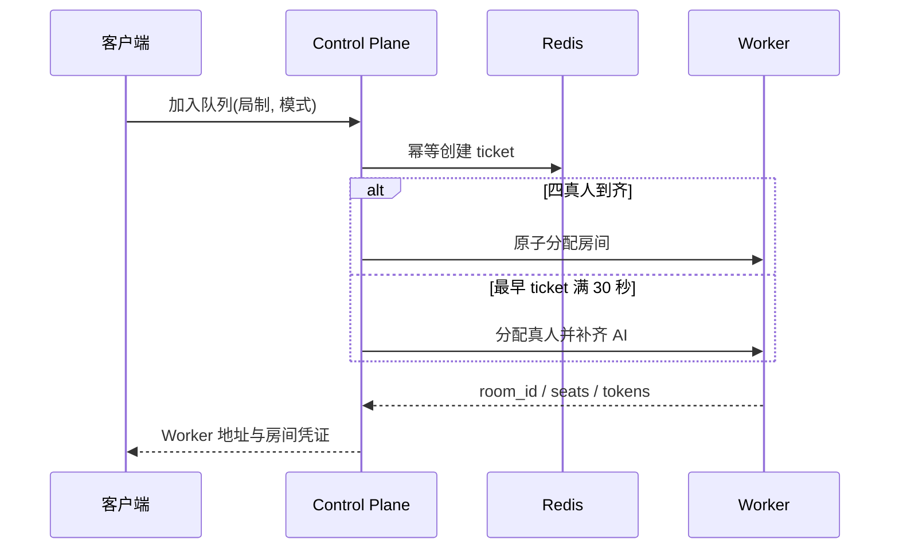
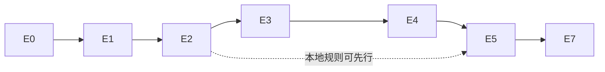

# 多人麻将与“嘴强道具”Epic PRD

> 总 PRD：[`2026-07-22-multiplayer-trash-talk-prd.md`](./2026-07-22-multiplayer-trash-talk-prd.md)
> Master Epic：[GitHub Issue #213](https://github.com/jingx8885/mahjong-game/issues/213)
> 编号规则：E0–E5、E7；**E6 永久空缺，不得复用**

本文把总 PRD 分解为 7 个可独立验收的 Epic。每个 Epic 的完成必须同时满足：所有原生子 Issue 关闭、对应测试门禁通过、文档与实际代码一致、PR 已由维护者人工合并。

## E0 产品与工程基线

**Epic：** [#214](https://github.com/jingx8885/mahjong-game/issues/214)
**里程碑：** M0 产品与工程基线
**优先级：** P0

### 目标

在业务代码开始前锁定产品模式、删除边界、角色/IP 清单、服务职责、协议版本、测试矩阵和桌面 Alpha 出口，使后续 Issue 无需重新做产品或架构决定。

### 子 Issue

- [#221 E0-01](https://github.com/jingx8885/mahjong-game/issues/221)：模式矩阵、成功指标和非目标。
- [#222 E0-02](https://github.com/jingx8885/mahjong-game/issues/222)：肉鸽、12 角色、道具与 IP 盘点。
- [#223 E0-03](https://github.com/jingx8885/mahjong-game/issues/223)：Control Plane、Worker、语音、STT 与协议 ADR。
- [#224 E0-04](https://github.com/jingx8885/mahjong-game/issues/224)：验收矩阵、协议版本与 Alpha DoD。

### 必须产物

- `GameMode`、`RoomKind`、`RoundKind`、`ParticipantKind` 及其稳定协议值。
- 当前 Run/角色/道具/联机骨架的代码级清单，明确“删除、保留、原创替换、延后”。
- Control Plane、Redis、Headless Worker、语音/STT 的职责与失败边界。
- 从局部 GUT 到公网四客户端 E2E 的测试矩阵。

### 验收

- 8 种入口组合均有清晰行为。
- 根 `main.go` 保持健康检查桩的约束写入 ADR。
- 规划中不存在 E6 或 E6 的同义替代模块。
- E1–E7 的每个成功标准都能追溯到一个叶子 Issue。

## E1 去肉鸽与原创大厅

**Epic：** [#215](https://github.com/jingx8885/mahjong-game/issues/215)
**里程碑：** M1 去肉鸽与原创大厅
**优先级：** P0
**依赖：** E0

### 目标

用生产级 1600×900 原创大厅替换 Run Flow 生产入口，按“入口壳 → `SessionIntent` → `GameSessionConfig`”分离 UI 与正式会话契约，注销指定肉鸽 Autoload，交付 1 首可听大厅 BGM，并把全部 12 名角色迁移为全新原创角色，保留其能力语义。

### 子 Issue

- [#225 E1-01](https://github.com/jingx8885/mahjong-game/issues/225)：生产入口壳替换；不拥有选择态或正式配置。
- [#226 E1-02](https://github.com/jingx8885/mahjong-game/issues/226)：移除肉鸽生产依赖并注销 5 个指定 Autoload，脚本保留。
- [#227 E1-03](https://github.com/jingx8885/mahjong-game/issues/227)：生产级 1600×900 大厅和角色常驻区。
- [#228 E1-04](https://github.com/jingx8885/mahjong-game/issues/228)：练习/匹配入口、规则抽屉和 `SessionIntent`。
- [#229 E1-05](https://github.com/jingx8885/mahjong-game/issues/229)：Run-only 过滤图鉴、规则、1 首大厅 BGM 与 BGM/SFX 控制。
- [#230 E1-06](https://github.com/jingx8885/mahjong-game/issues/230)：全新 12 名原创角色、两道美术确认闸门、能力工厂映射与立绘序列化。

### 行为约束

- 生产启动、返回大厅、再来一局均不能进入 `ui/run/run_flow.tscn`。
- 生产 `project.godot` 不注册 `SaveSystem`、`MetaProgress`、`BattlePass`、`DailyQuest`、`SaveToast`；旧存档无需迁移到新会话，对应脚本可保留供 legacy 测试显式实例化。
- 角色生产契约只保留原创身份、能力映射、立绘和 Momentum affinity；HP、金币、卡包、声望解锁退出生产契约。
- 大厅参考雀魂的“左角色、右主入口、二级规则抽屉、顶底功能区”层级，但背景、视觉资产、角色、文案、动效和音频必须原创，并达到生产视觉而非线框占位。
- `SessionIntent` 只属于大厅 UI；正式 `GameSessionConfig` 及其校验、序列化和 Intent 转换只属于 E2-01。
- 设置只包含 BGM/SFX 等非语音项目；大厅交付 1 首通过既有 new-api Suno 模型生成并入库的可循环原创 BGM。
- 12 名角色先确认身份/能力/美术 brief，再确认小批量样张；两道用户确认闸门通过后才批量生成和入库。

### UI 验收契约

```text
顶部：玩家卡 + 公告/帮助/设置
左中：原创角色常驻区
右侧：电脑练习、公共匹配两个大入口
右侧抽屉：东风/半庄 × 标准/欢乐
底部：角色图鉴、道具图鉴、规则说明、BGM/SFX
```

- GUT 钉住 1600×900 几何、入口可达性、规则选择和返回行为。
- `capture_screens.gd` 提供 1600×900 验收图。
- PNG 或 `class_name` 变化后必须执行 Godot import。

### 完成定义

- 启动即进入生产级大厅；四个规则维度均可生成合法 `SessionIntent`，且 E1 不提前定义正式 `GameSessionConfig`。
- 生产主路径不存在章节、HP、金币、商店、抽卡、营地、战令或 Run 存档 UI。
- 5 个指定肉鸽 Autoload 已从生产配置注销；1 首大厅 BGM 可听且音量可控。
- 12 名角色无旧 IP 名称、文案、立绘和生产引用；12 个 `CharacterPool.ability_id` 均可经工厂构建/注入，`portrait_path` 序列化与加载回归通过。

## E2 统一电脑对战

**Epic：** [#216](https://github.com/jingx8885/mahjong-game/issues/216)
**里程碑：** M2 统一电脑对战
**优先级：** P0
**依赖：** E1

### 目标

把既有 `BattleController`、`GameDriver`、AI、事件回放与新大厅会话统一起来，交付 1 人 + 3 AI 的东风/半庄、标准/欢乐完整闭环，并为 Headless Worker 提供可复用接口。

### 子 Issue

- [#231 E2-01](https://github.com/jingx8885/mahjong-game/issues/231)：统一 `GameSessionConfig`。
- [#232 E2-02](https://github.com/jingx8885/mahjong-game/issues/232)：统一行动/事件接口。
- [#233 E2-03](https://github.com/jingx8885/mahjong-game/issues/233)：东风/半庄 1+3 AI 闭环。
- [#234 E2-04](https://github.com/jingx8885/mahjong-game/issues/234)：标准/欢乐硬隔离。
- [#235 E2-05](https://github.com/jingx8885/mahjong-game/issues/235)：整场结算与导航。

### 会话契约

```text
SessionIntent（E1-04，大厅 UI）
├── room_kind: PRACTICE | PUBLIC_CASUAL
├── round_kind: EAST | HANCHAN
├── game_mode: STANDARD | TRASH_TALK
└── selected_character_id?（可选 UI 选择）

        │ E2-01 唯一转换
        ▼
GameSessionConfig（E2-01，正式会话）
├── room_kind / round_kind / game_mode
├── participants[4]: HUMAN | AI
└── seed / session_id / rule_version
```

E2-01 首次定义正式类型并消费 E1-04 冻结的 Intent；练习场固定 `participants = [HUMAN, AI, AI, AI]`。`room_kind=PUBLIC_CASUAL` 不允许通过本地练习启动器直接实例化权威牌局。

### 模式隔离

| 组件 | STANDARD | TRASH_TALK |
|---|---|---|
| 日麻规则、AI、结算 | 启用 | 启用 |
| 角色能力 | 不创建 | 启用 |
| 道具库存与命令 | 不创建/拒绝 | 启用 |
| Momentum/TextAnalyzer | 不创建 | 启用 |
| 麦克风/PTT/STT | 不请求/不创建 | 启用 |

### 完成定义

- 固定种子东风/半庄真实牌局通过，分数守恒。
- 玩家可完成所有已有日麻操作，AI 只通过合法行动入口。
- 两种模式不能在运行中切换或被客户端事件绕过。
- 结算只显示分数/排名，可重赛或返回大厅，不产生肉鸽奖励。

## E3 服务端权威与公共匹配

**Epic：** [#217](https://github.com/jingx8885/mahjong-game/issues/217)
**里程碑：** M3 服务端权威与公共匹配
**优先级：** P0
**依赖：** E2

### 目标

建立独立 Go Control Plane、Redis 临时状态和 Godot Headless 权威 Worker，交付公共休闲队列、30 秒 AI 补位、幂等命令、快照、重连与回放。

### 子 Issue

- [#236 E3-01](https://github.com/jingx8885/mahjong-game/issues/236)：Control Plane 与 Redis 拓扑。
- [#237 E3-02](https://github.com/jingx8885/mahjong-game/issues/237)：游客与房间凭证。
- [#238 E3-03](https://github.com/jingx8885/mahjong-game/issues/238)：公共队列 API。
- [#239 E3-04](https://github.com/jingx8885/mahjong-game/issues/239)：30 秒真人等待与 AI 补位。
- [#240 E3-05](https://github.com/jingx8885/mahjong-game/issues/240)：Headless Worker 权威牌局。
- [#241 E3-06](https://github.com/jingx8885/mahjong-game/issues/241)：快照、重连和 AI 接管/归还。
- [#242 E3-07](https://github.com/jingx8885/mahjong-game/issues/242)：幂等、非法行动与回放对抗测试。

### 权威与临时状态

- Control Plane 负责游客、ticket、房间/Worker 分配、短期令牌；不运行麻将规则。
- Redis 保存可重建的队列、ticket、房间租约、Worker 注册；不保存永久账号或权威牌局状态。
- Headless Worker 负责牌墙、随机数、回合、合法性、AI、角色、道具、发奖和事件序列。
- 客户端只提交命令和显示权威事件，不能提交计算结果或隐藏信息。

### 匹配时序



### 完成定义

- 1–4 真人均能且只能进入一个四席房间。
- 重复 `command_id` 不重复改变状态；所有非法/越权/伪造发奖命令被拒绝。
- 30 秒内重连恢复；超时 AI 接管；本局内玩家可安全取回控制。
- 同 seed + 命令流得到一致事件摘要，现有 replay E2E 保持通过。
- 在真实公网四端验证前，所有相关 PR 声明“网络端到端未验证”。

## E4 实时语音与双层 STT

**Epic：** [#218](https://github.com/jingx8885/mahjong-game/issues/218)
**里程碑：** M4 实时语音与双层 STT
**优先级：** P0
**依赖：** E3

### 目标

在欢乐场实现 PTT、PCM16 四座位语音、本地 whisper.cpp 字幕、服务端 faster-whisper 权威转写和 OpenAI-compatible/new-api 回退。

### 子 Issue

- [#243 E4-01](https://github.com/jingx8885/mahjong-game/issues/243)：Godot PTT、采集、缓冲和播放。
- [#244 E4-02](https://github.com/jingx8885/mahjong-game/issues/244)：四座位 WebSocket 语音中继。
- [#245 E4-03](https://github.com/jingx8885/mahjong-game/issues/245)：whisper.cpp 模型管理。
- [#246 E4-04](https://github.com/jingx8885/mahjong-game/issues/246)：中英日字幕与座位指示。
- [#247 E4-05](https://github.com/jingx8885/mahjong-game/issues/247)：faster-whisper、VAD 与权威转写。
- [#248 E4-06](https://github.com/jingx8885/mahjong-game/issues/248)：new-api 回退、超时和熔断。

### 音频契约

- PTT 按下后创建 utterance；松开后结束，标准场不请求权限。
- 采样格式固定 PCM16 little-endian、16kHz、单声道、20ms 帧。
- 中继只将音频广播给同房其他座位并送入服务端 STT。
- 背压时丢弃过旧语音帧；牌局命令通道不得与语音共用无界队列。
- 原始音频和房间转写不持久化；断开/完成后释放内存缓冲。

### 双层 STT

- 本地 whisper.cpp：中英日即时字幕；模型按需下载、断点续传、SHA-256 校验、原子启用。
- 公共服务端：faster-whisper small + VAD 产生权威最终文本。
- 回退：主服务超时或失败后，仅最终片段调用 new-api `/v1/audio/transcriptions`；同 utterance 最多采用一次结果。
- 练习场本地最终文本可进入本地权威评分；公共场本地文本只显示。

### 完成定义

- 真实麦克风 loopback、双客户端和四客户端语音通过。
- 中英日临时/最终字幕正确替换且不遮挡牌桌关键操作。
- 主备 STT 的超时、熔断、去重有真实行为测试。
- 不存在举报、证据存储、静音、语音音量、总开关或自动禁言。

## E5 确定性垃圾话与道具

**Epic：** [#219](https://github.com/jingx8885/mahjong-game/issues/219)
**里程碑：** M5 确定性垃圾话与道具
**优先级：** P0
**依赖：** 本地规则可在 E2 后开始；Epic 完成依赖 E4

### 目标

扩展 `TextAnalyzer` 与 `Momentum`，将中英日角色人设、道具设定和服务端牌局上下文转化为确定性候选；每次话语最多直接发放一个最高匹配道具。

### 子 Issue

- [#249 E5-01](https://github.com/jingx8885/mahjong-game/issues/249)：原创多语言角色/道具规则库。
- [#250 E5-02](https://github.com/jingx8885/mahjong-game/issues/250)：文本标准化、关键词、模板与版本。
- [#251 E5-03](https://github.com/jingx8885/mahjong-game/issues/251)：角色、道具、牌局上下文评分。
- [#252 E5-04](https://github.com/jingx8885/mahjong-game/issues/252)：Momentum、冷却和稳定决胜。
- [#253 E5-05](https://github.com/jingx8885/mahjong-game/issues/253)：权威道具生命周期与回放。
- [#254 E5-06](https://github.com/jingx8885/mahjong-game/issues/254)：字幕命中、到账/发动反馈和平衡夹具。

### 确定性规则

```text
最终转写
→ 文本标准化
→ 关键词/模板命中
→ 角色 affinity
→ 道具标签
→ 权威牌局上下文过滤
→ 候选排序(priority DESC, specificity DESC, rule_id ASC)
→ 冷却/幂等检查
→ 至多一个 item_granted
```

规则库必须有稳定 `rule_version` 和 `rule_id`。同一转写、角色、牌局状态和规则版本必须得到完全一致的结果。STT、LLM、客户端、UI 动画均没有发奖权。

### 道具事件

`ITEM_GRANTED` 至少包含：

```json
{
  "rule_version": "v1",
  "rule_id": "stable_rule_id",
  "item_id": "stable_item_id",
  "seat": 0,
  "hand_seq": 3,
  "utterance_id": "stable_utterance_id"
}
```

获得、持有、使用、效果结算必须进入统一权威事件流；重复 utterance 或回放不得重复发奖。标准场拒绝所有道具命令。

### 完成定义

- 12 角色与全部可发放道具均有中英日规则和五类 Momentum affinity。
- 正例、反例、同分、上下文、冷却、重复和回放夹具全部通过。
- UI 清楚区分字幕、命中、到账和发动，不暴露隐藏信息。
- 不出现三选一、商店、抽卡、金币或 Run 奖励。

## E7 部署与桌面 Alpha

**Epic：** [#220](https://github.com/jingx8885/mahjong-game/issues/220)
**里程碑：** M7 部署与桌面 Alpha
**优先级：** P1
**依赖：** E3、E4、E5

### 目标

交付可复现服务拓扑、Worker 生命周期、macOS/Windows Alpha 包和真实公网四客户端验收。

### 子 Issue

- [#255 E7-01](https://github.com/jingx8885/mahjong-game/issues/255)：服务容器测试拓扑。
- [#256 E7-02](https://github.com/jingx8885/mahjong-game/issues/256)：Worker 注册、租约、容量和回收。
- [#257 E7-03](https://github.com/jingx8885/mahjong-game/issues/257)：macOS 包与模型流程。
- [#258 E7-04](https://github.com/jingx8885/mahjong-game/issues/258)：Windows 包与模型流程。
- [#259 E7-05](https://github.com/jingx8885/mahjong-game/issues/259)：公网 E2E、负载、回滚与 Alpha 清单。

### 测试拓扑

- Linux 容器：Control Plane、Redis、faster-whisper、至少一个 Godot Headless Worker。
- 外部可选依赖：配置后的 OpenAI-compatible/new-api 回退。
- 桌面客户端：至少一台 macOS 和一台 Windows；最终四客户端可以是平台混合。
- 所有密钥通过环境变量，模型二进制不入 Git。

### 完成定义

- 一条文档化命令启动全部服务，health/readiness 全绿。
- Worker 注册、容量、租约、故障回收在真实 Redis 下通过。
- macOS、Windows 干净环境完成安装、权限、模型按需下载和整场牌局。
- 四真人和 AI 补位场景均通过；东风/半庄、标准/欢乐至少各有一场公网证据。
- 记录 STT 延迟、Worker 房间容量、资源基线与回滚结果。
- “无 E6”仓库与 GitHub 审计通过。

## 全局依赖与停止条件



- 上游 Epic 未人工合并时，不开始依赖它的业务 Issue。
- 第三方接口没有真实最小请求证据时，停止对应接入，不用 mock 冒充完成。
- 网络路径没有真实公网四客户端证据时，不宣称桌面 Alpha 完成。
- 任何实现若需要举报、静音、语音控制、自动禁言或音频存储，必须先回到产品重新立项；不得放入 E4/E5/E7。
