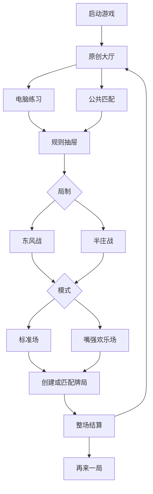
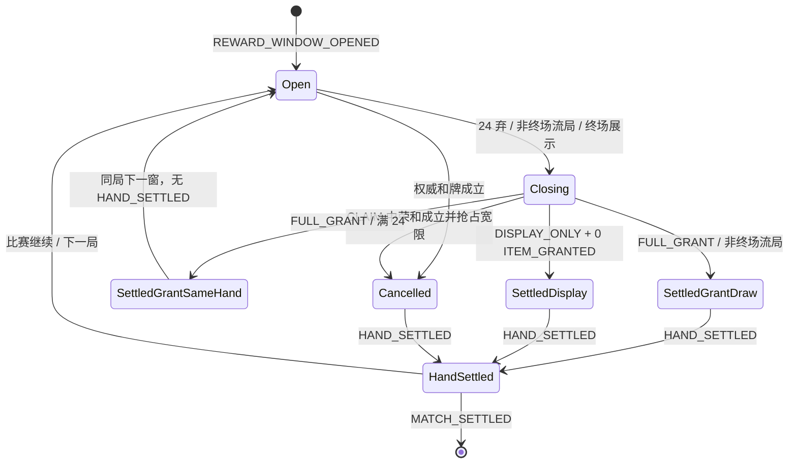
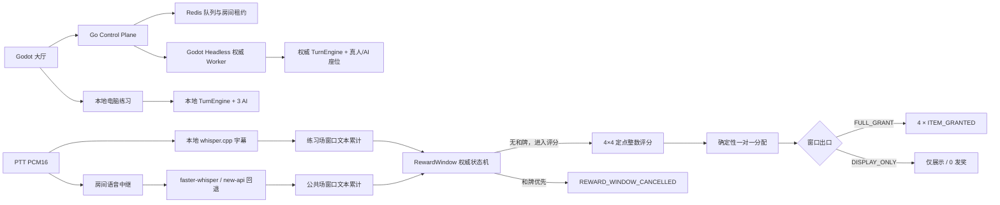

# 多人麻将与“嘴强道具”桌面 Alpha PRD

> 状态：规划 PR #260 已合并，E0 执行中
> 日期：2026-07-22
> 规划入口：[GitHub Issue #212](https://github.com/jingx8885/mahjong-game/issues/212)
> Master Epic：[GitHub Issue #213](https://github.com/jingx8885/mahjong-game/issues/213)
> 产品范围：E0–E5、E7；**不存在 E6**
> 2026-07-22 决策锁：入口壳 / `SessionIntent` / `GameSessionConfig` 三层分离；生产级原创大厅；1 首可听二次元大厅 BGM；12 角色采用全新美术方向；生产注销 5 个肉鸽 Autoload；嘴喷奖励采用六巡窗口、公开四道具与四席一对一分配；和牌取消窗口且不评分/不发奖，终场非和牌窗口只评分展示，同一玩家可重复持有同 `item_id` 的独立实例。

## 1. 背景与代码事实

当前项目已经有完整四人日麻规则、东风/半庄跨局驱动、玩家 seat 0 + 3 AI、角色能力、遗物/道具、`Momentum`、`TextAnalyzer`、事件回放与本地 loopback 联机骨架，但仍存在以下产品断层：

- `godot/project.godot` 的生产主场景指向 `res://ui/lobby/lobby_shell.tscn`。
- `SaveSystem`、`RunState`、章节、HP、金币、商店、抽卡、营地和战令已经退出并从仓库删除。
- `NetworkedBattleController` 只会一次性重放完整事件流；`LocalLoopbackServer` 是本地参考/回放桩（`PASS` no-op 占位），不是真实对战服务。
- `TextAnalyzer` 只做中文关键词计数；`Momentum` 含五类属性和旧技能倍率骨架，Alpha 只保留五类 affinity 标签，旧倍率不得进入生产结算。
- `CharacterPool` 有 12 名角色及对应能力，但名称、文案和部分立绘带有明确第三方 IP 指向，角色字段也混入 HP、金币、卡包和声望等肉鸽数据。
- 最新 `origin/main` 已使用 1600×900 viewport，可作为大厅与牌桌统一视觉基准。
- 根目录 `main.go` 只是 Railway 健康检查桩，不承担真实游戏服务职责。

本 PRD 将上述能力重组为桌面四人日麻，而不是在肉鸽 Run 上继续追加联机功能。

## 2. 产品目标与非目标

### 2.1 目标

1. 提供无需账号的电脑练习：1 名玩家 + 3 名 AI。
2. 提供公共休闲匹配：真人优先，最早队列 ticket 等待 30 秒后由服务端 AI 补齐四席。
3. 练习与公共场都支持东风战、半庄战。
4. 提供两个互斥模式：
   - 标准场：纯日麻；角色能力、道具、Momentum、麦克风与语音链路全部关闭。
   - 嘴强欢乐场：角色能力、道具、PTT、字幕与确定性垃圾话发奖启用。
5. 保留 12 名角色的既有能力语义，但完成原创 ID、名称、人设、文案、立绘和生产引用替换。
6. 删除肉鸽生产主路径和相关状态依赖。
7. 交付 macOS、Windows 桌面 Alpha，并通过真实公网四客户端整场验证。

### 2.2 非目标

- Web、移动端、排位、ELO、私人房间、好友/社交、观战。
- 商店、抽卡、卡包、金币、战令、章节、HP、Run 存档和声望解锁。
- 复制雀魂的资产、商标、音频、角色、布局像素或商业化入口；只参考其信息层级和入口权重。
- 让 LLM、STT 或客户端直接决定道具奖励。
- 单句话即时发奖或以 `Momentum.skill_effect_multiplier()` 放大角色技能；Momentum 在 Alpha 只作为五类 affinity/标签枚举来源。
- Alpha 套装加成、套装合成或套装专属 UI；Alpha 库存必须支持同场持有多件，后续套装另行立项。
- Kubernetes、跨地域容灾、生产级自动扩缩容。
- **整个 E6：语音举报、证据缓冲、音频上传、人工审核、对象存储、按座位静音、语音音量、全局关语音、自动临时禁言及相关占位接口。**

### 2.3 锁定默认值

| 决策 | Alpha 固定值 | 边界 |
|---|---|---|
| 四人桌席位 | 4 | 不提供二人/三人麻将 |
| 练习场真人 | 1，固定 seat 0 | 其余 3 席均为本地 AI |
| 公共场真人 | 1–4 | 不足席位只能由 Headless Worker AI 补齐 |
| 公共队列等待 | 从匹配池最早有效 ticket 的 `queued_at` 起 30 秒 | 四真人提前到齐则立即开房 |
| 公共重连宽限 | 掉线起 30 秒 | 超时由 Worker AI 接管；仅本局内允许恢复 |
| 标准场能力 | 角色、道具、Momentum、语音全部关闭 | 必须构造期硬隔离，不能只隐藏 UI |
| 欢乐场语音 | PTT | 不提供常开麦或语音设置 |
| 练习场转写 | 本地 whisper.cpp final 为本地评分输入 | 不经过公共 Control Plane |
| 公共场转写 | 本地仅显示；服务端 final 才能评分 | STT/LLM 本身没有发奖权 |
| 奖励窗口 | 全桌累计 24 次权威弃牌，约六巡 | 和牌取消且不评分；非终场流局提前结算并发奖；终场非和牌只评分展示 |
| 窗口奖池 | 开窗时公开 4 件互不重复道具 | `FULL_GRANT` 每席实际一件；`DISPLAY_ONLY` 仅展示虚拟分配；和牌取消无分配 |
| STT 结算宽限 | 最多 1500ms | 只等待 `PTT_END.server_seq <= closing_boundary_server_seq` 的在途 final；超时结果当前窗与后续窗均忽略 |
| 角色被动激活 | affinity 匹配的奖励自动武装下一窗口 | 道具基础效果不依赖 affinity；主动使用不负责启动角色被动 |
| 道具库存 | 同一场内可持有多件，未使用道具不被新奖励替换 | 道具使用/消耗或整场结束时移除；Alpha 不实现套装效果 |
| 语音/转写留存 | 仅房间生命周期内的有界内存 | 不写磁盘，不建立证据存储 |

### 2.4 已确认实施决策

1. **会话三层分离**：[#225](https://github.com/jingx8885/mahjong-game/issues/225) 只拥有生产入口壳；[#228](https://github.com/jingx8885/mahjong-game/issues/228) 拥有大厅选择态 `SessionIntent`；[#231](https://github.com/jingx8885/mahjong-game/issues/231) 首次定义正式 `GameSessionConfig`、校验/序列化和 `SessionIntent → GameSessionConfig` 转换。
2. **生产级原创大厅**：E1 不以纯线框或占位壳作为最终大厅验收；参考雀魂仅限信息层级和入口权重，背景、面板、角色、动效、文案和音频全部原创。
3. **首发 BGM**：交付 1 首可听、可循环的二次元风格大厅 BGM；通过仓库既有 new-api 配置调用 Suno 模型生成，运行时客户端不调用生成 API。
4. **全新角色美术**：12 名角色不沿用现有 4 张原创向立绘作为生产身份。先确认世界观、12 人身份/能力映射和美术 brief，再确认小批量样张；两道闸门通过后才批量生成并进入生产资源树。
5. **删除肉鸽遗留**：`SaveSystem`、`MetaProgress`、`BattlePass`、`DailyQuest`、`SaveToast` 及 Run UI 已物理删除，不保留 legacy 显式加载。
6. **六巡嘴喷奖励**：每累计 24 次权威弃牌进入一次关闭边界；窗口开始公开 4 件道具。第 24 次弃牌后的 CLAIM 与最多 1500ms STT 宽限并行，荣和优先并立即取消窗口；无和牌才按四席 final 文本生成 4×4 分数矩阵并确定性一对一分配。任意和牌均不评分、不发奖；非终场流局仍提前结算并发四件；终场非和牌只评分展示、不产生 `ITEM_GRANTED`。同一玩家可持有同 `item_id` 的多个独立实例，affinity 只由实际发放的实例登记下一窗口角色武装；未来套装效果不进入 Alpha。

E0 的 #222–#224 仍是 E1 业务代码的硬闸门；上述决策锁只消除歧义，不构成跳过 E0 的授权。

## 3. 用户与核心路径

首发用户是希望快速开始一局四人日麻的桌面玩家，以及希望用角色垃圾话和道具改变牌局节奏的轻竞技玩家。无需注册账号，首次启动获得签名游客身份。



### 3.1 大厅信息架构

```text
┌──────────────────────────────────────────────────────────────────┐
│ 玩家头像 / 游客名                         公告  帮助  设置        │
│                                                                  │
│       ┌────────────────────┐       ┌────────────────────────┐    │
│       │                    │       │      电脑练习          │    │
│       │   原创角色常驻     │       │  1 人 + 3 AI          │    │
│       │   立绘/待机反馈    │       ├────────────────────────┤    │
│       │                    │       │      公共匹配          │    │
│       └────────────────────┘       │  真人优先 / AI 补位   │    │
│                                    └────────────────────────┘    │
│  角色图鉴     道具图鉴     规则说明              BGM / 音效设置  │
└──────────────────────────────────────────────────────────────────┘

点击练习或匹配后，从右侧打开二级抽屉：
[东风战 / 半庄战] × [标准场 / 嘴强欢乐场] → 开始
```

UI 实现必须以该 ASCII、1600×900 几何测试和 `capture_screens.gd` 截图共同作为验收证据。大厅最终交付为生产级原创视觉，不接受纯线框占位作为 E1 完成态。BGM 与 SFX 可独立控制；大厅默认播放 1 首可循环原创 BGM；不存在语音设置入口。

### 3.2 模式矩阵

下列 8 个 `mode_id` 是 Alpha 的完整可启动集合；实现可以分别序列化三个枚举，但测试与遥测必须能稳定还原对应 `mode_id`。

| mode_id | 房间/局制/玩法 | 权威 | 真人 / AI | 角色与道具 | 语音与 STT | 发奖权 |
|---|---|---|---|---|---|---|
| `PRACTICE_EAST_STANDARD` | 练习 / 东风 / 标准 | 本地 Godot | 1 / 3 本地 AI | 关闭 | 不创建 | 无 |
| `PRACTICE_EAST_TRASH_TALK` | 练习 / 东风 / 欢乐 | 本地 Godot | 1 / 3 本地 AI | 启用 | PTT；本地 whisper.cpp | 本地确定性规则 |
| `PRACTICE_HANCHAN_STANDARD` | 练习 / 半庄 / 标准 | 本地 Godot | 1 / 3 本地 AI | 关闭 | 不创建 | 无 |
| `PRACTICE_HANCHAN_TRASH_TALK` | 练习 / 半庄 / 欢乐 | 本地 Godot | 1 / 3 本地 AI | 启用 | PTT；本地 whisper.cpp | 本地确定性规则 |
| `PUBLIC_EAST_STANDARD` | 公共 / 东风 / 标准 | Headless Worker | 1–4 / 0–3 Worker AI | 关闭 | 不创建 | 无 |
| `PUBLIC_EAST_TRASH_TALK` | 公共 / 东风 / 欢乐 | Headless Worker | 1–4 / 0–3 Worker AI | 启用 | 房间 PTT；本地字幕 + 服务端 STT | Worker 确定性规则 |
| `PUBLIC_HANCHAN_STANDARD` | 公共 / 半庄 / 标准 | Headless Worker | 1–4 / 0–3 Worker AI | 关闭 | 不创建 | 无 |
| `PUBLIC_HANCHAN_TRASH_TALK` | 公共 / 半庄 / 欢乐 | Headless Worker | 1–4 / 0–3 Worker AI | 启用 | 房间 PTT；本地字幕 + 服务端 STT | Worker 确定性规则 |

标准场的“关闭”是构造期硬隔离：不得实例化角色能力、道具库存、Momentum 或语音采集/传输节点，不能仅靠隐藏 UI 实现。

公共场的 AI 数量由 `4 - 已匹配真人数` 唯一决定；四真人到齐立即开房，否则最早 ticket 满 30 秒后补位。练习场不连接公共队列、房间服务或服务端 STT。

## 4. 功能需求

### FR-LOBBY 大厅与去肉鸽

- **FR-LOBBY-01**：生产主场景必须是原创大厅入口壳，不再进入 Run Flow；生产级视觉由 E1-03 收口。
- **FR-LOBBY-01A**：生产 `project.godot` 不注册 `SaveSystem`、`MetaProgress`、`BattlePass`、`DailyQuest`、`SaveToast`。
- **FR-LOBBY-02**：练习与公共匹配是右侧一级大入口；局制与模式使用同一右侧二级抽屉；抽屉只输出 `SessionIntent`，不得提前定义正式 `GameSessionConfig`。
- **FR-LOBBY-03**：角色图鉴、道具图鉴、规则说明和 BGM/SFX 设置可从大厅打开并返回；图鉴不展示 HP、金币、卡包、声望、战令或其他 Run-only 内容。
- **FR-LOBBY-03A**：大厅提供 1 首已入库的原创 BGM；BGM 与 SFX 音量独立可控；不存在语音设置入口。
- **FR-LOBBY-04**：生产导航、Autoload 和新会话数据不再读取或写入 RunState、HP、金币、章节、商店、抽卡、营地、战令或 Run 存档。
- **FR-LOBBY-05**：旧 Run 代码只按实际依赖外科手术式退出生产路径；不在同一 Issue 清扫所有 legacy 文件。
- **FR-LOBBY-06**：1600×900 大厅使用原创背景、卡片、角色展示和抽屉动效达到生产视觉；不得复制雀魂资产、商标、音频、角色或像素布局。

### FR-SESSION 统一会话与电脑练习

- **FR-SESSION-00**：大厅 UI 使用 `SessionIntent` 表示玩家选择的 `room_kind`、`round_kind`、`game_mode` 和可选角色；不得包含权威 seed、session ID、rule version 或服务端凭证。
- **FR-SESSION-01**：`GameSessionConfig` 是唯一可验证、可序列化、可驱动牌局构造的正式配置；由 E2-01 将 `SessionIntent` 转换并补齐参与者、四席 `character_ids`、随机种子、session ID 与 rule version。
- **FR-SESSION-01a（角色方案 A）**：`STANDARD` 与 `TRASH_TALK` 均在 Config 中记录四席角色身份/外观（`character_ids[4]`）；`STANDARD` 后续绝不创建角色能力对象。练习场 seat0 使用 `SessionIntent.selected_character_id`，空则默认大厅常驻 `CharacterPool.all()[0]`；三 AI 从其余角色按 `seed` 用跨平台稳定 **unsigned 32-bit Numerical Recipes LCG** 确定性选择且不重复。练习 `create_validated`/`from_dict` 拒绝重复 `character_ids`；`PUBLIC_CASUAL` 允许重复。
  练习场三 AI 角色抽取（Fisher-Yates + LCG）**必须**按下列逐步规范实现，不得改用 `RandomNumberGenerator` 或其它 LCG 常数：
  1. **state 初值**：`state = seed & 0xffffffff`（把 int64 `seed` 规范化为 unsigned 32-bit；不 `abs`、不 31-bit mask）。
  2. **先排除玩家角色**：从 `CharacterPool.all()` 取出全部角色稳定 id，剔除 seat0 已占用的玩家 `character_id`，得到候选列表（长度 `n`）。
  3. **候选排序**：将候选按角色稳定 id 的 **Unicode code point 升序**排序（对 ASCII 标识符等价于字典序；跨平台字符串比较结果必须一致）。
  4. **Fisher-Yates（递减）**：对 `i` 从 `n-1` 递减到 `1`（含）执行：
     - 先计算 `state = (state * 1664525 + 1013904223) & 0xffffffff`；
     - 再令 `j = state % (i + 1)`；
     - 交换候选下标 `i` 与 `j`。
  5. **取前三个 AI**：洗牌完成后取候选前 3 个 id，依次填入 `character_ids[1..3]`（与 seat0 玩家 id 组成四席、互不重复）。
- **FR-SESSION-01b（公共 authority）**：`PUBLIC_CASUAL` 的 authority context 必须显式提供 `room_kind` / `round_kind` / `game_mode` / `participants` / `character_ids` / `seed` / `session_id` / `rule_version`；`room_kind` 必须为 `PUBLIC_CASUAL`；authority 的 `round_kind`/`game_mode` 必须与 `SessionIntent` 一致，否则稳定错误 `AUTHORITY_MISMATCH`。最终公共 Config 的 room/round/mode 取自 authority，客户端不得用 Intent 把 `STANDARD`/`EAST` 伪造成 `TRASH_TALK`/`HANCHAN`。本地权威 typed context 中 `seed` 只接受真正整型（`TYPE_INT`）。
- **FR-SESSION-01c（seed wire）**：内部 `seed` 为 Godot int（int64）；`to_dict` 的 wire `seed` 为规范十进制字符串；`from_dict` 只接受规范十进制字符串并无损恢复 int64，拒绝 JSON number/float/null/非数字/溢出（避免超过 2^53 失真）。
- **FR-SESSION-02**：公开枚举以 GDScript 命名 enum 定义（稳定整数值），并保留冻结 wire 字符串映射：
  - `GameMode`: `STANDARD=0 | TRASH_TALK=1`
  - `RoomKind`: `PRACTICE=0 | PUBLIC_CASUAL=1`
  - `RoundKind`: `EAST=0 | HANCHAN=1`
  - `ParticipantKind`: `HUMAN=0 | AI=1`
  Config 须能经 `mode_id()` 稳定还原 8 个 `mode_id`（与 Intent 同构）。
- **FR-SESSION-03**：练习场固定玩家 seat 0，其余三席为 AI（`participants = [HUMAN, AI, AI, AI]`）；所有操作通过统一命令/事件接口进入既有日麻引擎。
- **FR-SESSION-04**：东风/半庄必须正确处理场风、局序、庄家、连庄、本场棒、立直棒和最终排名。
- **FR-SESSION-05**：整场结束后只提供“再来一局”和“返回大厅”，不产生肉鸽奖励。

### FR-MATCH 公共匹配与权威牌局

- **FR-MATCH-01**：独立 Go Control Plane 提供游客会话、公共队列、房间分配、Worker 注册和 STT 路由；根 `main.go` 不变。
- **FR-MATCH-02**：Redis 按 `round_kind + game_mode` 隔离匹配池；重复加入同一池返回同一 ticket。
- **FR-MATCH-03**：四名真人到齐立即开房；最早 ticket 等待 30 秒后按当前真人数量补 1–3 个 Worker AI。
- **FR-MATCH-04**：Godot Headless Worker 是牌墙、随机数、合法行动、AI、技能、道具、发奖与事件序列的唯一权威。
- **FR-MATCH-05**：所有客户端命令带 `command_id`；重复命令最多应用一次。
- **FR-MATCH-06**：掉线后保留座位 30 秒；超时由 AI 接管；玩家本局内重连后在安全行动边界恢复控制。
- **FR-MATCH-07**：客户端伪造状态、行动结果、隐藏牌、上下文或 `item_granted` 必须被拒绝并返回稳定错误码。
- **FR-MATCH-08**：`ROOM_SNAPSHOT` 使用 `NetworkedEvent` 六键 envelope，必须带协议版本、快照对应的最后 `server_seq`、当前座位可见的完整 public projection，以及该 projection 经 canonical JSON 后的 `view_hash`（SHA-256）。其它业务事件的 `view_hash` 为事件应用后同一 recipient 的 public view 哈希。#241 在 E3 只冻结基础快照包络、从下一 `server_seq` 续传，以及按稳定模块 key/version 组合权威模块 snapshot provider 的扩展机制；它用测试 provider 验证透明 round-trip，不提前实现 E5 字段。#252 后续拥有 RewardWindow 的 ID、奖池、弃牌进度、`OPEN/CLOSING/SETTLED/CANCELLED` phase、可空的三值 `window_exit`、语音/上下文边界与 Worker 权威 `grace_deadline_at` 的模块 DTO/provider；#253 拥有该席全部 `ItemInstance`、角色 `active_window_id/pending_window_id` 的模块 DTO/provider，并接入 #241 已冻结的包络。STANDARD 不注册这些 provider，快照不得出现相应模块 key。E5 完成后的快照与增量事件不能复活已取消窗口、在展示出口发奖、重复发奖或丢失道具。`AuthorityReplaySnapshot` 不进入线上协议。

### FR-VOICE PTT 与双层 STT

- **FR-VOICE-01**：欢乐场使用按住说话；仅按下期间采集 PCM16、16kHz、单声道、20ms 帧。
- **FR-VOICE-02**：公共房间语音通过独立 WebSocket 中继；帧必须绑定房间、座位、会话和单调序号。
- **FR-VOICE-03**：客户端 whisper.cpp 使用按需下载的 multilingual small 模型，模型清单包含版本、URL、大小和 SHA-256，支持断点续传和原子启用。
- **FR-VOICE-04**：本地字幕支持中、英、日临时/最终文本；公共场本地字幕不能进入权威评分。
- **FR-VOICE-05**：公共场服务端以 faster-whisper small 为主；主服务失败或超时后，对最终片段调用 OpenAI-compatible/new-api `/v1/audio/transcriptions`。
- **FR-VOICE-06**：同一 utterance 的主备结果最多有一个进入评分；STT 只输出文字，不输出奖励。
- **FR-VOICE-07**：原始语音只存在于采集、中继和转写所需的有界内存缓冲；断开或完成后释放，不写磁盘。
- **FR-VOICE-08**：凡进入 `CLOSING`（满 24、非终场流局或终场非和牌展示），RewardWindow/Worker 均记录唯一 `closing_boundary_server_seq`、关闭新语音输入并设置唯一权威 `grace_deadline_at`（最多 1500ms）；STT 服务不维护第二个权威窗口计时器，只回传带 PTT_END 序号的 final 并响应 cancel/deadline。仅满足 `PTT_END.server_seq <= closing_boundary_server_seq` 的 utterance 可在宽限内提交 final，超时结果不进入当前或后续窗口。第 24 次弃牌后的 CLAIM 与该宽限并行；权威和牌一成立就中止宽限并取消窗口，不得为了 STT 延迟和牌结算。

### FR-REWARD 确定性垃圾话与道具

- **FR-REWARD-01**：规则库覆盖 12 名原创角色、所有允许奖励的道具及中英日关键词/模板；规则只输出可累计的版本化文本特征，不直接发奖。
- **FR-REWARD-02**：文本分析只使用版本化标准化、关键词、模板、角色 affinity、道具标签和权威公开牌局上下文，不使用在线 LLM、向量相似度、隐藏牌信息或随机语义裁定。`Momentum` 只提供五类 affinity/标签枚举，旧技能倍率函数不进入生产路径。
- **FR-REWARD-03**：欢乐场在权威整场 match 开始、第一条 `TURN_PROMPT` 前开启第一个奖励窗口；只有这个 match 级首窗无条件 unarmed，后续窗口仅在存在匹配其 `window_id` 的 pending 时 arm。每应用一次权威弃牌事件计数加一；第 24 次弃牌必须先发出 `REWARD_WINDOW_CLOSING`、冻结语音边界，再继续完成 CLAIM。若荣和成立，走 `CANCELLED_BY_WIN`；若无荣和，在 CLAIM 全过或非和牌鸣牌应用后记录 `context_boundary_server_seq`。`claim_is_terminal` 只有两种成立方式：当前 CLAIM 的全部资格动作已终态且非和牌鸣牌（如有）已经应用，或当前根本没有开放 CLAIM 且权威手牌结果已在同一事务中确定为流局/终场非和牌；后者用于未满 24 的 scoring close，结果判定序号同时成为 `context_boundary_server_seq`。结算屏障释放条件唯一为 `claim_is_terminal AND (all_eligible_utterances_are_terminal OR now >= grace_deadline_at)`；和牌 cancel 立即中止屏障。释放后在下一次摸牌、岭上补牌、出牌提示、道具/技能牌局事件等状态推进前发出 `REWARD_WINDOW_SETTLED`；纯 UI 动画不属于该屏障。鸣牌裁决可进入本窗公开上下文，但不得放宽语音边界。
- **FR-REWARD-04**：开窗时从可发道具池按 `seed + hand_seq + window_index + rule_version` 确定性选出 4 件互不重复道具并向四席公开；客户端不得选择、替换或伪造奖池。
- **FR-REWARD-05**：窗口累计各席权威 final 转写。每个 AI 席每窗至多生成 1 条文字：在该席本窗第一次权威弃牌成功后，按 `seed + hand_seq + window_id + seat + discard_server_seq + rule_version` 从人设/公开牌局情境模板确定性选择；窗口提前结算前尚未弃牌的 AI 视为静默。AI 不生成语音。重复 utterance 以 `window_id + seat + utterance_id` 幂等去重。
- **FR-REWARD-06**：结算为每个 `seat × item` 生成 4×4 定点整数分数矩阵。统一刻度为 1000 基点：`score = persona + item_tag + public_context + expression`，四项均为 `[0, 1000]` 非负整数，总分为 `[0, 4000]`；每个 `rule_id` 对同一 `window_id + seat` 最多贡献一次，分项整数权重、上限和累计顺序由 `rule_version` 固定。静默席的 expression 为零但仍参与分配；#249–#251 必须提供全零与有文本的黄金数值 fixture。
- **FR-REWARD-07**：结算枚举 4 件道具的 24 种双射，先最大化四席总分；并列时选择按 seat 0–3 排列的 `item_id` 向量中字典序最小者。算法记录 `assignment_version`，不得依赖随机数、浮点舍入或容器遍历顺序。
- **FR-REWARD-08**：RewardWindow 的终态字段 `window_exit` 只有三种互斥值：`FULL_GRANT` 用于比赛仍继续时的满 24 弃且无和牌、或非终场流局，产生 4×4 矩阵、稳定分配及恰好四个 `ITEM_GRANTED`；`DISPLAY_ONLY` 只用于整场结束且未走和牌取消路径，产生矩阵和展示分配但 `grant_count=0`；`CANCELLED_BY_WIN` 用于任意自摸/荣和，发出独立 `REWARD_WINDOW_CANCELLED`，不评分、不分配且 `grant_count=0`。出口优先级固定为 `CANCELLED_BY_WIN > DISPLAY_ONLY > FULL_GRANT`；OPEN/CLOSING 时 `window_exit=null`。
- **FR-REWARD-09**：`REWARD_WINDOW_SETTLED` 仅承载 `outcome=FULL_GRANT | DISPLAY_ONLY`，必须记录 `window_id`、`outcome`、`settle_reason`、规则/分配版本、奖池、矩阵摘要、四席分配、`closing_boundary_server_seq`、`context_boundary_server_seq`、`grace_deadline_at`、`grant_count`、`hand_seq` 和权威序号。流局/终场展示的 context boundary 是权威牌局结果判定序号。`REWARD_WINDOW_CANCELLED` 是 Alpha 唯一取消事件且仅用于和牌，载荷固定 `cancel_reason=CANCELLED_BY_WIN`，不含 `outcome` 或矩阵；第 24 弃后的取消必须带已落下的 closing boundary。取消后禁止再 settle。职责唯一归属为：#252 独占全部 `REWARD_WINDOW_OPENED/CLOSING/SETTLED/CANCELLED` 的业务发射及 phase/`window_exit` 转换，绝不发 `ITEM_GRANTED`；#253 在处理 settle 的同一权威事务内，仅当 `outcome=FULL_GRANT` 时紧随发出 seat 0–3 的四个 `ITEM_GRANTED` 并更新库存/pending。每席恰好一个；不存在第二种 `GRANT` 业务事件。`DISPLAY_ONLY` 为零 `ITEM_GRANTED`。
- **FR-REWARD-10**：库存为一场 `GameSessionConfig` 东风/半庄 match 内的多件 `ItemInstance` 集合，不设 Alpha 人为容量上限；未使用道具持续到指定实例使用/消耗或 `MATCH_SETTLED`，不被后续奖励替换。同一玩家可跨窗口重复获得并同时持有同一 `item_id`，每份实例 ID 唯一。相同 `item_id` 的持续被动实例各自注册、各自触发并按既有 hook 顺序叠加，不得按 `item_id` 去重为一次效果；使用/消耗仍只作用于命令指定实例。新增库存只认 `ITEM_GRANTED`；移除只认指定实例的 `ITEM_CONSUMED` 或 `MATCH_SETTLED` 清场；效果反馈只认 `ITEM_APPLIED`，UI 不得从 `SETTLED` 或动画推断库存变化。库存 UI 必须滚动/分页且不得反向限制权威集合。未来套装只能扫描未去重的实例集合；禁止单槽、按 `item_id` 合并身份或新奖励替换旧道具语义。
- **FR-REWARD-11**：角色武装显式分为 `active_window_id` 与 `pending_window_id`。窗口处于 OPEN/CLOSING 时 pending 必须为空：目标 `REWARD_WINDOW_OPENED` 已原子消费匹配 pending 为 active。每席的唯一 `ITEM_GRANTED` 在增加实例的同一权威事务内，可按 affinity 设置唯一 next pending；若此时 pending 非空则为状态不变量错误，禁止静默覆盖。随后 DISARM 只清当前 active，不能清刚登记的 next pending。`DISPLAY_ONLY/CANCELLED_BY_WIN` 不登记 pending；非终场和牌取消时断言 pending 为空，只清 active，旧库存跨局保留且下一局首窗 unarmed。非终场流局 `FULL_GRANT` 的 pending 可带入下一局首窗。arm/disarm 不得统一清空或改写 `SkillResource.params`，12 个技能状态语义由 #230/#253 逐项回归。`CHARACTER_ABILITY_DISARMED` 只停止后续 hook 派发；ARM 时已经发生的信息揭示、清振听等一次性权威副作用不回滚，继续遵循现有牌局状态的自然生命周期。
- **FR-REWARD-12**：`OPEN → CLOSING → SETTLED|CANCELLED` 与 `OPEN → CANCELLED` 是仅有合法转换；流局/终场展示即使未满 24 也必须先 `CLOSING` 再 settle。Alpha 只有和牌能 cancel；流局不得复用 cancel。禁止 `SETTLED → CANCELLED`、`CANCELLED → SETTLED`、`DISPLAY_ONLY → ITEM_GRANTED`。重复 close/settle/cancel/grant/consume 必须幂等；道具持有、使用、消耗、技能武装和效果结算进入同一权威事件流。标准场不创建这些模块并拒绝全部相关命令。



权威事件顺序固定如下：

1. 第 24 弃无和牌：`ACTION_APPLIED(discard) → REWARD_WINDOW_CLOSING`；CLAIM 与剩余 STT 宽限并行；CLAIM 全过或非和牌鸣牌应用后，`REWARD_WINDOW_SETTLED(FULL_GRANT) → ITEM_GRANTED(seat 0..3) → CHARACTER_ABILITY_DISARMED? → REWARD_WINDOW_OPENED(next) → CHARACTER_ABILITY_ARMED?`，其后才进入下一普通摸打/行动提示。当前窗口被动在 CLAIM 裁决期间仍有效。
2. 任意和牌：权威和牌一成立即 `REWARD_WINDOW_CANCELLED → CHARACTER_ABILITY_DISARMED? → HAND_SETTLED`；若窗口已经 closing，同时中止 STT 宽限。不得插入 `SETTLED`、矩阵或 `ITEM_GRANTED`。若该和牌结束整场，随后继续 `MATCH_SETTLED → 清空库存/active/pending`，不存在下一局。
3. 非终场流局：权威先计算牌局结果并确认比赛继续；即使当前窗未满 24，也写双边界/deadline 并 `REWARD_WINDOW_CLOSING`，再于 `HAND_SETTLED` 前走 `SETTLED(FULL_GRANT) → ITEM_GRANTED(seat 0..3) → DISARMED? → HAND_SETTLED → 下一局 OPEN/ARM`；实际奖励与 pending 带入下一局。与之相对，同一牌局中满 24 的 `FULL_GRANT` 不发 `HAND_SETTLED`，而是直接开启下一窗。
4. 终场非和牌：权威先计算牌局结果并确认将进入 `MATCH_SETTLED`，写双边界/deadline 并 CLOSING，再走 `SETTLED(DISPLAY_ONLY) → DISARMED? → HAND_SETTLED → MATCH_SETTLED`；不得产生 `ITEM_GRANTED`，既有库存随整场结束清空。

### FR-CHARACTER 角色原创化

- **FR-CHARACTER-01**：`CharacterPool` 的 12 个旧 ID 全部迁移为原创稳定 ID；显示名、描述、立绘和生产引用不保留第三方 IP 指向。
- **FR-CHARACTER-02**：每名新角色恰好映射一个现有 `ability_id` 的能力语义，迁移阶段不重新平衡能力。
- **FR-CHARACTER-03**：`starting_hp`、`starting_gold`、`recommended_pack`、`unlock_renown` 不进入新生产角色契约。
- **FR-CHARACTER-04**：原创角色为五类 Momentum 属性提供 affinity，并拥有可审阅的 13+ 挑衅文案。
- **FR-CHARACTER-05**：12 名角色采用完全新美术方向，不允许把旧 IP 肖像改名、改色后作为原创立绘。
- **FR-CHARACTER-06**：第一道确认闸门覆盖 12 组新 ID、显示名、人设摘要、既有 `ability_id` 语义映射和美术 brief；第二道确认闸门覆盖小批量立绘样张。两道闸门均由用户确认后才允许批量生成和入库。
- **FR-CHARACTER-07**：12 个 `CharacterPool.ability_id` 必须均可经 `BossAbilityFactory` 构建和注入；当前后 6 个角色的工厂映射缺口必须在 E1-06 修复。
- **FR-CHARACTER-08**：`Character.to_dict()` / `from_dict()` 必须保留 `portrait_path`，且 12 个生产立绘路径均可加载。
- **FR-CHARACTER-09**：#230 冻结 12 个能力的原始触发与效果语义；#253 为窗口 arm 提供适配。当前 CharacterPool 中仅监听 `GAME_BEGIN` 的三项稳定 ID 为 `char_washizu_passive_v1`、`char_awai_passive_v1`、`char_toki_passive_v1`，必须在目标窗口 `CHARACTER_ABILITY_ARMED` 上执行各自现有 hook 的等价激活效果，否则首窗 unarmed 后将永远无法触发；适配不得误绑到 `yamagan_v1`、`toki_foresight_v1` 等语义近似但身份不同的卡池能力。

### FR-ASSET-GEN 原创资产生成

- **FR-ASSET-GEN-01**：BGM 通过仓库既有 new-api 配置下的 Suno 模型生成；立绘可使用 Grok 或 new-api 的 image-2 / nano banana 模型。调用前必须以最小真实请求核对当时有效的模型名、参数、返回格式和费用边界。
- **FR-ASSET-GEN-02**：生成凭证只读既有环境变量或本地配置，禁止提交 API key、base URL 私密值、cookie、token 或 `.env`。
- **FR-ASSET-GEN-03**：`_raw_*`、`_staging*` 和失败中间产物不入库；只有通过用户确认、版权来源审计和资源加载验证的最终资产才能进入生产目录。
- **FR-ASSET-GEN-04**：游戏运行时不连接付费生成 API，只消费已经入库并随桌面包交付的音频与图像。

### FR-DESKTOP 桌面交付

- **FR-DESKTOP-01**：macOS、Windows 包不内置大模型，首次启用欢乐场时按需下载。
- **FR-DESKTOP-02**：标准场无需麦克风权限即可完整游戏。
- **FR-DESKTOP-03**：可复现测试拓扑必须同时启动 Control Plane、Redis、STT 与至少一个 Headless Worker。
- **FR-DESKTOP-04**：桌面 Alpha 以真实公网四客户端完成整场牌局为出口，不以 loopback 或单机多实例替代。

## 5. 系统架构



### 5.1 服务职责

| 组件 | 唯一职责 | 不得承担 |
|---|---|---|
| Godot 客户端 | UI、输入、播放、练习场本地权威、公共场状态投影 | 公共场牌墙、合法性、AI、评分或发奖 |
| Go Control Plane | 游客、队列、房间/Worker 分配、令牌、STT 路由 | 日麻规则和牌局状态 |
| Redis | 临时队列、ticket、房间租约、Worker 注册 | 永久玩家资料或牌局权威状态 |
| Godot Headless Worker | 公共牌局全部权威逻辑与事件流 | 账号、跨房匹配或原始音频存储 |
| 语音/STT 服务 | 有界语音中继、VAD、转写 | 道具选择与牌局状态改变 |

### 5.2 HTTP 接口

| 方法与路径 | 用途 | 关键结果 |
|---|---|---|
| `POST /v1/guest-sessions` | 创建游客会话 | `guest_id`、`display_name`、`session_token`、`expires_at` |
| `POST /v1/queues/casual` | 加入公共队列 | `ticket_id`、规则组合、`queued_at`、`deadline_at` |
| `GET /v1/queues/casual/{ticket_id}` | 查询分配 | `waiting` 或 Worker/room/seat/token |
| `DELETE /v1/queues/casual/{ticket_id}` | 取消排队 | 幂等取消结果 |
| `GET /healthz`、`GET /readyz` | 服务探针 | 进程与依赖状态 |

所有错误统一返回 `code`、`message`、`request_id`；客户端仅根据 `code` 分支。游客 session token 不可直接作为房间令牌，房间令牌必须绑定 `room_id + seat + session_id + expires_at`。

### 5.3 牌局 WebSocket

对局业务命令使用 `Action v1`；与 `godot/protocol/action.gd` 的唯一契约对齐，顶层恰好九键：

```json
{
  "protocol_version": 1,
  "command_id": "550e8400-e29b-41d4-a716-446655440000",
  "room_id": "room_x",
  "seat": 0,
  "hand_seq": 0,
  "decision_id": "550e8400-e29b-41d4-a716-446655440010",
  "kind": "DISCARD",
  "payload": {
    "tile_instance_id": 4
  },
  "client_seq": 12
}
```

`Action v1` 集合：`DISCARD`、`CHI`、`PON`、`KAN`、`RIICHI`、`RON`、`TSUMO`、`PASS`、`ITEM_USE`、`DECLARE_ABORTIVE_DRAW`。`JOIN`、`READY`、`RESYNC_REQUEST` 属于 E3 会话 / 传输控制命令，不进入牌局 `Action` 入口。

按 kind 的精确 payload schema（冻结）：

| kind | payload |
|---|---|
| `DISCARD` / `RIICHI` | `{ "tile_instance_id": int }`（实体属于 envelope 的 `hand_seq`） |
| `CHI` / `PON` | `{ "companion_tile_instance_ids": [int, int] }`（被鸣牌与弃牌座来自权威窗口） |
| `KAN` | MINKAN：`{ "kan_kind": "MINKAN", "companion_tile_instance_ids": [int, int, int] }`；ANKAN：`{ "kan_kind": "ANKAN", "tile_instance_ids": [int, int, int, int] }`；ADDED_KAN：`{ "kan_kind": "ADDED_KAN", "meld_id": int, "added_tile_instance_id": int }` |
| `RON` | `{}`（和牌张与放铳 / 加杠座来自权威窗口） |
| `TSUMO` / `PASS` | `{}`（`PASS` 替代已删除的 `PASS_CLAIM`） |
| `ITEM_USE` | `{ "item_instance_id": string }`（非空；**仅命令**） |
| `DECLARE_ABORTIVE_DRAW` | `{ "reason": "KYUUSYU_KYUUHAI" }`（Alpha 九种九牌唯一 reason） |

`ITEM_USE` 仅是带 `command_id`、`decision_id` 与目标 `item_instance_id` 的客户端命令，不是服务端事件 kind。权威接受后只通过 `ITEM_CONSUMED`（实例被移除时）和/或 `ITEM_APPLIED`（效果已应用）表达结果；Alpha 不增加“使用请求已接受”的独立回声事件，拒绝则返回稳定 `ERROR`。

服务端业务事件公共包络（`NetworkedEvent`；顶层键**恰好**六键）：

```json
{
  "protocol_version": 1,
  "server_seq": 42,
  "room_id": "room_x",
  "kind": "ACTION_APPLIED",
  "payload": {},
  "view_hash": "e3b0c44298fc1c149afbf4c8996fb92427ae41e4649b934ca495991b7852b855"
}
```

- 六键：`protocol_version`、`server_seq`、`room_id`、`kind`、`payload`、`view_hash`。
- `view_hash` 必填：64 位小写 hex SHA-256。`ROOM_SNAPSHOT` 为该 recipient 的 public projection 经 canonical JSON 后的哈希；其它业务事件为**该事件应用后**同一 recipient 的 public view 经 canonical JSON 后的哈希。不同 recipient 的 `view_hash` 可以不同，客户端用于分叉检测。
- 协议 DTO（含 envelope、`payload`、`modules` 及嵌套对象）递归禁止历史私有/全量状态摘要字段名；线上分叉检测仅用 envelope 顶层 `view_hash`。
- `AuthorityReplaySnapshot` 仅服务端内部恢复与确定性回放，不进入线上协议 envelope / `payload` / `modules`。
- `ERROR` 是服务端控制响应，不是业务事件包络成员。

最小业务事件集合：`ROOM_SNAPSHOT`、`PLAYER_JOINED`、`TURN_PROMPT`、`ACTION_APPLIED`、`CLAIM_WINDOW`、`REWARD_WINDOW_OPENED`、`REWARD_WINDOW_CLOSING`、`REWARD_WINDOW_SETTLED`、`REWARD_WINDOW_CANCELLED`、`ITEM_GRANTED`、`ITEM_CONSUMED`、`ITEM_APPLIED`、`CHARACTER_ABILITY_ARMED`、`CHARACTER_ABILITY_DISARMED`、`HAND_SETTLED`、`MATCH_SETTLED`。

### 5.4 语音 WebSocket

- 文本控制帧：`PTT_START`、`PTT_END`、`TRANSCRIPT_PARTIAL`、`TRANSCRIPT_FINAL`。
- 二进制音频帧：固定头包含协议版本、座位、utterance ID、帧序号和采样格式，数据为 PCM16 little-endian。
- 语音帧丢失时允许跳帧；不得因单个慢客户端无限缓存或阻塞整房牌局。
- 字幕事件与牌局事件分流；只有服务端最终转写能提交公共场评分请求。

## 6. 确定性、失败与恢复

| 场景 | 规定行为 |
|---|---|
| 重复队列加入 | 返回同规则池中的既有 ticket |
| 30 秒内凑齐四真人 | 立即开房，不等待 deadline |
| deadline 到达但不足四人 | 同一原子操作创建房间并补齐 AI |
| 重复 `command_id` | 返回原处理结果，不重复改变状态 |
| 客户端 `view_hash` 分叉 | 停止本地预测并请求权威快照（`RESYNC_REQUEST`） |
| 玩家掉线 | 30 秒保留座位；随后 AI 接管 |
| 玩家在本局内重连 | 应用快照，在安全行动边界归还控制 |
| 本地 whisper 不可用 | 欢乐练习场提示模型下载/重试；不能伪造文字发奖 |
| faster-whisper 超时 | 仅最终片段进入 new-api 回退 |
| 主备均失败 | 本 utterance 无字幕且不进入窗口文本累计，牌局继续 |
| 窗口达到 24 次弃牌 | 立即记录语音 `closing_boundary_server_seq`；CLAIM 与剩余 1500ms 宽限并行，鸣牌裁决完成序号另记为评分上下文 `context_boundary_server_seq` |
| 第 24 次弃牌发生荣和 | 荣和抢占宽限，立即 `REWARD_WINDOW_CANCELLED`；不评分、不分配、不发奖，再进入 `HAND_SETTLED` |
| 其他自摸/荣和 | 直接取消当前窗口并 disarm；库存不变且不登记新武装，再进入 `HAND_SETTLED` |
| 非终场流局时窗口未满 | 在 `HAND_SETTLED` 前以 `FULL_GRANT` 提前结算并发四件；库存和新武装资格带入下一局 |
| 整场结束且未走和牌取消 | 以 `DISPLAY_ONLY` 评分/分配供结算页展示，`grant_count=0`，不得产生 `ITEM_GRANTED`，随后清空整场库存 |
| 语音背压 | 丢弃过旧音频帧，牌局命令通道不受影响 |
| Worker 失联 | Control Plane 停止新分配；当前房间明确失败，Alpha 不承诺跨 Worker 热迁移 |

## 7. 测试与 Alpha 出口

### 7.1 必须验证

- Godot：变更资产或 `class_name` 后执行 import；功能采用 GUT Red → Green → Refactor；Epic 结束跑全量 GUT。
- UI：1600×900 几何测试、`capture_screens.gd` 截图和真实主路径手测。
- 规则：固定种子东风/半庄、分数守恒、标准/欢乐隔离、角色映射、24 弃牌与 CLAIM 并行边界、`FULL_GRANT/DISPLAY_ONLY/CANCELLED_BY_WIN` 三出口、4×4 同分决胜、重复实例库存、技能武装、发奖与回放。
- 服务：真实 Redis、真实 WebSocket、真实 Headless Worker；第三方 STT 接入前先做最小真实请求。
- 桌面：干净 macOS 与 Windows 环境的权限、模型下载、校验和公网连接。
- 最终：四真人完整牌局、1–3 真人 AI 补位、东风/半庄、标准/欢乐均有真实公网证据。

### 7.2 Alpha 成功标准

1. 大厅和生产流程不出现肉鸽概念。
2. 练习场与公共场支持全部 8 种模式组合。
3. 公共场从 1–4 名真人可靠开局，超时 AI 补位无重复房间。
4. 标准场不创建角色、道具、RewardWindow、Momentum 或语音逻辑。
5. 欢乐场每个奖励窗口公开 4 件道具；无和牌的完整窗/非终场流局稳定完成一对一分配并发四件，终场非和牌只展示分配，任意和牌取消窗口。各席可重复持有并按实例使用同种道具，实际发奖且 affinity 命中才自动武装下一窗口角色被动。
6. 公共场牌局和发奖可由同一 seed、命令流、规则版本重放。
7. 12 名角色完成原创替换，能力语义有回归测试。
8. 仓库与 GitHub 不存在 E6、举报、静音、语音控制或自动禁言占位实现。
9. macOS 与 Windows 包可连接同一公网房间并完成整场牌局。

### 7.3 成功指标与证据归属

| 指标 ID | Alpha 目标 | 最终证据 | 负责 Issue |
|---|---|---|---|
| `S-MODE-01` | 8 个 `mode_id` 均能从大厅生成合法 `GameSessionConfig` | UI 组合测试 + 配置序列化测试 | #228、#231 |
| `S-PRACTICE-01` | 东风/半庄练习均能由 1 人 + 3 AI 完成整场且分数守恒 | 固定种子 GUT + 桌面主路径 | #233、#235 |
| `S-MATCH-01` | 四真人立即开房；1–3 真人在 30 秒边界后只进入一个 AI 补位房 | 真实 Redis 并发与可控时钟测试 | #238、#239 |
| `S-AUTH-01` | 客户端不能改变牌墙、合法行动、AI、技能、道具或发奖结果 | 伪造/越权/重复命令测试 + replay | #240、#242 |
| `S-ISOLATION-01` | 4 个 STANDARD 模式均不创建角色、道具、RewardWindow、Momentum 或语音链路 | 构造期隔离测试 | #234 |
| `S-REWARD-01` | 同 seed、权威事件、final/AI 文本序列与规则版本得到相同奖池、窗口出口、矩阵/取消结果、发奖数、重复实例库存和技能武装 | 满 24、CLAIM 全过/鸣牌/荣和、自摸、非终场流局、终场展示、同 ID 双实例、幂等/回放夹具 | #249–#253 |
| `S-ORIGINAL-01` | 12 名生产角色无旧 IP 身份且能力语义一一映射 | 角色映射/资源加载/生产引用审计 | #230 |
| `S-NO-ROGUE-01` | 启动、对局、结算、重赛和返回均不读取或展示肉鸽状态 | 导航/Autoload/场景测试 | #225、#226、#235 |
| `S-DESKTOP-01` | macOS、Windows 可连接同一公网房并完成整场 | 干净环境包验证 + 四客户端公网 E2E | #257–#259 |
| `S-NO-E6-01` | M6、scope:e6、E6 Issue/API/UI/代码均为 0 | GitHub 与仓库审计 | #259 |

## 8. 发布与协作闸门

- 本 PRD、Epic PRD、master plan 和 backlog 使用纯文档规划 PR 交付。
- 规划 PR 人工合并前禁止开始 E1 业务代码。
- 每个叶子 Issue 必须有独立 worktree/任务分支、中文 PR、真实验证结果和人工合并。
- 网络链路在四客户端公网验证前，相关 PR 必须明确写“网络端到端未验证”。
- 任何需求变化必须先更新 PRD、对应 Epic/Issue 与验收矩阵，不能只改代码。
