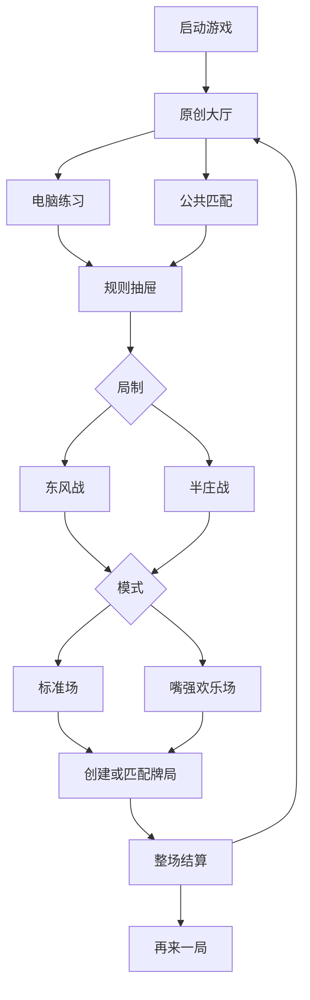
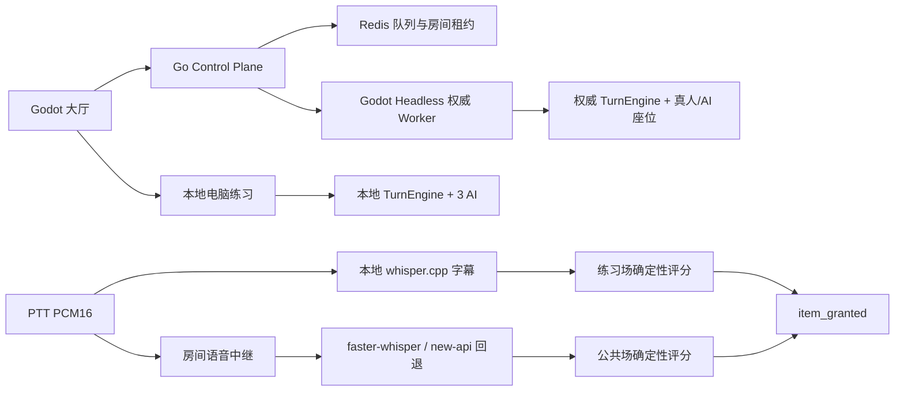

# 多人麻将与“嘴强道具”桌面 Alpha PRD

> 状态：已由用户确认，等待规划 PR 人工合并
> 日期：2026-07-22
> 规划入口：[GitHub Issue #212](https://github.com/jingx8885/mahjong-game/issues/212)
> Master Epic：[GitHub Issue #213](https://github.com/jingx8885/mahjong-game/issues/213)
> 产品范围：E0–E5、E7；**不存在 E6**

## 1. 背景与代码事实

当前项目已经有完整四人日麻规则、东风/半庄跨局驱动、玩家 seat 0 + 3 AI、角色能力、遗物/道具、`Momentum`、`TextAnalyzer`、事件回放与本地 loopback 联机骨架，但仍存在以下产品断层：

- `godot/project.godot` 的生产主场景仍指向 `res://ui/run/run_flow.tscn`。
- `SaveSystem`、`RunState`、章节、HP、金币、商店、抽卡、营地和战令仍位于生产流程。
- `NetworkedBattleController` 只会一次性重放完整事件流；`LocalLoopbackServer` 只接受 `PASS_CLAIM` 占位，不是真实对战服务。
- `TextAnalyzer` 只做中文关键词计数，`Momentum` 尚未接入道具发放和权威事件流。
- `CharacterPool` 有 12 名角色及对应能力，但名称、文案和部分立绘带有明确第三方 IP 指向，角色字段也混入 HP、金币、卡包和声望等肉鸽数据。
- 最新 `origin/main` 已使用 1600×900 viewport，可作为大厅与牌桌统一视觉基准。
- 根目录 `main.go` 只是 Railway 健康检查桩，不承担真实游戏服务职责。

本 PRD 将上述能力重组为桌面四人日麻，而不是在肉鸽 Run 上继续追加联机功能。

## 2. 产品目标与非目标

### 2.1 目标

1. 提供无需账号的电脑练习：1 名玩家 + 3 名 AI。
2. 提供公共休闲匹配：真人优先，最早队列 ticket 等待 30 秒后由服务端 AI 补齐四席。
3. 练习与公共场都支持东风战、半庄战。
4. 提供两个互斥模式：
   - 标准场：纯日麻；角色能力、道具、Momentum、麦克风与语音链路全部关闭。
   - 嘴强欢乐场：角色能力、道具、PTT、字幕与确定性垃圾话发奖启用。
5. 保留 12 名角色的既有能力语义，但完成原创 ID、名称、人设、文案、立绘和生产引用替换。
6. 删除肉鸽生产主路径和相关状态依赖。
7. 交付 macOS、Windows 桌面 Alpha，并通过真实公网四客户端整场验证。

### 2.2 非目标

- Web、移动端、排位、ELO、私人房间、好友/社交、观战。
- 商店、抽卡、卡包、金币、战令、章节、HP、Run 存档和声望解锁。
- 复制雀魂的资产、商标、音频、角色、布局像素或商业化入口；只参考其信息层级和入口权重。
- 让 LLM、STT 或客户端直接决定道具奖励。
- Kubernetes、跨地域容灾、生产级自动扩缩容。
- **整个 E6：语音举报、证据缓冲、音频上传、人工审核、对象存储、按座位静音、语音音量、全局关语音、自动临时禁言及相关占位接口。**

## 3. 用户与核心路径

首发用户是希望快速开始一局四人日麻的桌面玩家，以及希望用角色垃圾话和道具改变牌局节奏的轻竞技玩家。无需注册账号，首次启动获得签名游客身份。



### 3.1 大厅信息架构

```text
┌──────────────────────────────────────────────────────────────────┐
│ 玩家头像 / 游客名                         公告  帮助  设置        │
│                                                                  │
│       ┌────────────────────┐       ┌────────────────────────┐    │
│       │                    │       │      电脑练习          │    │
│       │   原创角色常驻     │       │  1 人 + 3 AI          │    │
│       │   立绘/待机反馈    │       ├────────────────────────┤    │
│       │                    │       │      公共匹配          │    │
│       └────────────────────┘       │  真人优先 / AI 补位   │    │
│                                    └────────────────────────┘    │
│  角色图鉴     道具图鉴     规则说明              BGM / 音效设置  │
└──────────────────────────────────────────────────────────────────┘

点击练习或匹配后，从右侧打开二级抽屉：
[东风战 / 半庄战] × [标准场 / 嘴强欢乐场] → 开始
```

UI 实现必须以该 ASCII、1600×900 几何测试和 `capture_screens.gd` 截图共同作为验收证据。BGM 与 SFX 可独立控制；不存在语音设置入口。

### 3.2 模式矩阵

| 房间 | 局制 | 标准场 | 嘴强欢乐场 |
|---|---|---|---|
| 电脑练习 | 东风 | 1 人 + 3 本地 AI；纯日麻 | 1 人 + 3 本地 AI；本地 PTT/STT、角色与道具 |
| 电脑练习 | 半庄 | 1 人 + 3 本地 AI；纯日麻 | 1 人 + 3 本地 AI；本地 PTT/STT、角色与道具 |
| 公共匹配 | 东风 | 真人优先、Worker AI 补位；纯日麻 | 真人优先、Worker AI 补位；房间语音、权威 STT/发奖 |
| 公共匹配 | 半庄 | 真人优先、Worker AI 补位；纯日麻 | 真人优先、Worker AI 补位；房间语音、权威 STT/发奖 |

标准场的“关闭”是构造期硬隔离：不得实例化角色能力、道具库存、Momentum 或语音采集/传输节点，不能仅靠隐藏 UI 实现。

## 4. 功能需求

### FR-LOBBY 大厅与去肉鸽

- **FR-LOBBY-01**：生产主场景必须是原创大厅，不再进入 Run Flow。
- **FR-LOBBY-02**：练习与公共匹配是右侧一级大入口；局制与模式使用同一右侧二级抽屉。
- **FR-LOBBY-03**：角色图鉴、道具图鉴、规则说明和 BGM/SFX 设置可从大厅打开并返回。
- **FR-LOBBY-04**：生产导航、Autoload 和新会话数据不再读取或写入 RunState、HP、金币、章节、商店、抽卡、营地、战令或 Run 存档。
- **FR-LOBBY-05**：旧 Run 代码只按实际依赖外科手术式退出生产路径；不在同一 Issue 清扫所有 legacy 文件。

### FR-SESSION 统一会话与电脑练习

- **FR-SESSION-01**：使用一个 `GameSessionConfig` 表示 `room_kind`、`round_kind`、`game_mode`、参与者和随机种子。
- **FR-SESSION-02**：公开枚举值固定为：
  - `GameMode`: `STANDARD | TRASH_TALK`
  - `RoomKind`: `PRACTICE | PUBLIC_CASUAL`
  - `RoundKind`: `EAST | HANCHAN`
  - `ParticipantKind`: `HUMAN | AI`
- **FR-SESSION-03**：练习场固定玩家 seat 0，其余三席为 AI；所有操作通过统一命令/事件接口进入既有日麻引擎。
- **FR-SESSION-04**：东风/半庄必须正确处理场风、局序、庄家、连庄、本场棒、立直棒和最终排名。
- **FR-SESSION-05**：整场结束后只提供“再来一局”和“返回大厅”，不产生肉鸽奖励。

### FR-MATCH 公共匹配与权威牌局

- **FR-MATCH-01**：独立 Go Control Plane 提供游客会话、公共队列、房间分配、Worker 注册和 STT 路由；根 `main.go` 不变。
- **FR-MATCH-02**：Redis 按 `round_kind + game_mode` 隔离匹配池；重复加入同一池返回同一 ticket。
- **FR-MATCH-03**：四名真人到齐立即开房；最早 ticket 等待 30 秒后按当前真人数量补 1–3 个 Worker AI。
- **FR-MATCH-04**：Godot Headless Worker 是牌墙、随机数、合法行动、AI、技能、道具、发奖与事件序列的唯一权威。
- **FR-MATCH-05**：所有客户端命令带 `command_id`；重复命令最多应用一次。
- **FR-MATCH-06**：掉线后保留座位 30 秒；超时由 AI 接管；玩家本局内重连后在安全行动边界恢复控制。
- **FR-MATCH-07**：客户端伪造状态、行动结果、隐藏牌、上下文或 `item_granted` 必须被拒绝并返回稳定错误码。

### FR-VOICE PTT 与双层 STT

- **FR-VOICE-01**：欢乐场使用按住说话；仅按下期间采集 PCM16、16kHz、单声道、20ms 帧。
- **FR-VOICE-02**：公共房间语音通过独立 WebSocket 中继；帧必须绑定房间、座位、会话和单调序号。
- **FR-VOICE-03**：客户端 whisper.cpp 使用按需下载的 multilingual small 模型，模型清单包含版本、URL、大小和 SHA-256，支持断点续传和原子启用。
- **FR-VOICE-04**：本地字幕支持中、英、日临时/最终文本；公共场本地字幕不能进入权威评分。
- **FR-VOICE-05**：公共场服务端以 faster-whisper small 为主；主服务失败或超时后，对最终片段调用 OpenAI-compatible/new-api `/v1/audio/transcriptions`。
- **FR-VOICE-06**：同一 utterance 的主备结果最多有一个进入评分；STT 只输出文字，不输出奖励。
- **FR-VOICE-07**：原始语音只存在于采集、中继和转写所需的有界内存缓冲；断开或完成后释放，不写磁盘。

### FR-REWARD 确定性垃圾话与道具

- **FR-REWARD-01**：规则库覆盖 12 名原创角色、所有允许语音获得的道具及中英日关键词/模板。
- **FR-REWARD-02**：文本分析只使用版本化标准化、关键词、模板、角色 affinity 和服务端牌局上下文，不使用在线 LLM、向量相似度或随机语义裁定。
- **FR-REWARD-03**：匹配候选必须包含 `rule_id`、`rule_version`、属性分、优先级、具体度、`item_id` 和上下文要求。
- **FR-REWARD-04**：每个 utterance 最多产生一个奖励；排序为规则优先级降序、上下文具体度降序、稳定 `rule_id` 升序。
- **FR-REWARD-05**：重复 utterance、重复命令和回放不得重复发奖；冷却由权威牌局序号与规则版本计算，不读取客户端时间。
- **FR-REWARD-06**：`item_granted` 必须记录规则版本、规则 ID、道具 ID、座位和 `hand_seq`。
- **FR-REWARD-07**：道具持有、使用和效果结算进入同一权威事件流；标准场拒绝全部道具命令。

### FR-CHARACTER 角色原创化

- **FR-CHARACTER-01**：`CharacterPool` 的 12 个旧 ID 全部迁移为原创稳定 ID；显示名、描述、立绘和生产引用不保留第三方 IP 指向。
- **FR-CHARACTER-02**：每名新角色恰好映射一个现有 `ability_id` 的能力语义，迁移阶段不重新平衡能力。
- **FR-CHARACTER-03**：`starting_hp`、`starting_gold`、`recommended_pack`、`unlock_renown` 不进入新生产角色契约。
- **FR-CHARACTER-04**：原创角色为五类 Momentum 属性提供 affinity，并拥有可审阅的 13+ 挑衅文案。

### FR-DESKTOP 桌面交付

- **FR-DESKTOP-01**：macOS、Windows 包不内置大模型，首次启用欢乐场时按需下载。
- **FR-DESKTOP-02**：标准场无需麦克风权限即可完整游戏。
- **FR-DESKTOP-03**：可复现测试拓扑必须同时启动 Control Plane、Redis、STT 与至少一个 Headless Worker。
- **FR-DESKTOP-04**：桌面 Alpha 以真实公网四客户端完成整场牌局为出口，不以 loopback 或单机多实例替代。

## 5. 系统架构



### 5.1 服务职责

| 组件 | 唯一职责 | 不得承担 |
|---|---|---|
| Godot 客户端 | UI、输入、播放、练习场本地权威、公共场状态投影 | 公共场牌墙、合法性、AI、评分或发奖 |
| Go Control Plane | 游客、队列、房间/Worker 分配、令牌、STT 路由 | 日麻规则和牌局状态 |
| Redis | 临时队列、ticket、房间租约、Worker 注册 | 永久玩家资料或牌局权威状态 |
| Godot Headless Worker | 公共牌局全部权威逻辑与事件流 | 账号、跨房匹配或原始音频存储 |
| 语音/STT 服务 | 有界语音中继、VAD、转写 | 道具选择与牌局状态改变 |

### 5.2 HTTP 接口

| 方法与路径 | 用途 | 关键结果 |
|---|---|---|
| `POST /v1/guest-sessions` | 创建游客会话 | `guest_id`、`display_name`、`session_token`、`expires_at` |
| `POST /v1/queues/casual` | 加入公共队列 | `ticket_id`、规则组合、`queued_at`、`deadline_at` |
| `GET /v1/queues/casual/{ticket_id}` | 查询分配 | `waiting` 或 Worker/room/seat/token |
| `DELETE /v1/queues/casual/{ticket_id}` | 取消排队 | 幂等取消结果 |
| `GET /healthz`、`GET /readyz` | 服务探针 | 进程与依赖状态 |

所有错误统一返回 `code`、`message`、`request_id`；客户端仅根据 `code` 分支。游客 session token 不可直接作为房间令牌，房间令牌必须绑定 `room_id + seat + session_id + expires_at`。

### 5.3 牌局 WebSocket

客户端命令的公共包络：

```json
{
  "protocol_version": 1,
  "command_id": "uuid",
  "room_id": "room_x",
  "seat": 0,
  "kind": "DISCARD",
  "payload": {},
  "client_seq": 12
}
```

最小命令集合：`JOIN`、`READY`、`DISCARD`、`CHI`、`PON`、`KAN`、`RIICHI`、`RON`、`TSUMO`、`PASS`、`ITEM_USE`、`RESYNC_REQUEST`。

服务端事件公共包络：

```json
{
  "protocol_version": 1,
  "server_seq": 42,
  "room_id": "room_x",
  "kind": "ACTION_APPLIED",
  "payload": {},
  "state_hash": "stable-hash"
}
```

最小事件集合：`ROOM_SNAPSHOT`、`PLAYER_JOINED`、`TURN_PROMPT`、`ACTION_APPLIED`、`CLAIM_WINDOW`、`ITEM_GRANTED`、`ITEM_APPLIED`、`HAND_SETTLED`、`MATCH_SETTLED`、`ERROR`。

### 5.4 语音 WebSocket

- 文本控制帧：`PTT_START`、`PTT_END`、`TRANSCRIPT_PARTIAL`、`TRANSCRIPT_FINAL`。
- 二进制音频帧：固定头包含协议版本、座位、utterance ID、帧序号和采样格式，数据为 PCM16 little-endian。
- 语音帧丢失时允许跳帧；不得因单个慢客户端无限缓存或阻塞整房牌局。
- 字幕事件与牌局事件分流；只有服务端最终转写能提交公共场评分请求。

## 6. 确定性、失败与恢复

| 场景 | 规定行为 |
|---|---|
| 重复队列加入 | 返回同规则池中的既有 ticket |
| 30 秒内凑齐四真人 | 立即开房，不等待 deadline |
| deadline 到达但不足四人 | 同一原子操作创建房间并补齐 AI |
| 重复 `command_id` | 返回原处理结果，不重复改变状态 |
| 客户端状态哈希分叉 | 停止本地预测并请求权威快照 |
| 玩家掉线 | 30 秒保留座位；随后 AI 接管 |
| 玩家在本局内重连 | 应用快照，在安全行动边界归还控制 |
| 本地 whisper 不可用 | 欢乐练习场提示模型下载/重试；不能伪造文字发奖 |
| faster-whisper 超时 | 仅最终片段进入 new-api 回退 |
| 主备均失败 | 本 utterance 无字幕/奖励，牌局继续 |
| 语音背压 | 丢弃过旧音频帧，牌局命令通道不受影响 |
| Worker 失联 | Control Plane 停止新分配；当前房间明确失败，Alpha 不承诺跨 Worker 热迁移 |

## 7. 测试与 Alpha 出口

### 7.1 必须验证

- Godot：变更资产或 `class_name` 后执行 import；功能采用 GUT Red → Green → Refactor；Epic 结束跑全量 GUT。
- UI：1600×900 几何测试、`capture_screens.gd` 截图和真实主路径手测。
- 规则：固定种子东风/半庄、分数守恒、标准/欢乐隔离、角色映射、规则决胜、冷却、发奖与回放。
- 服务：真实 Redis、真实 WebSocket、真实 Headless Worker；第三方 STT 接入前先做最小真实请求。
- 桌面：干净 macOS 与 Windows 环境的权限、模型下载、校验和公网连接。
- 最终：四真人完整牌局、1–3 真人 AI 补位、东风/半庄、标准/欢乐均有真实公网证据。

### 7.2 Alpha 成功标准

1. 大厅和生产流程不出现肉鸽概念。
2. 练习场与公共场支持全部 8 种模式组合。
3. 公共场从 1–4 名真人可靠开局，超时 AI 补位无重复房间。
4. 标准场不创建角色、道具或语音逻辑。
5. 欢乐场中符合规则的中英日话语稳定获得并使用一个最高匹配道具。
6. 公共场牌局和发奖可由同一 seed、命令流、规则版本重放。
7. 12 名角色完成原创替换，能力语义有回归测试。
8. 仓库与 GitHub 不存在 E6、举报、静音、语音控制或自动禁言占位实现。
9. macOS 与 Windows 包可连接同一公网房间并完成整场牌局。

## 8. 发布与协作闸门

- 本 PRD、Epic PRD、master plan 和 backlog 使用纯文档规划 PR 交付。
- 规划 PR 人工合并前禁止开始 E1 业务代码。
- 每个叶子 Issue 必须有独立 worktree/任务分支、中文 PR、真实验证结果和人工合并。
- 网络链路在四客户端公网验证前，相关 PR 必须明确写“网络端到端未验证”。
- 任何需求变化必须先更新 PRD、对应 Epic/Issue 与验收矩阵，不能只改代码。
