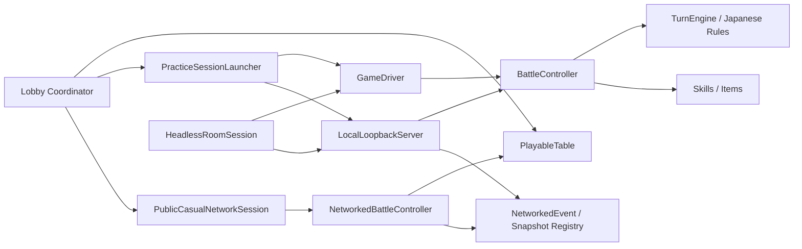
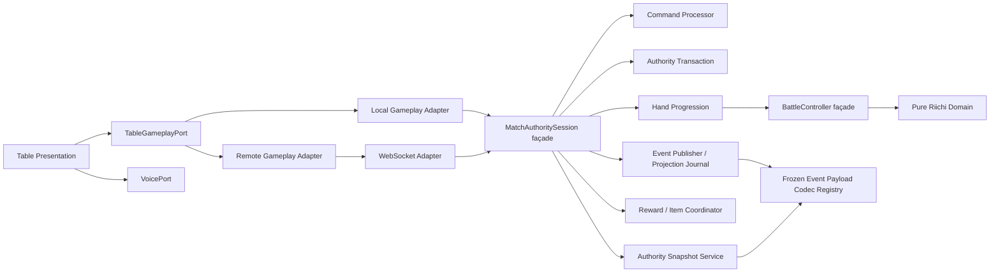
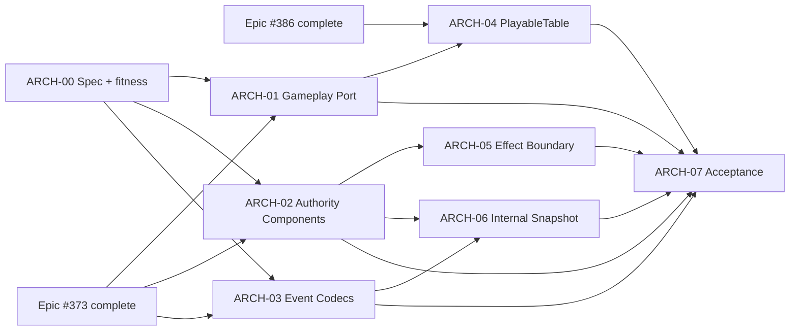

# 架构整改与演进边界 Spec

> 日期：2026-07-29
>
> 状态：Accepted（#390 建立依赖适应度基线后进入实施）
>
> 关联：架构整改 Epic #389、多人桌面 Alpha Master Epic #213、公共可玩闭环 Epic #373、原创牌桌 Epic #386
>
> 事实基线：`docs/superpowers/specs/2026-07-22-e0-03-architecture-protocol-adr.md`

## 1. 背景与问题

当前仓库已经建立了正确的宏观边界：公共场由 Godot Headless Worker 独占权威，练习场复用同一套纯逻辑，Control Plane 不运行日麻规则，STT 与语音中继不拥有牌局状态，客户端只消费按席投影。

本轮整改不推翻这些决策，也不重写已经通过验证的日麻核心。需要解决的是随着 E2–E8、角色、道具、语音和公共场能力叠加后出现的应用层与表现层集中化：

1. `LocalLoopbackServer` 同时承担命令幂等、事务回滚、AI 推进、事件发布、按席日志、快照、奖励窗口、道具、角色能力和单局收口；它也被 Headless Worker 生产路径使用，名称与职责均已失真。
2. `PlayableTable` 同时承担本地输入、公共投影、结算弹层、演出、奖励反馈、语音/PTT、模型下载状态和设置入口，练习场与公共场通过不同内部对象接线。
3. `BattleController` 同时承担手牌状态推进、行动解析、和牌结算、技能 Hook、AI 选择与回放入口，未来效果与流程扩展容易继续堆入同一类。
4. `NetworkedEvent` 同时定义 envelope 与全部业务 payload 的严格校验；每增加事件都会修改同一协议热点。
5. 内部应用层大量使用无类型 `Dictionary` 传递有不变量的事务、结算、投影和效果上下文。
6. 练习场通过 `Object.set_meta("local_authority", ...)` 暴露权威对象，UI 和 `BattleController` 直接读取 metadata，说明缺少稳定的业务端口。

这些问题目前尚未否定功能正确性，但会提高后续需求的冲突面、Review 难度、回归成本和并行开发风险。

## 2. 目标

本 Epic 完成后，应满足：

- 牌桌 UI 只依赖稳定的游戏业务端口，不区分或直接持有本地/远端权威实现。
- 练习与公共场使用同一组输入、投影和结果语义；本地与 WebSocket 只是不同适配器。
- `LocalLoopbackServer` 保留兼容 façade，但核心职责按命令、事务、发布、推进、奖励和快照拆为可独立测试的组件。
- `PlayableTable` 根节点只负责场景装配和生命周期；结算、事件演出、奖励、语音和业务投影由独立子控制器负责。
- `NetworkedEvent` 只拥有稳定 envelope；payload 校验按冻结注册表分域组织，不放松 exact-key、类型、隐私和 hash 契约。
- 领域/应用层高价值边界使用值对象表达不变量；JSON 和 wire 边界继续使用 `Dictionary`。
- 依赖方向由自动化架构适应度测试保护，不再只靠文档约定。
- 所有迁移保持公共协议兼容、确定性回放、按席隐私、幂等语义和现有用户可见行为。

## 3. 非目标

- 不重写 `core/` 日麻规则、`TurnEngine`、符算、役种或计分公式。
- 不新增第二种麻将规则，也不预先设计通用 `RuleSet` 插件框架。
- 不新增 EventBus、ECS、依赖注入容器或通用微服务框架。
- 不把 Control Plane、Worker、STT 或语音继续拆成更多服务。
- 不合并在线脱敏快照与内部完整回放快照。
- 不把消耗品、遗物、角色能力的生命周期强行合并成一个万能类型。
- 不借重构改变道具数值、角色技能、牌桌视觉、Action、事件 schema 或结算产品语义。
- 不重复实现 #373、#378–#381 的公共可玩闭环，也不抢写 #386、#369、#327、#305 的牌桌视觉工作。

## 4. 当前架构事实

当前值得保留的基础：

- `Tile`、`Hand`、`DiscardRiver`、`MeldCollection`、`Wall` 等领域集合已经封装真实实体与不变量。
- `IAuthoritativeBattleController` 与 `IBattleController` 已明确区分本地权威和远端只读投影。
- `GameDriver` 已在练习和 Headless 路径复用跨局语义。
- `HandSettlement` 已成为本地与 Worker 共享的规范落账入口。
- `SnapshotModuleRegistry` 已采用 provider 注册、stage/commit 和回滚，适合作为协议拆分风格参考。
- 生产 GDScript 约 6.2 万行，测试约 8.3 万行，具备先补 characterization 再迁移的条件。

## 5. 目标架构

### 5.1 依赖方向

- `core/` 不得依赖 `battle/`、`session/`、`protocol/`、`server/` 或 `ui/`。
- `battle/` 可依赖 `core/` 与 `skills/` 的稳定领域契约，不得依赖 `ui/`、WebSocket、Control Plane 或具体服务适配器。
- `protocol/` 可引用稳定领域标识和协议 DTO，不得依赖 `ui/`、场景节点或服务生命周期。
- `session/` 负责编排用例和客户端连接，不运行第二套日麻合法性或计分。
- `server/` 负责权威应用适配、连接、Worker 生命周期和按席投影，不拥有 UI。
- `ui/` 只通过端口提交意图、消费已提交投影和展示状态，不读取具体权威对象内部字段。

### 5.2 端口边界

`TableGameplayPort` 应保持最小，只覆盖：

- 当前 committed table view；
- 当前本席 decision view；
- 提交 `Action` 与 `ITEM_USE`；
- committed event、decision、命令结果和连接状态通知；
- release/关闭生命周期。

语音采集、播放和模型下载继续走独立 `VoicePortModule`。Lobby 导航和整场生命周期继续由 Coordinator/Session 管理，不塞入牌桌端口。

### 5.3 权威 façade

迁移期间保留 `LocalLoopbackServer` 的公开行为，禁止一次性改名并搬动所有调用方。内部按以下职责提取：

| 组件 | 唯一职责 | 禁止承担 |
|---|---|---|
| `AuthorityCommandProcessor` | command fingerprint、幂等命中/冲突、预校验结果 | 推进牌局、渲染、网络连接 |
| `AuthorityTransaction` | capture、commit、rollback、失败原子性 | 业务规则选择、协议投影 |
| `AuthorityEventPublisher` | `server_seq`、按席事件、journal、view hash | 修改领域状态 |
| `AuthorityProgression` | server draw、AI、TURN/CLAIM prompt 推进 | 连接鉴权、UI |
| `RewardAuthorityCoordinator` | RewardWindow、ItemAuthority、能力生命周期与屏障 | 日麻原始合法性、STT |
| `AuthoritySnapshotService` | snapshot registry 上下文与按席快照发布 | 内部完整 replay snapshot |

提取必须保留 façade 级 characterization tests，并证明 accepted/rejected 命令、序号、journal、hash、回滚和确定性未变化。

### 5.4 UI 组合边界

`PlayableTable` 最终只做：

- 构造/发现子节点；
- 绑定 gameplay/voice 端口；
- 协调子控制器生命周期；
- 暴露场景级少量稳定 API。

建议的独立子控制器：

- `TableInteractionController`
- `HandResultPresenter`
- `BattleEventPresenter`
- `RewardFeedbackController`
- `TableVoiceController`
- `TableProjectionBinder`

这是结构迁移，不得改 #386 已确认的布局、动画方向和视觉参数。实施前必须取得 UI 草图确认并使用生产截图对比。

### 5.5 协议 Codec

`NetworkedEvent` 保留六键 envelope、构造、序列化与顶层拒绝。payload 验证按领域拆分：

- table action/prompt；
- room/match snapshot；
- settlement；
- reward/item/ability；
- presence/control-adjacent business events。

Codec 注册表必须在构造时冻结；未知 kind 继续拒绝。不得将 `ERROR`、`COMMAND_RESULT` 或客户端伪造事件纳入业务事件流。

### 5.6 值对象选择标准

仅当一个内部结构满足至少两项时才新增值对象：

- 跨两个以上模块传递；
- 拥有 exact keys、范围或交叉字段不变量；
- 被多个调用方用字符串 key 重复读取；
- 需要稳定 fingerprint、copy 或 rollback；
- 测试经常构造无效组合来证明拒绝。

首批候选为 `AuthorityCommandFingerprint`、`AuthorityCommitBatch`、`MatchProgressState`、`ItemTriggerContext` 和内部 `HandSettlementResult` 视图。wire payload 仍以严格 Dictionary 为事实格式。

## 6. 与 open_mahjong_unity 的对比结论

本地 `example/` 当前只有 `open_mahjong_unity` 一个项目。可借鉴：

- Python 服务端权威、Unity 计算只用于提示；
- 多规则计算使用独立目录和 Unity `asmdef`；
- 新规则明确列出服务端、客户端允许域和非目标。

明确不采用：

- 大型 `NetworkManager` / `NormalGameStateManager` 单例；
- Python 与 Unity 复制两套最终规则；
- 每个规则复制 `GameState`、`boardcast`、`wait_action` 整套流程；
- 仅靠目录命名而没有依赖和契约门禁。

Godot 没有等价的程序集边界，因此本项目使用架构适应度测试扫描 `extends`、`preload/load`、显式路径与已知 concrete type 引用，作为可执行边界。

## 7. Epic 拆分与依赖图

建议 Epic 代号：`ARCH`。

| Issue | 目标 | 主要范围 | 依赖 |
|---|---|---|---|
| #390 ARCH-00 | 冻结 Spec、依赖矩阵和验收基线 | docs + health tests | 无 |
| #391 ARCH-01 | 建立统一 `TableGameplayPort` 与本地/远端适配器 | battle/session/ui seam | #378、#380、#381、#390 |
| #392 ARCH-02 | 拆分权威命令、事务、发布和推进组件 | server authority | #379–#381、#390 |
| #393 ARCH-03 | 拆分 `NetworkedEvent` payload codec | protocol | #379–#381、#390 |
| #394 ARCH-04 | 拆分 `PlayableTable` 子控制器 | ui/four_player_table | #386 执行 Issue、#391 |
| #395 ARCH-05 | 收口道具/遗物/角色能力的效果执行边界 | items/skills/session | #379、#392 |
| #396 ARCH-06 | 模块化内部权威 snapshot/replay 状态 | battle/server | #392、#393 |
| #397 ARCH-07 | 整体迁移验收、文档收口与债务清单 | cross-module tests/docs | #391–#396 |

## 8. 各 Issue 统一交付合同

每个执行 Issue 必须包含：

1. 原始问题、真实生产调用链和允许修改文件范围；
2. 明确非目标、前置依赖、冲突文件和禁止提前实现项；
3. Red → Green → Refactor 计划；纯文档/架构扫描说明豁免理由；
4. façade/端口兼容策略，禁止一次性全仓搬迁；
5. 受影响模块、直接依赖契约和全量升级条件；
6. 完整命令、退出码、tests/asserts/fails、日志路径；
7. 网络端到端未验证声明（凡涉及公共场）；
8. 累计 diff Review、P0–P3 问题和最终 Git/远端 SHA。

每个 Agent Task 对应一个 Issue 和独立 worktree。不同任务只有在依赖满足且写入文件不重叠时并行。

## 9. 验证策略

### 9.1 ARCH-00 最小门禁

- `git diff --check`
- 架构适应度测试自身 Red/Green 证据
- 扫描当前允许的历史例外并以精确 allowlist 冻结，禁止使用宽泛目录豁免
- 文档人工核对：所有路径、依赖和 Issue 关系与当前仓库一致

Accepted 基线（`origin/main` 5090ac2，生产 GDScript 210 个）：

| 扫描边界 | 零豁免命中 | 精确历史例外 | 归属 Issue |
|---|---:|---|---|
| `core/` → `battle/session/protocol/server/ui` 路径或具体类型 | 7 | `nagashi_mangan.gd` 的 `BattleState` 1；`draw_detector.gd` 4；`turn_engine.gd` 2 | #397 |
| `battle/` → `ui/server`、WebSocket/Control Plane 适配器 | 0 | 无 | — |
| `protocol/` → `ui/server`、场景节点或服务生命周期类型 | 0 | 无 | — |
| `session/` 新建 `TurnEngine`、`ScoreCalc`、`SkillScheduler` 权威入口 | 0 | 无 | — |
| `local_authority` metadata seam | 11 | `battle_controller.gd` 2；`practice_session_launcher.gd` 2；`playable_table.gd` 7 | #391 |
| `ui/` 读取权威内部字段/方法 | 4 | `playable_table.gd` 的 `_room_id` 2、`event_journal` 2 | #391 |

allowlist 以“文件 + 规则 + 精确匹配文本 + 次数 + 归属 Issue”登记；没有目录、后缀或通配豁免。同一文件新增相同匹配也会因次数超出而失败。扫描只覆盖显式 `.gd` 文本依赖，逐行忽略注释，并排除测试与插件目录；动态拼接路径和反射式调用仍由 Review 与后续迁移验证覆盖。

### 9.2 生产迁移共同门禁

- 受影响模块 GUT + 直接调用方/被调用方契约测试；
- `scripts/test_run_core.sh` 或 `scripts/test_run_slow.sh` 仅按真实风险选择，不能互相冒充；
- 修改 `class_name`、资源路径或大范围脚本加载链时执行 Godot import；
- UI 拆分执行 focused UI GUT、1600×900/1280×720 截图与练习主路径手测；
- 协议/权威状态机共享 schema 变更命中全量 GUT；
- 公共网络在 #259 前始终声明未完成公网四客户端 E2E。

### 9.3 Epic 完成判据

- ARCH-00–ARCH-07 全部关闭，P0–P2 清零；
- `local_authority` metadata 生产后门清零；
- UI 生产代码不引用 `LocalLoopbackServer` 或权威内部字段；
- `LocalLoopbackServer` façade 的命令/事务/事件/奖励/快照职责已委托独立组件；
- `PlayableTable` 不再直接实现结算、奖励、语音和协议投影的全部细节；
- `NetworkedEvent` envelope 与 payload codec 已分离且协议 fixture 完全兼容；
- 固定 seed 练习和 Headless 事件 digest、settlement、snapshot/hash 与迁移前 golden 一致；
- 架构适应度测试覆盖目标依赖方向；
- 所有未验证项、兼容 façade 和后续可删除债务均记录清楚。

## 10. 风险与缓解

| 风险 | 缓解 |
|---|---|
| 与 E8、UI Epic 并发修改同一热点 | 生产 Issue 显式依赖 #373/#386，对未解锁节点不创建写入任务 |
| 拆类时改变事件顺序或回滚原子性 | 先冻结 digest、journal、seq、hash 和失败注入 characterization |
| 新端口变成包含语音/导航/大厅的胖接口 | gameplay、voice、match lifecycle 分离 |
| Codec 注册表放松严格协议 | 构造期冻结、未知 kind 拒绝、复用现有 fixture 和 exact-key tests |
| 值对象泛滥增加样板代码 | 严格执行“至少两项选择标准”，wire Dictionary 不包装 |
| façade 永久残留形成双入口 | ARCH-07 列出唯一入口和可删除清单；无调用方后才删除兼容层 |
| 大规模目录搬迁触发 Godot UID/资源风险 | 先组合拆分、不改路径；路径迁移独立 Issue 并执行 import |

## 11. 默认决策

若无新的产品决策，后续按以下结论执行：

- 先完成 ARCH-00；其余生产重构等待对应 E8/UI 依赖关闭。
- 先引入端口和 façade，再拆内部实现，最后才考虑重命名或搬目录。
- 保持练习与 Worker 共用同一规则/权威逻辑，不复制客户端规则。
- 优先抽象稳定业务边界，不按“文件超过多少行”机械拆类。
- 任何发现的行为缺陷先作为独立 bug/feature Issue 修复并验证，再继续结构迁移，禁止在重构 diff 中静默改语义。
