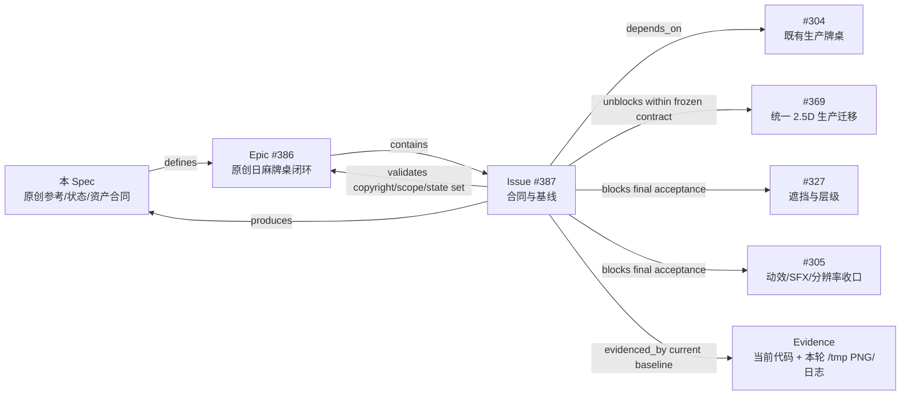

# Issue #387 原创牌桌参考、状态与资产合同（方案 A 已确认）

- 日期：2026-07-29
- 状态：**方案 A「青岚织界」已获用户确认并冻结合同方向；未生成、选定或入库具体生产资产**
- 归属：[Epic #386](https://github.com/lov-team/mahjong-game/issues/386) / [Issue #387](https://github.com/lov-team/mahjong-game/issues/387)
- 基线：detached HEAD `e3b9d59e8b40c8933744a0e10c0136d84c101ea7`
- 范围：取证、原创设计约束、生产状态矩阵、资产合同与用户确认；不实现 #369/#327/#305。

## 1. 结论与边界

本项目只从参考对象抽象四席相对关系、空间拓扑、信息层级和反馈原则，所有角色、Logo、牌图、贴图、模型、音频、字体、专有纹样、文案、控件造型、精确色值、尺寸、像素布局与动画关键帧均禁止复制。仓库级许可证不等于所有资源都有同一授权；任何代码或资产复用都必须另开许可证、来源与兼容性审查，本 Issue 不构成默许。

本轮没有下载、保存或提交第三方截图、网页、打包资源、图片、音频、字体、模型、代码；也没有调用收费生成。#369 的仓库外雀王运行时证据没有复制进仓库。所有事实来自当前生产代码、本轮生成的 `/tmp` 证据、GitHub 仓库元数据/README/LICENSE 与 Issue 正文。

## 2. 原创参考矩阵

许可证事实核对日期均为 2026-07-29。

| 参考 | 允许抽象 | 禁止复制 | 许可证与来源风险 | 本项目落点 |
| --- | --- | --- | --- | --- |
| [NaoMahjong](https://github.com/HitomiFlower/NaoMahjong) | 四席围桌关系；自家手牌为操作焦点；桌内信息由中心向四席分层；短促、可回退的操作反馈 | 角色、Logo、牌图、贴图、模型、音频、字体、纹样、文案、控件轮廓、精确比例/色值/像素位置/关键帧 | GitHub [LICENSE](https://github.com/HitomiFlower/NaoMahjong/blob/master/LICENSE) 元数据为 MIT；但 [README](https://github.com/HitomiFlower/NaoMahjong/blob/master/README.md) 明示资源取自 Majsoul。MIT 只能描述仓库许可证事实，不能推断这些第三方资源可复用 | 仅转化为“四席闭合、自家优先、反馈不遮手牌”的语义验收；不导入任何内容 |
| [OpenRiichi](https://github.com/FluffyStuff/OpenRiichi) | 四家牌区相对方向；手牌、牌河、副露的拓扑完整性 | 任何源码实现、资产、UI 造型、布局参数或动画 | GitHub [LICENSE](https://github.com/FluffyStuff/OpenRiichi/blob/master/LICENSE) 为 GPL-3.0；未做 GPL 与本项目分发方式的兼容性审查 | 只形成“上/下/左/右方向一致、公开信息靠近所属席”的布局原则 |
| [Autotable](https://github.com/pwmarcz/autotable) | 轻量桌内交互；公共牌区与操作区职责分离 | 代码、资产、网页结构、控件样式和精确几何 | GitHub [COPYING](https://github.com/pwmarcz/autotable/blob/master/COPYING) 的 license API 为 `NOASSERTION` / `Other`；未逐文件核验，不能推断可复制 | 只采用“操作带短时出现、牌局信息常驻”的反馈原则 |
| [Majiang](https://github.com/kobalab/Majiang) | 牌河、副露、宝牌、墙余量与牌局阶段的覆盖完整性 | 源码、牌图、文案、控件与精确排版 | GitHub [LICENSE](https://github.com/kobalab/Majiang/blob/master/LICENSE) 为 MIT；仍不代表每个外来资产均可复用 | 转化为状态矩阵的覆盖清单，不转移实现或视觉 |
| [#369 雀王证据](https://github.com/lov-team/mahjong-game/issues/369) | 一次统一桌面投影；远近比例关系；自家前景清晰；中央盘、牌河和结构线共享空间 | 网页、DOM/CSS/JS、截图、字体、音频、资源、角色、Logo、纹样、文案、控件与精确参数/像素布局 | 只有 Issue 中的事实摘要；未发现允许再分发其运行时内容的许可证。仓库外证据不得复制进本仓 | 作为 #369 后续技术验证输入；#387 只冻结“单一空间关系与可读性”目标，不冻结竞品参数 |

## 3. 真实生产入口与证据等级

### 3.1 生产调用链

```text
project.godot run/main_scene
  → res://ui/lobby/lobby_shell.tscn（LobbyShell）
  → PracticeMatchCoordinator._on_session_intent()
  → PracticeSessionLauncher.launch() / GameDriver
  → PracticeMatchCoordinator.mount_playable_table()
  → res://ui/four_player_table/playable_table.tscn（PlayableTable）
  → PlayableTable.play_hand_async(PlayableBattleController)
  → res://ui/four_player_table/four_player_table.tscn（FourPlayerTable）
  → FourPlayerTable.bind_battle_state(BattleState)
  → SeatPanel / DiscardRiverView / MeldArea / CenterInfoPanel / PlayerActionPanel
  → PlayableTable._show_hand_result_overlay()
  → PracticeMatchRunner.advance_or_finish()
  → MatchSettlementPanel（整场结算 / 再来一局 / 返回大厅）
```

`playable_table.tscn` 与 `four_player_table.tscn` 都是薄场景，实际节点由对应脚本构建。生产练习场通过真实控制器和 `BattleState` 驱动；公共桌截图中的网络状态来自生产 `PublicCasualNetworkSession + NetworkedBattleController` 投影链，但使用仓库内合法 fixture，不是服务端 E2E。

### 3.2 等级定义

| 等级 | 定义 |
| --- | --- |
| A | 真实生产场景 + 真实业务控制器/事件，且本轮有当前 PNG |
| B | 生产节点 + 合法 fixture/公开注入入口，且本轮有当前 PNG |
| C | 当前只有生产节点上的可复跑 GUT、几何或静态代码证据；没有本轮对应 PNG |
| D | 当前缺口；既无满足 #387 语义的生产状态 PNG，也不能由已有证据完整证明 |

### 3.3 状态基线矩阵

| 状态 | 生产入口 | 驱动事件 / 真实 fixture | 当前证据 | 实际缺陷 / 缺口 | 后续负责 Issue |
| --- | --- | --- | --- | --- | --- |
| 正常摸打、13/14 张 | `PracticeMatchCoordinator → PlayableTable.play_hand_async → FourPlayerTable.bind_battle_state` | `BattleController.new(42, 0, false, TileId.E)` 真实起手；摸牌后由 `TILE_DRAWN`/决策端口进入 14 张，弃牌回 13 张 | **A（起手）**：`/tmp/shot_battle_live.png`；现有 `test_deal_animation_reference.gd` 验证真实生产桌 4×13，`test_entity_click_chain.gd` 有 13/14 分组静态证据 | 当前 PNG 只截到 13 张起手，没有由真实一次摸牌/弃牌串起的 13→14→13 连续证据 | #369 生产迁移；#305 最终矩阵 |
| 候选 / 选中 / 禁用 | `SeatPanel + CardTileBack + PlayerActionPanel` | 截图工具在真实 `PlayableTable` 上调用 `set_hand_clickable/dim_hand_except/enter_waiting_claim`；生产决策由 `TableDecisionAdapter` 驱动 | **B**：`/tmp/shot_battle_claim_candidates.png` 证明候选操作与禁用遮罩；`test_original_table_contract_304.gd` 在生产组件验证 CandidateBrackets / SelectedSeal / DisabledHatch | 本轮 PNG 没有“已选中牌”；截图 fixture 直接设置生产节点，不是一次真实 `DecisionContext` 全链 | #327 层级遮挡；#305 全状态截图 |
| 振听 | `FourPlayerTable.bind_battle_state → SeatPanel.set_furiten` | `BattleState` / 权威投影中的振听状态；现有生产组件 GUT 调 `set_furiten(true)` | **C**：`test_original_table_contract_304.gd` 验证“振听”文字徽章与位置，不只依赖颜色 | 无本轮振听 PNG，无真实牌局触发振听的端到端截图 | #327、#305 |
| 立直确认 | `PlayableTable._decision_adapter → PlayerActionPanel.enter_waiting_riichi_confirm` | 本地真实规则决策端口；本轮截图工具在真实生产节点上合法进入确认态并同步 `SeatPanel.set_riichi(true)` | **B**：`/tmp/shot_battle_riichi_confirm.png` | PNG 证明 UI 组合，不证明规则为何允许立直；缺真实事件序列截图 | #327、#305 |
| 吃 / 碰 / 明杠 / 荣和候选 | `PlayableTable / PublicCasualNetworkSession → PlayerActionPanel.enter_waiting_claim` | 本地 `WAITING_CLAIM`；公共 `CLAIM_WINDOW.allowed_actions` 映射 RON/CHI/PON/KAN/PASS | **B**：`/tmp/shot_battle_claim_candidates.png` 同屏显示和/吃/碰/杠/跳过 | fixture 同时打开所有按钮用于视觉基线，不代表某个真实牌局中该组合合法；公共动作截图未生成 | #327、#305；公共 E2E 仍属 #378/#381 |
| 暗杠 / 加杠 / 自摸候选 | `TURN_PROMPT → _present_public_allowed_actions → enter_waiting_discard`；本地控制器同类决策口 | `KAN(ANKAN/ADDED_KAN)`、`TSUMO` | **C**：`test_public_table_projection_377.gd` 的合法生产 wire fixture 与生产映射；截图工具定义了对应 fixture | 工具在进入该截图前挂起，`shot_public_table_377_turn_actions.png` 本轮不存在；无当前 PNG | #305；公共 E2E 为 #378/#381 |
| 吃 / 碰 / 杠宣告 | `PlayableTable._handle_event_dramatic` | 确认后的 `PLAYER_ACTION.kind = chi/pon/minkan/ankan/added_kan` | **C**：生产事件分支和 CallAnnounce 组件测试 | 无本轮宣告 PNG；不得用候选按钮图冒充确认宣告 | #305 |
| 荣和 / 自摸宣告 | `PlayableTable._handle_event_dramatic` | 候选 `RON_DECLARED/TSUMO_DECLARED` 只标提示；确认 `WIN_DECLARED` 才触发宣告、人物状态和 MomentBand | **C**：`test_confirmed_win_announce.gd`、`test_result_sequence.gd` | 无本轮确认宣告 PNG；`shot_battle_moment.png` 是直接调用生产 MomentBand，不等于真实确认事件全链 | #305 |
| 最大牌河 | `FourPlayerTable.bind_battle_state → DiscardRiverView.set_tiles` | 真实 `BattleController.run_to_end()`；几何测试用 4×12 张生产牌河节点 | **A（终局密度，非最大合同）**：`/tmp/shot_battle_end.png`；**C**：`test_table_layout.gd` 4×12 几何 | PNG 为 seed 42 的自然终局，不保证每家达到定义中的最大牌河；当前测试只锁 12 张/席，不能冒充完整最大值 | #369、#327、#305 |
| 四家副露 | `FourPlayerTable.bind_battle_state → MeldArea.set_melds` | 真实 `Seat.melds`；现有测试覆盖 chi/pon/minkan/ankan/added_kan 的生产组件与结果渲染 | **C**：`test_meld_reference.gd`、`test_meld_layout.gd`、`test_result_gate_draw_reference.gd` | 无四席同时副露的生产组合 PNG；`shot_battle_end.png` 不满足该条件 | #369、#327、#305 |
| 宝牌 / 墙余量 | `FourPlayerTable.bind_battle_state → CenterInfoPanel` 与 `DoraWidget` | 真实 `BattleState.dora_indicators`、`wall.live_wall_size()`；公共 fixture 使用 `live_wall_count` | **A**：`shot_battle_live.png`（余 70）、`shot_battle_end.png`（余 0）；**B**：`shot_public_table_377_playing.png`（fixture 66） | 已有单点状态，尚无多宝牌与临界墙余量的组合截图 | #369、#305 |
| 最拥挤组合 | 生产 `FourPlayerTable` 全节点；`TableLayout.crowded_state_rects` 定义公开信息区 | 应组合 14 张手牌、四家最大河、四家副露、多宝牌、低墙余量、操作栏和短时反馈 | **C**：`test_original_table_contract_304.gd`、`test_table_layout.gd` 只有几何/分项证据 | 没有单张真实生产组合 PNG；这是当前最重要的视觉缺口之一 | #369 建立布局；#327 消除遮挡；#305 最终截图 |
| 和牌 Modal | `PlayableTable.play_hand_async → _show_hand_result_overlay` | 确认 `WIN_DECLARED`，读取真实 `BattleEvent.extra`、胜者手牌、役/番/符/支付 | **C**：`test_result_sequence.gd`、`test_result_gate_draw_reference.gd` 在生产 `PlayableTable` 上验证 | 本轮截图工具不截 ResultOverlay；没有当前生产 PNG | #305 |
| 普通流局 Modal | 同上 | `EXHAUSTIVE_DRAW`，冻结四席手牌/副露/听牌与支付快照 | **C**：`test_result_gate_draw_reference.gd` 验证 500ms 门控与四席真实快照 | 无当前 PNG | #305 |
| 途中流局 Modal | 同上 | `ABORTIVE_DRAW` + reason（九种九牌、四风连打、四家立直、四杠散了、三家和了） | **C**：`test_result_gate_draw_reference.gd` 验证四风连打标题、说明与门控 | 无当前 PNG，其他 reason 只有格式化/静态分支证据 | #305 |
| 局间过渡入口 | `ResultContinueButton → PracticeMatchRunner.apply_result/advance_or_finish → 下一次 start_hand` | 用户确认本局结果；`after_hand` 更新已提交分数；下一局 `_bind_state_for_deal` 清上局翻牌 | **C**：生产调用链；`test_deal_animation_reference.gd` 验证第二局恢复 4×13；练习场 coordinator 测试验证整场结算与 rematch | 无从“本局结果 → 下一局开局 splash”连续生产截图/录制 | #305 |
| 整场结算 / 再来一局 / 返回大厅 | `PracticeMatchCoordinator.present_settlement → MatchSettlementPanel` | `PracticeMatchRunner` 完成 summary，真实 `GameDriver`；rematch 重建 config/driver/table | **C**：`test_practice_match_coordinator.gd` | 无本轮整场结算 PNG；这不是本 Issue 扩展结算业务的授权 | #305，仅做视觉收口 |

## 4. 本轮 1600×900 证据

### 4.1 当前可安全重试的命令与本轮结果

```bash
# 仅限当前已经存在忽略型 .godot 缓存的现场；必须使用窗口渲染，不能 --headless。
godot --path godot -s tools/capture_screens.gd
```

该命令在当前缓存现场仍只得到部分证据，**不是完整通过**。新 worktree 若缺少导入缓存，应暂停并按意外文件/测试基础设施规则处理；不得依据本合同自行运行 import、制造 tracked 配置 diff 后再恢复。

本轮事实：

- 首次截图因 `.godot` 导入缓存缺失而 Parse Error，退出码 1；日志：`/tmp/mahjong-issue-387-codex-evidence-r1/capture_screens.log`。
- 历史上曾执行 `godot --headless --path godot --import`，日志退出码为 0：`/tmp/mahjong-issue-387-codex-evidence-r1/godot_import.log`；但该命令已证实会改写受跟踪的 `project.godot`。该意外 diff 后经用户授权精确恢复，未纳入本 Issue。**这是本轮失败与恢复记录，不是本合同批准或推荐的复跑步骤。**
- 随后的截图日志第 8–26 行包含 `Identifier not found: ANIMA`、多条依赖脚本编译错误，以及 `Failed to load script ... Compilation failed`；Godot 进程仍在第 30–87 行报告写出 22 张部分 PNG。日志：`/tmp/mahjong-issue-387-codex-evidence-r1/capture_screens_after_import.log`。
- 该日志未出现 `[capture] done`，证据目录也没有可独立审计的 post-import 截图退出码文件；因此只能认定逐文件部分证据，不能认定脚本健康或工具成功。worker 记录曾手工中断无进展的进程，但这只是执行记录，不是独立 exit artifact。
- 日志另有 4 条既有未知道具图标 warning。它们不影响已逐文件读取的 PNG 签名/尺寸，但仍属于工具健康缺口。
- PNG 清单：`/tmp/mahjong-issue-387-codex-evidence-r1/png-manifest.txt`。日志报告的 22 张文件均已逐一核验为非空 PNG、1600×900，mtime 为 2026-07-29 12:34–12:35（Asia/Shanghai）；关键四图另已目视。逐文件合格不等于截图脚本通过。

### 4.2 与本 Issue 直接相关的 PNG

| 文件（绝对路径） | 生产入口 / 驱动 | 等级 | 只证明 | 不证明 |
| --- | --- | --- | --- | --- |
| `/tmp/shot_four_player_table.png` | `four_player_table.tscn` 裸生产场景 | C | 生产桌节点可渲染 | 真实业务控制器、牌局状态 |
| `/tmp/shot_battle_live.png` | 真实 `PlayableTable` + `BattleController(seed=42)` | A | 真实起手牌、四席、宝牌/墙余量、生产牌面 | 14 张摸牌、动作全链 |
| `/tmp/shot_battle_claim_candidates.png` | 真实生产节点 + 合法 UI fixture | B | 和/吃/碰/杠/跳过、候选与禁用的组合视觉 | 同一真实规则时刻允许全部动作 |
| `/tmp/shot_battle_riichi_confirm.png` | 真实生产节点 + 立直确认 fixture | B | 立直/跳过操作带与立直徽章 | 立直合法性计算 |
| `/tmp/shot_battle_moment.png` | 生产 MomentBand 入口 | B | 短时反馈层可渲染 | `WIN_DECLARED` 真实确认全链 |
| `/tmp/shot_battle_end.png` | 真实 `BattleController.run_to_end()` 后 rebind | A | seed 42 终局河牌密度、墙余量 0、真实牌面 | 最大牌河、四家副露、结果 Modal |
| `/tmp/shot_public_table_377_playing.png` | `PublicCasualNetworkSession + NBC` 合法 fixture | B | committed public projection、墙余量 66 | 公共服务器 E2E |
| `/tmp/shot_public_table_377_recipient2.png` | 同上，recipient=2 | B | 本席映射到底部 | 网络发送、服务端权限 |

工具没有覆盖或本轮没有生成：振听、已选中牌、暗杠/加杠/自摸动作栏、确认后的吃碰杠荣和自摸宣告、四家副露、严格最大牌河、最拥挤组合、和牌/普通流局/途中流局 Modal、局间过渡、整场结算。不得声称这些状态已截图。

## 5. 1600×900 原创分层草图

以下是语义布局合同，不复制任何参考项目的精确几何。括号为当前基线 protected zone；#369 若要改变坐标，必须保持职责并更新契约/测试。

```text
1600 × 900
┌──────────────────────────────────────────────────────────────────────────────┐
│ Z60 顶部工具/状态带（规则、设置；不进入对家牌区）                         │
│        ┌──────────── 对家：HUD / 暗手 / 副露 ────────────┐                 │
│        │             对家牌河（公开信息区）              │                 │
│ 左家   │  ┌──────────────────────────────────────────┐   │   右家          │
│ HUD    │  │ Z10 桌布/桌框/结构线                     │   │   HUD           │
│ 暗手   │  │ Z20 四席牌河 / 副露 / 宝牌 / 墙余量     │   │   暗手          │
│ 副露   │  │          ┌────────────────────┐          │   │   副露          │
│ 牌河   │  │          │ Z30 中央盘         │          │   │   牌河          │
│        │  │          │ 局/庄/风/余牌/棒   │          │   │                 │
│        │  │          └────────────────────┘          │   │                 │
│        │  └──────────────────────────────────────────┘   │                 │
│        └──────────────── 自家牌河 / 副露 ────────────────┘                 │
│ Z100 短时反馈层：宣告/Toast/Moment，只穿透输入，不长期遮中央盘与手牌        │
│             Z50 操作带（当前基线 440,680,720×78）                           │
│             Z40 自家手牌（当前基线 218,778,1164×92）                        │
│ Z300 Modal/结算层（当前结果面板 490,90,620×560；背景阻断桌面输入）          │
└──────────────────────────────────────────────────────────────────────────────┘
```

### Protected zones 与输入边界

- 手牌保护区：任何常驻 HUD、牌河、副露、宝牌、墙余量、Toast 不得进入；只有手牌自身的选中抬升/合法遮罩可占用。
- 操作带保护区：显示期间必须在手牌上方，不能覆盖可点击牌面；隐藏时不得留下 `MOUSE_FILTER_STOP` 空壳。
- 四席公开信息区：当前 `crowded_state_rects()` 分别承载所属席牌河+副露，不能压相应席位 HUD、操作带或结果面板。
- 中央盘：局、风、庄、墙余量、立直棒是常驻关键读数；结构线可经过背景，不得穿过文字或点击区。
- 短时反馈：建议 `z=100–220`，一律 `MOUSE_FILTER_IGNORE`；可短暂越过背景结构线，不得遮手牌/操作带超过反馈生命周期。
- Modal/结算：最高交互层，背景 `MOUSE_FILTER_STOP`，内部按钮可聚焦；打开时阻断桌面牌和操作带输入，关闭后完整释放。
- 桌布、桌框、结构线、阴影等装饰层均 `MOUSE_FILTER_IGNORE`；牌张与操作按钮是正常牌局唯一点击层。

## 6. 两套原创视觉方向（方案 A 已确认）

| 项目 | 方案 A：青岚织界（已确认） | 方案 B：玄砂星轨（未选备选） |
| --- | --- | --- |
| 材质 | 低反光青绿织毡、温润深木框、哑光墨蓝中央盘 | 深灰矿砂毡、氧化铜窄框、层压黑石中央盘 |
| 空间 | 织纹向中央收束，四席以疏密变化闭合；自家区更平静、留白更多 | 放射状星轨切分四席，以断续刻线强调方向和回合 |
| 结构线 | 单层细金属嵌线，中央附近较清晰、远离信息区逐渐衰减 | 冷灰主线 + 少量铜色节点，不形成竞品式完整图案 |
| 反馈语言 | 纸签/印记式局部显现；候选用边角括号，确认用短促亮边，禁用用纹理遮罩 | 刻痕点亮 + 小范围粒子尘；候选用断线框，确认用环形脉冲，禁用用斜向砂纹 |
| 可读性 | 与白色牌面、赤宝和金色状态天然分层；中低亮桌面减轻视觉竞争 | 高级、克制，但深背景上黑色牌侧与小字更易丢失，需要更强亮边 |
| 资产成本 | 可复用现有 1600×900 桌布和程序化框/线结构，主要是原创重绘与校色 | 需要新矿砂底纹、铜节点、石材中心与更多小尺寸 QA，成本更高 |
| 风险 | 青绿+木框若纹样过密会回到现有“背景抢牌”问题；必须压低纹理局部对比 | 暗部层次、色弱可读性和压缩噪点风险高；粒子可能干扰公开信息 |
| 1280×720 | 结构线减一档、背景纹理降频；14px 以下说明合并；保留牌面、墙余量、动作按钮 ≥40px 高 | 取消细小铜节点和尘粒，只留主方向线；需要额外提高文字/牌侧亮度，降级更明显 |

**已确认方案 A「青岚织界」**：它与当前真实牌面和绿色牌背的对比关系更稳定，能最小化新增位图数量，也更容易在 1280×720 保持牌局信息优先。方案 B 保留为未选备选，不纳入本轮冻结。

本轮冻结仅覆盖：方案 A 的材质语言、空间与结构线原则、纸签/印记式反馈语言、protected zones、共同视觉原则、既有牌面硬契约、未来资产规格与入库门禁。方案确认不代表任何具体生产资产已经生成、选定或入库。

## 7. 原创视觉与资产合同

### 7.1 已冻结的共同视觉原则

- 桌布：低反光、低局部对比、无角色/Logo/文字/专有纹样；中央和四席公开信息区不得有高频细节。
- 桌框：只表达舞台边界和近远关系，不承担业务状态；不能靠厚重高光挤压左右席。
- 中央盘：唯一常驻状态核；局/庄/风/余牌/立直棒至少有文字或形状冗余，不只靠颜色。
- 结构线：只保留一套外边界与四席分区，不重复叠加第二套菱形/结界线；必须位于牌区下层。
- 牌背/牌侧：牌背用统一暗绿或所选方案的低饱和深色；牌侧必须有白身、暗侧棱和接触阴影三层，左右家也能读出厚度。
- 阴影/亮边：阴影用于分离牌与桌面，亮边用于朝向和可交互提示；不得用整牌染色破坏牌面。
- 字号：1600×900 常驻关键读数不低于 14px，操作按钮主字不低于 20px，次要说明不低于 12px；1280×720 关键读数仍不低于 12px，必要时删次要说明而不缩牌面。
- 对比：关键文字/按钮与直接背景目标至少 4.5:1；大字/非文本结构至少 3:1。状态必须同时使用文字/图形/位置中的至少两种编码。
- 小尺寸：1280×720 不缩小可点击命中区到 40×40 以下；牌面数字/花色、赤宝、振听、立直、当前行动席和墙余量必须可辨。

### 7.2 现有牌面硬契约（本 Issue 不替换）

- 生产目录：`res://assets/mahjong_tiles_riichi/`。
- 文件名不变：`1m..9m`、`1p..9p`、`1s..9s`、`1z..7z`、`0m/0p/0s`、`back.png`。
- 每张均为 **272×389 PNG**；牌面保持 `Color.WHITE` / WHITE modulate，禁用、候选、选中通过独立覆盖层表达。
- 赤宝必须加载真实 `0m/0p/0s`，不得用粉红/红色 modulate 模拟。
- 真实加载链：`project.godot` Autoload `TextureExtractor` → `res://scripts/texture_extractor.gd` → `res://assets/mahjong_tiles_riichi/<key>.png` → `CardTileBack.tile_id_to_atlas_key()` → 手牌/牌河/副露/结果组件。
- 默认纹理滤波继续使用 `textures/canvas_textures/default_texture_filter=3`；除非另行批准，不改文件名、像素、资源路径、滤波、调制或映射。

### 7.3 未来可能新增位图的生产合同

以下只定义允许的新资产槽位，不代表已授权生成或选定内容。

| 用途 | 像素 / 格式 / alpha | 安全边距 | 命名 | 生产目录 | Godot import 与验收 |
| --- | --- | --- | --- | --- | --- |
| 桌布底图 | 1600×900，PNG，RGB；若有透明叠层则 RGBA | 四边 64px 不放不可裁切细节；中央 620×560 与四席公开信息区保持低频 | `table_felt_<direction>_v01.png` | `godot/assets/table/`（采用前新建） | import 后实际 `TableStage` 加载；1600×900/1280×720 截图，无文字、水印、色带、接缝；`git diff --check` + `--import` |
| 桌框/内沿九宫格 | 单边源 256×256 或整框 1600×900，PNG RGBA | 九宫格拉伸区距角至少 32px；可见高光距裁边 ≥8px | `table_frame_<direction>_9slice_v01.png` 或 `table_frame_<direction>_v01.png` | `godot/assets/table/` | alpha 无 halo，9-slice 拉伸不扭曲；不吞左右席；实际场景和缩放截图 |
| 中央盘底板 | 512×512，PNG RGBA | 核心纹理距边 48px；中央文字区至少 300×300 低对比 | `center_plate_<direction>_v01.png` | `godot/assets/table/` | alpha 边缘、mipmap、小尺寸 220×220 可读；不含业务文字，由 Godot 文本叠加 |
| 结构线图层（仅位图方案） | 1600×900，PNG RGBA | 所有线距手牌/动作保护区 ≥16px | `table_guides_<direction>_v01.png` | `godot/assets/table/` | 只允许一套分区线；透明背景、无线头、水印；验证 z-index 与输入穿透。优先程序线，确需位图才新增 |
| 通用牌背（若另批替换） | 272×389，PNG RGBA | 主纹样距边 ≥24px；缩到 34×49 仍无糊边 | `back.png`（只能经单独迁移批准覆盖） | `godot/assets/mahjong_tiles_riichi/` | 与既有尺寸/路径完全兼容；四向牌背、mipmap、alpha/halo、真实发牌动画检查 |
| 牌侧/亮边小纹理（若程序绘制不足） | 128×128，PNG RGBA，可平铺 | 8px 透明缓冲；平铺边缘连续 | `tile_side_<direction>_v01.png` / `tile_edge_<direction>_v01.png` | `godot/assets/table/tiles/` | 四向旋转无接缝，白牌身不染色，小尺寸不出现摩尔纹；生产手牌/河/副露截图 |
| 状态遮罩纹理 | 128×128，PNG RGBA，可平铺 | 8px；线宽缩放后 ≥2px | `tile_state_disabled_hatch_v01.png` 等 | `godot/assets/table/states/` | 必须与文字/形状冗余；选中/候选/禁用互不混淆，不能替代业务状态 |

所有后续生成必须使用 `game-asset-forge`：先写资产合同和版权边界，真实生成前取得计费授权，仓库外唯一 `/tmp` staging，生成代表性 smoke，候选像素/alpha/小尺寸 QA，用户看原图选稿，选定后才复制到生产目录；随后执行 Godot import、真实场景加载、1600×900 与 1280×720 截图及受影响测试。这里的 import 是后续资产 Issue 的验收门禁；后续执行者必须先解决或隔离本轮已知的 `project.godot` 保存副作用，不能把本节当作在 #387 当前现场运行 import 后自行恢复的授权。本 Issue 不收费生成、不生成、不选定、不入库任何生产资产。

## 8. 关系与证据图



- `Spec → Epic #386 → Issue #387 → Evidence`：Spec 定义目标，Epic 组织闭环，#387 冻结合同，Evidence 只验证当前事实。
- `depends_on #304`：当前生产牌桌与真实牌面契约来自 #304 已有基线。
- `unblocks within frozen contract #369`：方案 A 确认只解除 #369 在本合同边界内继续技术与生产迁移的产品方向阻塞，不改变其自身验收责任。
- `blocks final acceptance #327/#305`：#387 仍为最终遮挡验收与动效/SFX/分辨率收口提供合同和状态基线；本次确认不授权在 #387 中实现这些 Issue，也不改变其验收责任。
- `produces`：原创参考矩阵、状态/缺口矩阵、ASCII 分层草图、两套视觉方向、资产槽位与选稿门禁。
- `validates`：#386 的版权边界、非目标、生产入口与后续必须覆盖的状态集合；不验证公共网络 E2E。

## 9. 用户确认记录

- 日期：2026-07-29。
- 用户原始答复：`a`。
- 确认语境：主 Agent 已完整展示 A/B 差异、推荐、证据与未验证项；用户在紧邻该决策问题的消息中回复 `a`，主 Agent 随后明确接受为确认方案 A「青岚织界」。这不同于此前仅表示恢复配置或继续取证的“继续”。
- 冻结结果：仅冻结方案 A 的材质语言、空间与结构线原则、纸签/印记式反馈语言、protected zones、共同视觉原则、既有牌面硬契约、未来资产规格与入库门禁；方案 B 保留为未选备选。
- 解锁边界：只解除 #369 在上述合同边界内继续技术与生产迁移的产品方向阻塞；不自动关闭 #387，不授权在本 Issue 实现 #369/#327/#305，也不改变这些 Issue 各自的验收责任。

本次确认**不会**授权：复制任何参考项目内容；下载或提交第三方资产/代码；触发收费生成；生成、选定或入库具体生产资产；修改规则、AI、计分、牌墙、协议、网络、权威状态或 Action；提前实现 #369/#327/#305；替换现有牌面。第 4 节记录的 import 副作用、截图编译错误、缺少 `[capture] done`、缺少 post-import 独立退出码及全部未验证项继续有效，不得因方案确认被视为已解决。
